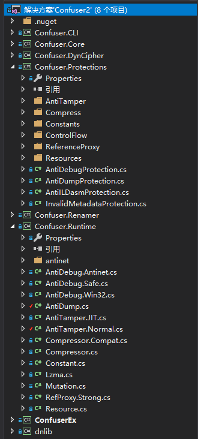
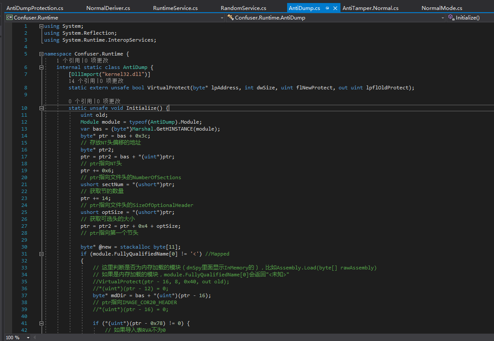
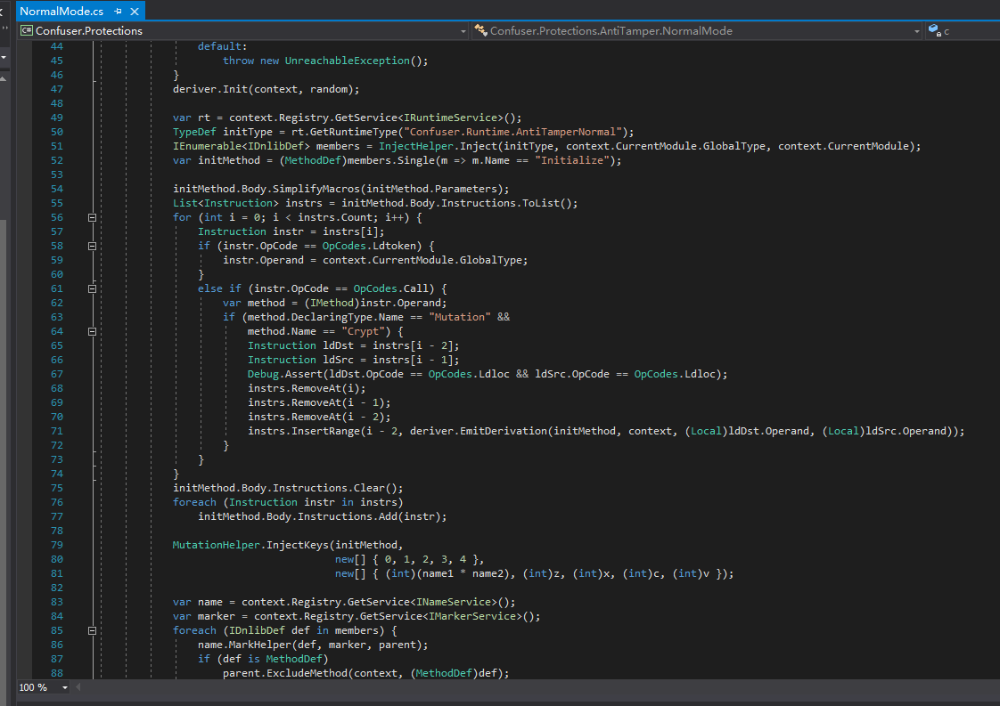
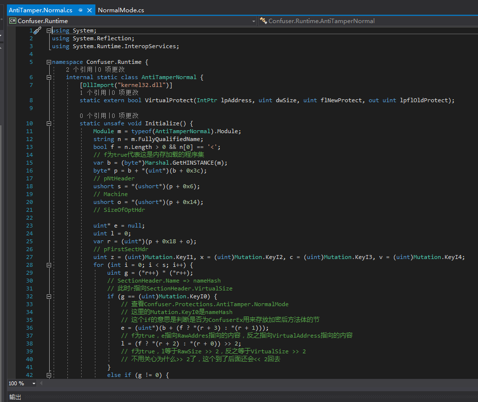
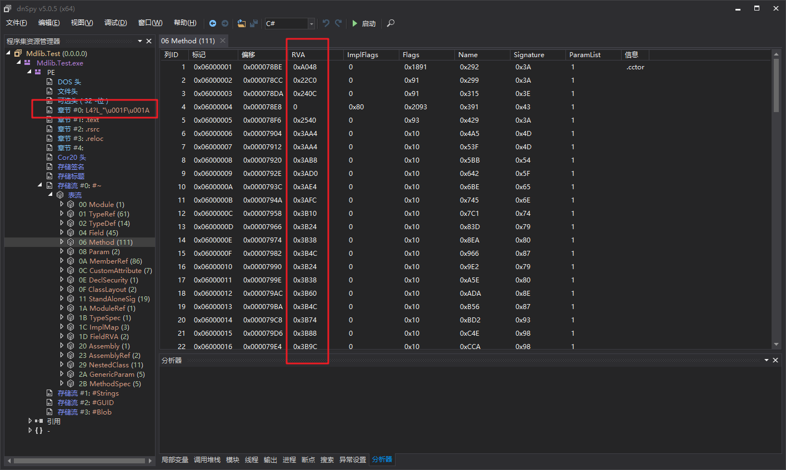

# [.NET]Explain in detail ConfuserEx ofAnti Tamper with Anti Dump by Wwh / NCK

Many people are aware of the ability to shed the ConfuserEx shell using dnSpy's array of one-step debugging+Dump+CodeCracker tools, which are available online in tutorials, but there are no articles that explain the rationale behind them. This article explains ConfuserEx's Anti Tamper and Anti Dump in as much detail as possible.

**（Patience and a little understanding of the PE structure is perfectly understandable.）**

## ConfuserEx Overall project structure

Before we get started, let's get a general idea of the structure of the ConfuserEx project.

We open ConfuserEx in Visual Studio and the project looks something like this.



- Confuser.CLI is a command-line version, similar to the way de4dot operates.
- Confuser.Core is the core that puts all the parts of Protection together.
- Confuser.DynCipher does Encryption algorithms can be generated dynamically.
- Confuser.Protections contains all the Protection, which is the part that needs to be studied.
- Confuser.Renamer are Class names, method names, etc. can be renamed, including various renaming methods, such as reversible renaming, which are not shown in ConfuserEx's GUI.
- Confuser.Runtime is the runtime, like the implementation of Anti Dump, that's actually in this project. Mentioned above. Confuser.Protections will take Confuser.Runtime middle Anti Dump implementation is injected into the target assembly.
- ConfuserEx GUI，No need to say more.

** There are few notes on the entire project, and the notes below in Chinese were added by me. **

## Anti Dump

Anti Dump compared to Anti Tamper is a lot simpler, so let's get to know it first. Anti Dump。

Anti Dump is only one way to achieve this, and it is very simple.

We found it. Confuser.Protections project AntiDumpProtection.cs。


``` csharp
protected override void Execute(ConfuserContext context, ProtectionParameters parameters) {
    TypeDef rtType = context.Registry.GetService<IRuntimeService>().GetRuntimeType("Confuser.Runtime.AntiDump");
    // get Confuser.Runtime project AntiDump class

    var marker = context.Registry.GetService<IMarkerService>();
    var name = context.Registry.GetService<INameService>();

    foreach (ModuleDef module in parameters.Targets.OfType<ModuleDef>()) {
        IEnumerable<IDnlibDef> members = InjectHelper.Inject(rtType, module.GlobalType, module);
        // general Confuser.Runtime.AntiDump class is injected into the target assembly, returning allIDnlibDef

        MethodDef cctor = module.GlobalType.FindStaticConstructor();
        // find <Module>::.cctor
        var init = (MethodDef)members.Single(method => method.Name == "Initialize");
        cctor.Body.Instructions.Insert(0, Instruction.Create(OpCodes.Call, init));
        // insert call void Confuser.Runtime.AntiDump::Initialize()This IL instruction.

        foreach (IDnlibDef member in members)
            name.MarkHelper(member, marker, (Protection)Parent);
        // Mark these IDnlibDef as the ones to be renamed
    }
}
```

AntiDumpProtectionDo just inject, so we go to Confuser.Runtime middle AntiDump.cs



``` csharp
static unsafe void Initialize() {
    uint old;
    Module module = typeof(AntiDump).Module;
    var bas = (byte*)Marshal.GetHINSTANCE(module);
    byte* ptr = bas + 0x3c;
    // Address where the NT header offset is stored
    byte* ptr2;
    ptr = ptr2 = bas + *(uint*)ptr;
    // The ptr points to the NT header.
    ptr += 0x6;
    // ptr point to the file header NumberOfSections
    ushort sectNum = *(ushort*)ptr;
    // Number of sections acquired
    ptr += 14;
    // ptr point to the file header SizeOfOptionalHeader
    ushort optSize = *(ushort*)ptr;
    // Get the size of the optional head
    ptr = ptr2 = ptr + 0x4 + optSize;
    // ptr point to the first node.

    byte* @new = stackalloc byte[11];
    if (module.FullyQualifiedName[0] != '<') //Mapped
    {
        // This is where you determine if the module is memory loaded or not.（dnSpy shows inside. InMemory of），For example. Assembly.Load(byte[] rawAssembly)
        // If it's a memory-loaded module.，module.FullyQualifiedName[0] Will return "<unknown>"
        //VirtualProtect(ptr - 16, 8, 0x40, out old);
        //*(uint*)(ptr - 12) = 0;
        byte* mdDir = bas + *(uint*)(ptr - 16);
        // ptr point to IMAGE_COR20_HEADER
        //*(uint*)(ptr - 16) = 0;

        if (*(uint*)(ptr - 0x78) != 0) {
            // If the import table RVA is not 0
            byte* importDir = bas + *(uint*)(ptr - 0x78);
            byte* oftMod = bas + *(uint*)importDir;
            // OriginalFirstThunk
            byte* modName = bas + *(uint*)(importDir + 12);
            // Import the name of the DLL
            byte* funcName = bas + *(uint*)oftMod + 2;
            // Name of the imported function
            VirtualProtect(modName, 11, 0x40, out old);

            *(uint*)@new = 0x6c64746e;
            *((uint*)@new + 1) = 0x6c642e6c;
            *((ushort*)@new + 4) = 0x006c;
            *(@new + 10) = 0;
            // ntdll.dll

            for (int i = 0; i < 11; i++)
                *(modName + i) = *(@new + i);
            // handle mscoree.dll turn into ntdll.dll

            VirtualProtect(funcName, 11, 0x40, out old);

            *(uint*)@new = 0x6f43744e;
            *((uint*)@new + 1) = 0x6e69746e;
            *((ushort*)@new + 4) = 0x6575;
            *(@new + 10) = 0;
            // NtContinue

            for (int i = 0; i < 11; i++)
                *(funcName + i) = *(@new + i);
            // handle _CorExeMain turn into NtContinue
        }

        for (int i = 0; i < sectNum; i++) {
            VirtualProtect(ptr, 8, 0x40, out old);
            Marshal.Copy(new byte[8], 0, (IntPtr)ptr, 8);
            ptr += 0x28;
        }
        // Clear the names of all sections
        VirtualProtect(mdDir, 0x48, 0x40, out old);
        byte* mdHdr = bas + *(uint*)(mdDir + 8);
        // mdHdr point to STORAGESIGNATURE（The one that starts with the BSJB.）
        *(uint*)mdDir = 0;
        *((uint*)mdDir + 1) = 0;
        *((uint*)mdDir + 2) = 0;
        *((uint*)mdDir + 3) = 0;
        // general IMAGE_COR20_HEADER of cb MajorRuntimeVersion MinorRuntimeVersion MetaData clear out

        VirtualProtect(mdHdr, 4, 0x40, out old);
        *(uint*)mdHdr = 0;
        // Remove the BSJB logo so that STORAGESIGNATURE is not searchable
        mdHdr += 12;
        // mdHdr point to iVersionString
        mdHdr += *(uint*)mdHdr;
        mdHdr = (byte*)(((ulong)mdHdr + 7) & ~3UL);
        mdHdr += 2;
        // mdHdr point to STORAGEHEADER of iStreams
        ushort numOfStream = *mdHdr;
        // Number of metadata streams acquired
        mdHdr += 2;
        // mdHdr points to the first metadata stream header
        for (int i = 0; i < numOfStream; i++) {
            VirtualProtect(mdHdr, 8, 0x40, out old);
            //*(uint*)mdHdr = 0;
            mdHdr += 4;
            // mdHdr point to STORAGESTREAM.iSize
            //*(uint*)mdHdr = 0;
            mdHdr += 4;
            // mdHdr point toSTORAGESTREAM.rcName
            for (int ii = 0; ii < 8; ii++) {
                VirtualProtect(mdHdr, 4, 0x40, out old);
                *mdHdr = 0;
                mdHdr++;
                if (*mdHdr == 0) {
                    mdHdr += 3;
                    break;
                }
                *mdHdr = 0;
                mdHdr++;
                if (*mdHdr == 0) {
                    mdHdr += 2;
                    break;
                }
                *mdHdr = 0;
                mdHdr++;
                if (*mdHdr == 0) {
                    mdHdr += 1;
                    break;
                }
                *mdHdr = 0;
                mdHdr++;
            }
            // zero STORAGESTREAM.rcName，Since this one is 4 bytes aligned, the code is longer
        }
    }
    else //Flat
    {
        // Here's what happens with the memory loading assemblies, which are pretty much the same as above, so I won't go into specifics
        //VirtualProtect(ptr - 16, 8, 0x40, out old);
        //*(uint*)(ptr - 12) = 0;
        uint mdDir = *(uint*)(ptr - 16);
        //*(uint*)(ptr - 16) = 0;
        uint importDir = *(uint*)(ptr - 0x78);

        var vAdrs = new uint[sectNum];
        var vSizes = new uint[sectNum];
        var rAdrs = new uint[sectNum];
        for (int i = 0; i < sectNum; i++) {
            VirtualProtect(ptr, 8, 0x40, out old);
            Marshal.Copy(new byte[8], 0, (IntPtr)ptr, 8);
            vAdrs[i] = *(uint*)(ptr + 12);
            vSizes[i] = *(uint*)(ptr + 8);
            rAdrs[i] = *(uint*)(ptr + 20);
            ptr += 0x28;
        }


        if (importDir != 0) {
            for (int i = 0; i < sectNum; i++)
                if (vAdrs[i] <= importDir && importDir < vAdrs[i] + vSizes[i]) {
                    importDir = importDir - vAdrs[i] + rAdrs[i];
                    break;
                }
            byte* importDirPtr = bas + importDir;
            uint oftMod = *(uint*)importDirPtr;
            for (int i = 0; i < sectNum; i++)
                if (vAdrs[i] <= oftMod && oftMod < vAdrs[i] + vSizes[i]) {
                    oftMod = oftMod - vAdrs[i] + rAdrs[i];
                    break;
                }
            byte* oftModPtr = bas + oftMod;
            uint modName = *(uint*)(importDirPtr + 12);
            for (int i = 0; i < sectNum; i++)
                if (vAdrs[i] <= modName && modName < vAdrs[i] + vSizes[i]) {
                    modName = modName - vAdrs[i] + rAdrs[i];
                    break;
                }
            uint funcName = *(uint*)oftModPtr + 2;
            for (int i = 0; i < sectNum; i++)
                if (vAdrs[i] <= funcName && funcName < vAdrs[i] + vSizes[i]) {
                    funcName = funcName - vAdrs[i] + rAdrs[i];
                    break;
                }
            VirtualProtect(bas + modName, 11, 0x40, out old);

            *(uint*)@new = 0x6c64746e;
            *((uint*)@new + 1) = 0x6c642e6c;
            *((ushort*)@new + 4) = 0x006c;
            *(@new + 10) = 0;

            for (int i = 0; i < 11; i++)
                *(bas + modName + i) = *(@new + i);

            VirtualProtect(bas + funcName, 11, 0x40, out old);

            *(uint*)@new = 0x6f43744e;
            *((uint*)@new + 1) = 0x6e69746e;
            *((ushort*)@new + 4) = 0x6575;
            *(@new + 10) = 0;

            for (int i = 0; i < 11; i++)
                *(bas + funcName + i) = *(@new + i);
        }


        for (int i = 0; i < sectNum; i++)
            if (vAdrs[i] <= mdDir && mdDir < vAdrs[i] + vSizes[i]) {
                mdDir = mdDir - vAdrs[i] + rAdrs[i];
                break;
            }
        byte* mdDirPtr = bas + mdDir;
        VirtualProtect(mdDirPtr, 0x48, 0x40, out old);
        uint mdHdr = *(uint*)(mdDirPtr + 8);
        for (int i = 0; i < sectNum; i++)
            if (vAdrs[i] <= mdHdr && mdHdr < vAdrs[i] + vSizes[i]) {
                mdHdr = mdHdr - vAdrs[i] + rAdrs[i];
                break;
            }
        *(uint*)mdDirPtr = 0;
        *((uint*)mdDirPtr + 1) = 0;
        *((uint*)mdDirPtr + 2) = 0;
        *((uint*)mdDirPtr + 3) = 0;


        byte* mdHdrPtr = bas + mdHdr;
        VirtualProtect(mdHdrPtr, 4, 0x40, out old);
        *(uint*)mdHdrPtr = 0;
        mdHdrPtr += 12;
        mdHdrPtr += *(uint*)mdHdrPtr;
        mdHdrPtr = (byte*)(((ulong)mdHdrPtr + 7) & ~3UL);
        mdHdrPtr += 2;
        ushort numOfStream = *mdHdrPtr;
        mdHdrPtr += 2;
        for (int i = 0; i < numOfStream; i++) {
            VirtualProtect(mdHdrPtr, 8, 0x40, out old);
            //*(uint*)mdHdrPtr = 0;
            mdHdrPtr += 4;
            //*(uint*)mdHdrPtr = 0;
            mdHdrPtr += 4;
            for (int ii = 0; ii < 8; ii++) {
                VirtualProtect(mdHdrPtr, 4, 0x40, out old);
                *mdHdrPtr = 0;
                mdHdrPtr++;
                if (*mdHdrPtr == 0) {
                    mdHdrPtr += 3;
                    break;
                }
                *mdHdrPtr = 0;
                mdHdrPtr++;
                if (*mdHdrPtr == 0) {
                    mdHdrPtr += 2;
                    break;
                }
                *mdHdrPtr = 0;
                mdHdrPtr++;
                if (*mdHdrPtr == 0) {
                    mdHdrPtr += 1;
                    break;
                }
                *mdHdrPtr = 0;
                mdHdrPtr++;
            }
        }
    }
}
```

This part of the import table is actually dispensable, it is reversible
The name of the clearing section is also optional.

MetaData, CLR has done the metadata positioning and saved the data (you can use CE to search for memory verification, search ImageBase+MetaData.VirtualAddress), this field is no longer needed, it can be zeroed, but we read the metadata, this field is needed.

Next Anti Dump will remove the BSJB logo so that STORAGESIGNATURE cannot be searched. There's also the rcName field for the metadata stream header, which is cleared together, which also makes it impossible to locate to the metadata structure, but CLR doesn't need that anymore.

The solution to this is simple, nop the call void Confuser.Runtime.AntiDump::Initialize() of &lt;Module&gt;::.cctor(). How are we going to position ourselves to this instruction?

Here's a speculative solution, found in dnSpy after solving Anti Tamper

``` csharp
Module module = typeof(AntiDump).Module;
byte* bas = (byte*)Marshal.GetHINSTANCE(module);
......
if (module.FullyQualifiedName[0] != '<'){
}
```

Such a method, and this method also calls VirtualProtect several times, as the original ConfuserEx did 14 times.

Nop off the place where this method is called, pay attention to the display mode to switch to IL, then click on the FileOffset where IL is, use the hex editor to change to 0, otherwise it is easy to have problems.

## Anti Tamper

**Anti Tamper is a little bit of a hassle to do what you can't read，arrive ConfuserEx Debugging inside the project！！！！！！**

### analysis

ConfuserEx is in there.2 AntiTamper pattern，一Hook JIT，The other is decryption in situ。Hook JIT is kind of half-baked and doesn't work yet, so what we're actually seeing is an in-situ decryption mode, not particularly strong.

We go to Confuser.Protections project AntiTamper\NormalMode.cs



I won't comment here because it's also an injector, which is similar to AntiDumpProtection.cs. It doesn't matter if you can't read it, just look at the actual implementation I'll analyze later.

Finding the implementation of AntiTamper AntiTamper.Normal.cs



``` csharp
static unsafe void Initialize() {
	Module m = typeof(AntiTamperNormal).Module;
	string n = m.FullyQualifiedName;
	bool f = n.Length > 0 && n[0] == '<';
          // f for true means this is the memory loaded set
	var b = (byte*)Marshal.GetHINSTANCE(m);
	byte* p = b + *(uint*)(b + 0x3c);
          // pNtHeader
	ushort s = *(ushort*)(p + 0x6);
          // Machine
	ushort o = *(ushort*)(p + 0x14);
          // SizeOfOptHdr

	uint* e = null;
	uint l = 0;
	var r = (uint*)(p + 0x18 + o);
          // pFirstSectHdr
	uint z = (uint)Mutation.KeyI1, x = (uint)Mutation.KeyI2, c = (uint)Mutation.KeyI3, v = (uint)Mutation.KeyI4;
	for (int i = 0; i < s; i++) {
		uint g = (*r++) * (*r++);
              // SectionHeader.Name => nameHash
              // At this point r points to SectionHeader.VirtualSize
		if (g == (uint)Mutation.KeyI0) {
                  // view Confuser.Protections.AntiTamper.NormalMode
                  // here Mutation.KeyI0 nameHash
                  // This if means to determine if it is the section that ConfuserEx uses to store the encrypted method body.
                  e = (uint*)(b + (f ? *(r + 3) : *(r + 1)));
                  // f is true, e points to what RawAddres points to and vice versa points to what VirtualAddress points to
			l = (f ? *(r + 2) : *(r + 0)) >> 2;
                  // f for true，l equal to RawSize >> 2，if true VirtualSize >> 2
                  // Don't care why>> 2 now, this one will go back when it gets here
              }
              else if (g != 0) {
			var q = (uint*)(b + (f ? *(r + 3) : *(r + 1)));
                  // f is true, q points to what RawAddres points to and vice versa points to what VirtualAddress points to
                  uint j = *(r + 2) >> 2;
                  // l equal to VirtualSize >> 2
                  for (uint k = 0; k < j; k++) {
                      // VirtualSize=0x200，For example.
                      uint t = (z ^ (*q++)) + x + c * v;
				z = x;
				x = c;
				x = v;
				v = t;
                      // Encryption itself, no analysis required.
			}
		}
		r += 8;
              // Make the r still point to the beginning of the SectionHeader on the next loop
	}

	uint[] y = new uint[0x10], d = new uint[0x10];
	for (int i = 0; i < 0x10; i++) {
		y[i] = v;
		d[i] = x;
		z = (x >> 5) | (x << 27);
		x = (c >> 3) | (c << 29);
		c = (v >> 7) | (v << 25);
		v = (z >> 11) | (z << 21);
	}
          // Encryption itself, no analysis required
          Mutation.Crypt(y, d);
          // ConfuserEx is replaced here with a real encryption algorithm, which would look something like this.
          // data[0] = data[0] ^ key[0];
          // data[1] = data[1] * key[1];
          // data[2] = data[2] + key[2];
          // data[3] = data[3] ^ key[3];
          // data[4] = data[4] * key[4];
          // data[5] = data[5] + key[5];
          // And so on and so forth.

          uint w = 0x40;
	VirtualProtect((IntPtr)e, l << 2, w, out w);

	if (w == 0x40)
              // Prevent duplicate calls, where duplicate decryption leads to data destruction
		return;

	uint h = 0;
	for (uint i = 0; i < l; i++) {
		*e ^= y[h & 0xf];
		y[h & 0xf] = (y[h & 0xf] ^ (*e++)) + 0x3dbb2819;
		h++;
	}
}
```
The actual decryption is written at the end of "*e ^= y[h & 0xf];", which I annotated, with a big chunk of code that calculates the key and the location of the data to be decrypted.

Why is it decryptable? Because XOR 2 times the same value is equal to XOR 0, say 123 ^ 456 ^ 456 == 123.

So what exactly does this code decrypt?

Let's first understand the meta-table Method table



The RVA marked in red points to the data in the method body, which holds the ILHeader ILCode LocalVar EH.

ConfuserEx modifies the RVA so that it points to another red box, "Section #0: Garbled", which houses the method body (the module static constructor and Anti Tamper's own method body are not in this section, otherwise neither would work).

ConfuserEx encrypts the content of this one section. Because the module static constructor is executed in preference to the assembly entry point, the first IL instruction for the module static constructor is call void AntiTamper::Initialize().

This IL instruction is executed first when the set is run, all other methods are decrypted, and the program can run normally.

This approach is so much better than Hook JIT's compatibility that it's almost impossible to have problems that don't work. But this approach is also nowhere near as strong as Hook JIT's.

### AntiTamperKiller finished product

We've just finished analyzing the Anti Tamper, if you read it, you can also write a static stripper of the Anti Tamper (dnSpy Dump method is possible to corrupt the data, static stripping only decrypts one section of data)

Anti Tamper Download：
Link: [https://pan.baidu.com/s/1IMWk7BywjVX1O2AsJ2qIrA](https://pan.baidu.com/s/1IMWk7BywjVX1O2AsJ2qIrA) password: 9ywx

This is how de4dot works, it supports ConfuserEx maximum protection.
