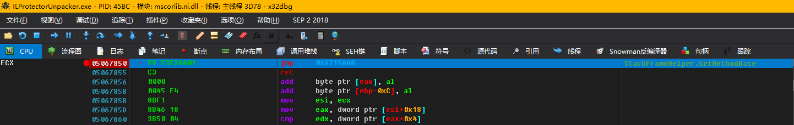

# [.NET] Detailing the ILProtector and writing out the decoiler by Wwh / NCK

## preamble

ILProtector should be considered a shell that is not too strong and has good compatibility, there is little information about it online. But there's the decoiler put out by the CodeCracker gods and some decoilers based on his improved decoilers.

These decapsulations have failed on the latest version of ILProtector, but the principle does not fail. Many people just use these strippers and are not aware of the principles involved. Once these deshellers fail, they cannot be deshelled.

In this article, we will explain the principle of ILProtector Unpacker and write our own unpacker based on an open source project on GitHub ([ILProtectorUnpacker by RexProg](https://github.com/RexProg/ILProtectorUnpacker)).

We still need to find a sample of the ILProtector plus shell before we can research it. Unfortunately, we didn't find the latest UnpackMe for ILProtector, so we just took the main ILProtector program (it says "ILProtector is protected by itself!" on the official website).

At the time of research, ILProtector version 2.0.22.4 was used, but it was a bit awkward to find out that ILProtector had been updated to 2.0.22.5 when writing the article. But I tested it and there is no difference between 2.0.22.5 and 2.0.22.4, so this article looks at the ILProtector v2.0.22.4 main program as a sample. Here are the packaged files to download：[ILProtector v2.0.22.4.7z](https://github.com/wwh1004/blog/raw/master/%5B.NET%5D%E8%AF%A6%E8%A7%A3ILProtector%E5%B9%B6%E5%86%99%E5%87%BA%E8%84%B1%E5%A3%B3%E6%9C%BA/ILProtector%20v2.0.22.4.7z)

## ILProtector Overview of protection modalities

Let's start with dnSpy open ILProtector see how this is protected.：


We can see that the method body has been hidden and replaced with "&ltModule&gt.Invoke(num)". Try debugging with dnSpy:.

Let's break it here in the Main method.：


Press F11 in one step after the break.：


As a preliminary indication that DynamicMethod is being used, we place a breakpoint in the DynamicMethod constructor and run it at F5.


That's right, we guessed wrong, the ILProtector uses DynamicMethod to dynamically generate a method body to protect the assembly.

## ILProtectorUnpacker by RexProg The Principle of Deshelling

### shedding process

To avoid all sorts of attempts that don't make particularly great sense, let's look at how the open source project mentioned at the beginning of the article came to be stripped down. Let's open this item inside VS first.（This provides packaged items to download：[ILProtectorUnpacker by RexProg.7z](https://github.com/wwh1004/blog/blob/master/%5B.NET%5D%E8%AF%A6%E8%A7%A3ILProtector%E5%B9%B6%E5%86%99%E5%87%BA%E8%84%B1%E5%A3%B3%E6%9C%BA/ILProtectorUnpacker%20by%20RexProg.7z?raw=true)）

Find the Main method and see what it's all about (I added the following comments myself).


The real implementation can be found in InvokeDelegates, go to this method.


### pass a test

At this point, we probably understand the process of disassembling a disassembling machine. The sheller first loads the protected assembly, then Hooks a place, then manually calls Invoke to get the dynamic method, then uses the DynamicMethodBodyReader provided by dnlib to read the method body of this dynamic method and restore it to the method body in the file. We just mentioned Hook, and since it's Hook, it's probably related to testing, let's see what Hook has.


Corresponding Detour：


Here we don't particularly understand why Hook System.Diagnostics.StackFrameHelper.GetMethodBase, nor do we understand what InvokeMethod is in "if (result.Name == "InvokeMethod")", let's search and decompile InvokeMethod with dnSpy again to see.


Those with a bit of reverse experience should know that this is where the call to MethodInfo.Invoke goes into the CLR in the hosted code, which can be understood as where R3 goes to R0 in Win32 programming.


Combined with some anti-illegal call detection principles, it is known that the ILProtector detects the previous method of the protected method in the call stack, such as this.


Assuming that arrow 2 points to the protected method and arrow 1 points to the unmanaged code running with the ILProtector (as if it were, since dnSpy can't single-step into unmanaged code), then the unmanaged code at runtime will detect if the caller pointed to by arrow 2 is the protected method, i.e. "internal static FormPos Load(string fileName)". If we manually Invoke to get the dynamic method, then the unmanaged code detected will not be "internal static FormPos Load(string fileName)", but the just mentioned "System.

``` csharp
if (result.Name == "InvokeMethod")
    // This is a very critical place. If the resulting Name is "InvokeMethod", then replace this MethodBase with the MethodBase of the current method to be decrypted.
    result = Assembly.Modules.FirstOrDefault()?.ResolveMethod(CurrentMethod.MDToken.ToInt32());
```
I've been here for testing.。

The explanation is a bit hard to understand, although it's explained in as much detail as possible. Readers may not understand too much, but know a general idea, so still need to debug and follow up yourself, practice to really learn!

### Something went wrong.！

Looking at what I wrote, does it feel like ILProtectorUnpacker has written it perfectly? However, with the test, there will also be a reverse test. We compiled RexProg's stripper directly and ran.


Why is this, after various analyses and attempts, and for the sake of a more concise article, here will be written directly on the correct analysis of the inverse detection process (ILProtector detected that we manually called Invoke)

## ILProtector detection

First of all, the ILProtector detects the call stack, we process it and it works, so why are illegal calls detected by the ILProtector? A: ILProtector detected our Hook.

First modify Memory.Hook so that it outputs some information (Target's address and Detour's address in Hook).


Open x64dbg, start the stripper and let it run, stop at "Console.ReadKey(true);".


Go to the first address in the x64dbg memory window, the first address is the address of the method that was Hooked, i.e. the address of System.


Press a button inside the console and let the stripper continue to run until it breaks at ProtectXXX.dll.


Here's a jcc instruction that better proves that this is a Hook test. for convenience and because it's an uncased DLL, we'll go straight to IDA and decompile the Hook test function. The RVA of this function is 0x31B70, so search for "31B70" directly in the IDA.


I've renamed the code so the reader can think directly about the rationale for this detection. I'll explain this test roughly.

IsHooked(char *pEntry)The address to be detected will be passed, for example, this time with x64dbg debugging, the address passed is 0x05067850.

``` cpp
if ( *pEntry == 0x55 )
  offset = 1;
```

This code can be considered junk code and doesn't need to be understood

``` cpp
while ( offset < 0xFF && pEntry[offset] == 0x90u )// Skip the nop.
  ++offset;
```

Skip the nop.

``` cpp
if ( pEntry[offset] == 0xE9u )                // The first directive is JMP. XXXXXXXX
{
  result = 1;
}
else
{
  InterlockedCompareExchange(&Destination, 0x45524548, 0x4B4F4F4C);
  result = 0;
}
return result;
```

Determine if the first instruction after NOP (if there is a NOP) is JMP. if it is JMP, return TRUE, indicating that Hook was detected; if not JMP, indicating that the code is normal and not Hooked, after setting a flag (this flag does not matter), return FALSE.

## Then it was tested by ILProtector.

But let's not forget that there are countless ways to write a bit of JunkCode and just pass the test.

Let's first look at what the stripper has done with System.Diagnostics.StackFrameHelper.GetMethodBase.



No wonder it was detected, this first instruction was JMP, Hook was too direct. Let's play a little trick and add 0xEB 0x00 in front of "jmp 0x06715AA8", equivalent to "jmp eip/rip+2".


Pressing F8 to single-step to the Hook detection return, you can find that it returns false. Press F5 to find that the stripper is not reporting an error, which means our re-test was successful!


## Your own hull stripper.

Then the study of RexProg's ILProtectorUnpacker and the study of ILProtector itself can come to an end. Next began the lecture on how to write a stripper yourself.

Write a simple framework.：


Before calling DecryptAllMethodBodys, we have to do a Hook on System.Diagnostics.StackFrameHelper.GetMethodBase.

GetMethodBase is an instance method, so we specifically write a class to put the Detour method, in the static constructor of this class to insert the reflection API initialization code.

``` csharp
Module mscorlib;

mscorlib = typeof(object).Module;
FieldInfo_rgMethodHandle = mscorlib.GetType("System.Diagnostics.StackFrameHelper").GetField("rgMethodHandle", BindingFlags.NonPublic | BindingFlags.Instance);
ConstructorInfo_RuntimeMethodInfoStub = mscorlib.GetType("System.RuntimeMethodInfoStub").GetConstructor(BindingFlags.Public | BindingFlags.Instance, null, new Type[] { typeof(IntPtr), typeof(object) }, null);
MethodInfo_GetTypicalMethodDefinition = mscorlib.GetType("System.RuntimeMethodHandle").GetMethod("GetTypicalMethodDefinition", BindingFlags.NonPublic | BindingFlags.Static, null, new Type[] { mscorlib.GetType("System.IRuntimeMethodInfo") }, null);
MethodInfo_GetMethodBase = mscorlib.GetType("System.RuntimeType").GetMethod("GetMethodBase", BindingFlags.NonPublic | BindingFlags.Static, null, new Type[] { mscorlib.GetType("System.IRuntimeMethodInfo") }, null);
```

Note that this pointer is wrong because it is Hook, FieldInfo_rgMethodHandle fields like this should be defined as static fields, if you don't understand, you can change it to non-static, see how to report the error, not demonstrated here.

I prefer to use an Attribute to get my own Detour as opposed to a violent GetMethodByName. we define a DetourAttribute.

``` csharp
private sealed class GetMethodBaseDetourAttribute : Attribute {
}
```

Go back to the class that put Detour and write the code like this.

``` csharp
[GetMethodBaseDetour]
public virtual MethodBase GetMethodBaseDetour(int i) {
	IntPtr[] rgMethodHandle;
	IntPtr methodHandleValue;
	object runtimeMethodInfoStub;
	object typicalMethodDefinition;
	MethodBase result;

	rgMethodHandle = (IntPtr[])FieldInfo_rgMethodHandle.GetValue(this);
	methodHandleValue = rgMethodHandle[i];
	runtimeMethodInfoStub = ConstructorInfo_RuntimeMethodInfoStub.Invoke(new object[] { methodHandleValue, this });
	typicalMethodDefinition = MethodInfo_GetTypicalMethodDefinition.Invoke(null, new[] { runtimeMethodInfoStub });
	result = (MethodBase)MethodInfo_GetMethodBase.Invoke(null, new[] { typicalMethodDefinition });
	if (result.Name == "InvokeMethod")
		result = _module.ResolveMethod(_currentMethod.MDToken.ToInt32());
	return result;
}
```

So that we can use

``` csharp
private static MethodInfo GetMethodByAttribute<TClass, TMethodAttribute>() where TMethodAttribute : Attribute {
	foreach (MethodInfo methodInfo in typeof(TClass).GetMethods(BindingFlags.Public | BindingFlags.NonPublic | BindingFlags.Instance | BindingFlags.Static)) {
		object[] attributes;

		attributes = methodInfo.GetCustomAttributes(typeof(TMethodAttribute), false);
		if (attributes != null && attributes.Length != 0)
			return methodInfo;
	}
	return null;
}
```

To get Detour, don't worry about when the code gets confused, GetMethodByName will make an error.

``` csharp
private static void* GetMethodAddress(MethodBase methodBase) {
	RuntimeHelpers.PrepareMethod(methodBase.MethodHandle);
	return (void*)methodBase.MethodHandle.GetFunctionPointer();
}

private static void WriteJunkCode(ref void* address) {
	byte[] junkJmp;

	junkJmp = new byte[] {
		0xEB, 0x00
	};
	// Use JunkJmp here, equivalent to jmp eip/rip+2
	Write(address, junkJmp);
	address = (byte*)address + 2;
}

private static void WriteJmp(ref void* address, void* target) {
	byte[] jmpStub;

	if (IntPtr.Size == 4) {
		jmpStub = new byte[] {
			0xE9, 0x00, 0x00, 0x00, 0x00
		};
		fixed (byte* p = jmpStub)
			*(int*)(p + 1) = (int)target - (int)address - 5;
	}
	else {
		jmpStub = new byte[] {
			0x48, 0xB8, 0x00, 0x00, 0x00, 0x00, 0x00, 0x00, 0x00, 0x00, // mov rax, target
			0xFF, 0xE0                                                  // jmp rax
		};
		fixed (byte* p = jmpStub)
			*(ulong*)(p + 2) = (ulong)target;
	}
	Write(address, jmpStub);
	address = (byte*)address + jmpStub.Length;
}
```

Writing this way, let's write a new method, get the address of Target and the address of Detour, write JunkCode to Tagret first, then write the real Jmp jump.

At this point, we can add the following to the Execute(string filePath).

``` csharp
if (Environment.Version.Major == 2)
	throw new NotSupportedException();
else
	InstallHook(typeof(object).Module.GetType("System.Diagnostics.StackFrameHelper").GetMethod("GetMethodBase", BindingFlags.Public | BindingFlags.Instance), GetMethodByAttribute<StackFrameHelperDetour4, GetMethodBaseDetourAttribute>());
```

Next, we write the previously defined DecryptAllMethodBodys(). Define the variables within the method first.

``` csharp
TypeDef globalType;
object instanceOfInvoke;
MethodInfo methodInfo_Invoke;
uint methodTableLength;
```

Then we have to get the "internal static i Invoke" in &ltModule&gt by reflection.

``` csharp
globalType = _moduleDef.GlobalType;
instanceOfInvoke = null;
foreach (FieldDef fieldDef in globalType.Fields)
	if (fieldDef.Name == "Invoke")
		instanceOfInvoke = _module.ResolveField(fieldDef.MDToken.ToInt32()).GetValue(null);
methodInfo_Invoke = instanceOfInvoke.GetType().GetMethod("Invoke");
methodTableLength = _moduleDef.TablesStream.MethodTable.Rows;
```

methodTableLength represents the total number of methods in the set, we start to iterate through each method, so use the for loop to implement

``` csharp
for (uint rid = 1; rid <= methodTableLength; rid++) {
}
```

In-cycle defined variables

``` csharp
MethodDef methodDef;
object dynamicMethod;
```

methodDef represents the method currently being Resolved, dynamicMethod represents the value returned by the previous i.Invoke(num), this value is delegated, the delegated internal is dynamic method.

``` csharp
methodDef = _moduleDef.ResolveMethod(rid);
if (!NeedDecryptMethodBody(methodDef))
	continue;
_currentMethod = methodDef;
dynamicMethod = methodInfo_Invoke.Invoke(instanceOfInvoke, new object[] { methodDef.Body.Instructions[1].GetLdcI4Value() });
```

At this point, we had everything ready, just Invoke and Restore, so we added them again.

``` csharp
try {
	DynamicMethodBodyReader reader;

	reader = new DynamicMethodBodyReader(_moduleDef, dynamicMethod);
	reader.Read();
	_currentMethod.FreeMethodBody();
	_currentMethod.Body = reader.GetMethod().Body;
}
catch (Exception) {
}
```

We ran down the decapitator and found that we could really decipher the method body. It would be really exciting to actually follow the writing of a stripper and work out the results yourself, wouldn't it?


But we can find that there seems to be strings left undeciphered. Let's contact the "internal static s String" in this &ltModule&gt again to know that this is the same as Invoke - the same way to call it to decrypt the string.

Decipher the effect of the string.：


Next, we want to remove the initialization code from the ILProtector runtime. While it's okay not to remove, for perfection's sake, let's refine the stripper a bit more.

``` csharp
private static void RemoveRuntimeInitializer() {
	// IL_0000: ldtoken   '<Module>'
	// IL_0005: call      class [mscorlib]System.Type [mscorlib]System.Type::GetTypeFromHandle(valuetype [mscorlib]System.RuntimeTypeHandle)
	// IL_000A: call      native int [mscorlib]System.Runtime.InteropServices.Marshal::GetIUnknownForObject(object)
	// IL_000F: stloc     V_0
	// .try
	// {
	// 	IL_0013: call      int32 [mscorlib]System.IntPtr::get_Size()
	// 	IL_0018: ldc.i4.4
	// 	IL_0019: bne.un.s  IL_0031

	// 	IL_001B: call      class [mscorlib]System.Version [mscorlib]System.Environment::get_Version()
	// 	IL_0020: callvirt  instance int32 [mscorlib]System.Version::get_Major()
	// 	IL_0025: ldloc     V_0
	// 	IL_0029: call      bool '<Module>'::g(int32, native int)
	// 	IL_002E: pop
	// 	IL_002F: br.s      IL_004D

	// 	IL_0031: call      int32 [mscorlib]System.IntPtr::get_Size()
	// 	IL_0036: ldc.i4.8
	// 	IL_0037: bne.un.s  IL_004D

	// 	IL_0039: call      class [mscorlib]System.Version [mscorlib]System.Environment::get_Version()
	// 	IL_003E: callvirt  instance int32 [mscorlib]System.Version::get_Major()
	// 	IL_0043: ldloc     V_0
	// 	IL_0047: call      bool '<Module>'::h(int32, native int)
	// 	IL_004C: pop

	// 	IL_004D: leave.s   IL_005A
	// } // end .try
	// finally
	// {
	// 	IL_004F: ldloc     V_0
	// 	IL_0053: call      int32 [mscorlib]System.Runtime.InteropServices.Marshal::Release(native int)
	// 	IL_0058: pop
	// 	IL_0059: endfinally
	// } // end handler

	MethodDef cctor;
	IList<Instruction> instructionList;
	int startIndex;
	int endIndex;
	IList<ExceptionHandler> exceptionHandlerList;

	cctor = _moduleDef.GlobalType.FindStaticConstructor();
	instructionList = cctor.Body.Instructions;
	startIndex = 0;
	for (int i = 0; i < instructionList.Count; i++)
		if (instructionList[i].OpCode == OpCodes.Call && instructionList[i].Operand is MemberRef && ((MemberRef)instructionList[i].Operand).Name == "GetIUnknownForObject")
			startIndex = i - 2;
	endIndex = 0;
	for (int i = startIndex; i < instructionList.Count; i++)
		if (instructionList[i].OpCode == OpCodes.Call && instructionList[i].Operand is MemberRef && ((MemberRef)instructionList[i].Operand).Name == "Release")
			endIndex = i + 3;
	for (int i = startIndex; i < endIndex; i++) {
		instructionList[i].OpCode = OpCodes.Nop;
		instructionList[i].Operand = null;
	}
	exceptionHandlerList = cctor.Body.ExceptionHandlers;
	for (int i = 0; i < exceptionHandlerList.Count; i++)
		if (exceptionHandlerList[i].HandlerType == ExceptionHandlerType.Finally && exceptionHandlerList[i].HandlerEnd == instructionList[endIndex]) {
			exceptionHandlerList.RemoveAt(i);
			break;
		}
}
```

The startIndex in the code indicates the beginning of the runtime initialization code and the endIndex indicates the end of the runtime initialization code. Because of possible jumps in the method body, and because of some features of dnlib, we can't just replace Instruction with Nop, but rather this.

``` csharp
instructionList[i].OpCode = OpCodes.Nop;
instructionList[i].Operand = null;
```

In addition to this, there are some other residual code in the protected program set caused by the ILProtector, and the removal method is not described.

There's not much point in releasing the finished stripper, or would you rather the reader research the stripper for themselves according to the article. Instead of just using what someone else wrote, one day the shelling tool will be updated and the stripper won't work, it won't be stripped.
