# .The ultimate debugging under NET

## preamble

The 0xd4d Great God wrote a project for an anti-debugger + anti-analyzer called [antinet](https://github.com/0xd4d/antinet), the code is on github. This anti-debugging principle is not detection, but active attack. If the identification is successful, some of the debugging-related fields in the CLR will be directly corrupted, allowing the debugging thread to exit and other debuggers to attach. Theoretically this anti-debugging is almost insoluble unless the internal identification mechanism of this anti-debugging is allowed to fail.

**So I made some improvements to this code, adding the Win32 function to detect the debugger, adding the Hook detection for the internal CLR function, and removing the anti-analyzer code by the way, because that code is not very useful for anti- debugging and does not look particularly stable. Improved code: [https://github.com/wwh1004/antinet](https://github.com/wwh1004/antinet). **

Here is the download address for sscli20, because sscli20 will be used in the article analysis, if not, you can download it from me.

[Baidu Cloud](https://pan.baidu.com/s/1WEORyUlymp1f-RLmHSeotQ)（extraction code：v1w2）

[OneDrive](https://1drv.ms/u/s!ApAHkNMXPkQYhvx1nouD-JwwBpRCaw)

Be sure to open my modified tantinet in VS (download address above) before reading the article, otherwise it may not be clear what the article is about!!!!

## 0xd4d of AntiManagedDebugger

### general flow

This is the antidebug class for 0xd4d's antinet, which I kept without modifications, and then added comments.

Let's first look at how 0xd4d explains the principle of AntiManagedDebugger.

Open [https://github.com/0xd4d/antinet](https://github.com/0xd4d/antinet) and find "Anti-managed debugger", the following "Technical details" is the implementation principle. My translation is as follows (not machine translation).

> When CLR starts, CLR creates an instance of the debugger class (class named Debugger). This debugger class creates an instance of the DebuggerRCThread class, which represents the .NET debugger thread. Normally, this thread would only end when the CLR exits (which for normal .NET programs is process end). In order to exit this thread early, we want to set the "keep-looping" field of the DebuggerRCThread class instance to 0 and send a signal to it.
> 
> Both instances are saved in the .data section of the CLR.
> 
> In order to find interesting DebuggerRCThread instances, we must scan the .data section to get a pointer to the Debugger instance. I looked for the Debugger instance first because the class contains the ID of the current process, which makes it easier to find. When we find that some features of the Debugger class appear where the possible instance of Debugger might be, and that this possible instance holds the ID of the current process on the specified offset, we get the DebuggerRCThread instance of this class.
> 
> There is a field in the DebuggerRCThread class that is a pointer back to the Debugger instance. If this pointer is the same as the previously found Debugger instance, then we can be pretty sure we have found the 2 instances we need.
> 
> Once we have a DebuggerRCThread instance, there is little value in setting the keep-looping field to 0 and signaling the thread to quit.
> 
> To prevent the debugger from attaching to the current process, we can clear the debugger IPC block size field. If the value of this size field is set to other numbers, mscordbi.dll in CordbProcess::VerifyControlBlock() will return an error code, and at this time no debugger can attach the current process.

It doesn't matter if you can't read it, you can probably get an impression. Let's go inside VS and look at the code for the AntiManagedDebugger class.

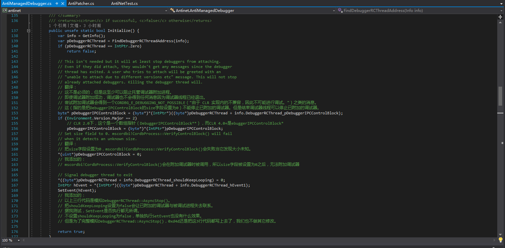
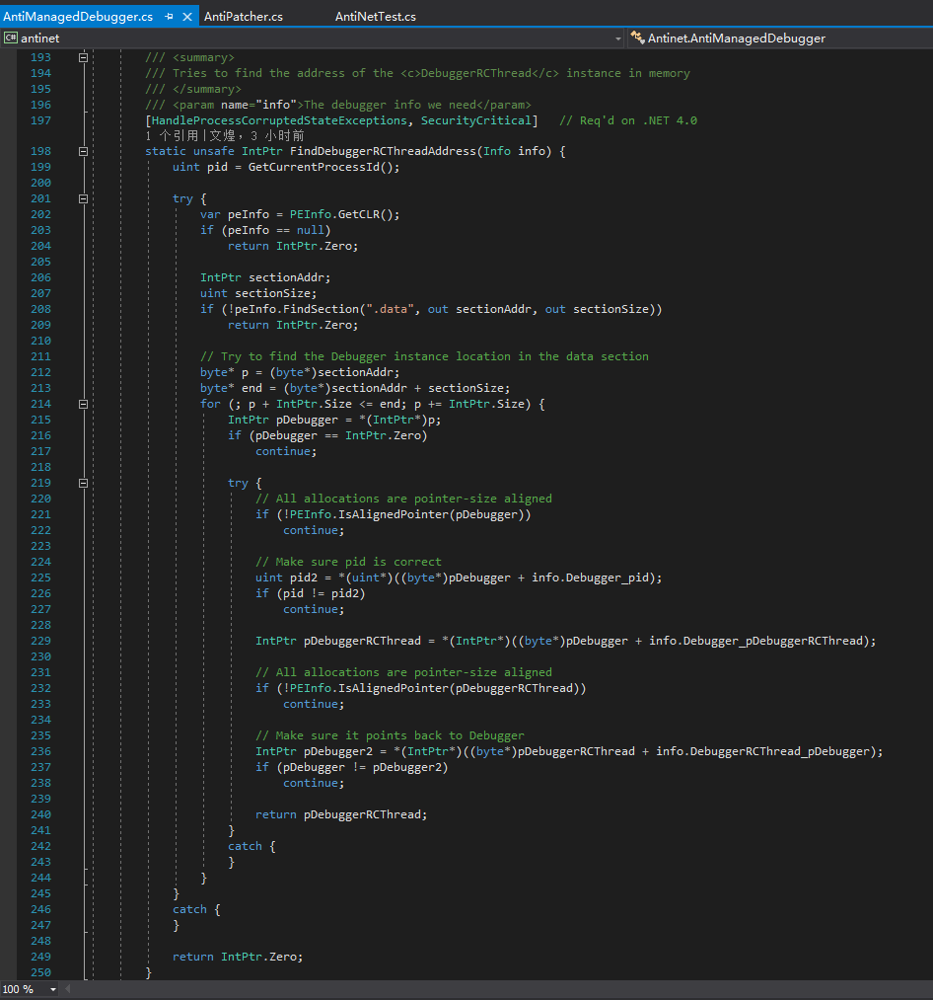

The meaning of the code and 0xd4d's own interpretation is exactly the same, can be seen against each other, here let's not talk about the principles and ideas of ending the debugger thread, let's see what exactly are those fields of 0xd4d operation.

### Learn more in the CLR Source Code

If I remember correctly, CoreCLR is open source on the CLR v4.6 branch. So the CLR v4.5 and later, CoreCLR are similar to them, see CoreCLR source code is much better than IDA decompilation. But CLR v4.0 is between CLR v2.0 and CLR v4.5, which can be considered a four unlike, we do not care for the moment, because now except XP can not install .

SSCLI20 corresponds to CLR v2.0, which is .

0xd4d does not mention the "keep-looping" field, we look for it in CoreCLR, you will find, in fact, can not find.

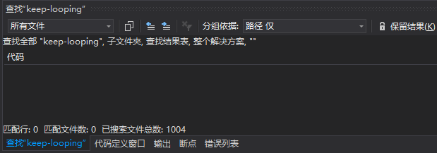

Could it be that 0xd4d is saying the wrong thing? Or is CoreCLR different? Of course not, with a project as large as CLR, many things can't be changed if you want to. We looked carefully in the declaration of DebuggerRCThread class, we can see a field called "m_run", this field is 0xd4d said "keep-looping" field.

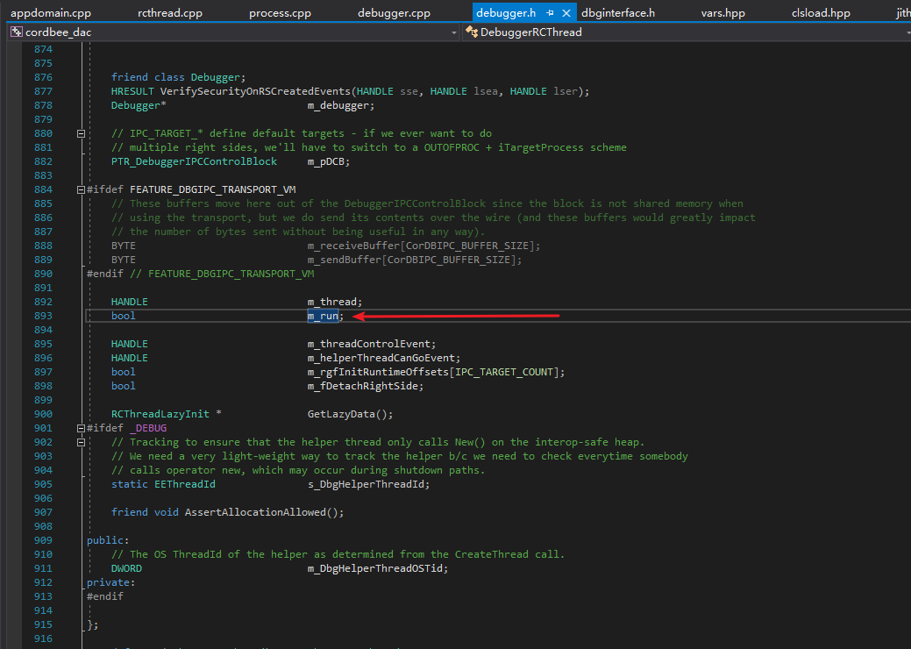

Now that we have found the "m_run" field, let's see what the comment "Signal debugger thread to exit" in AntiManagedDebugger.Initialize() does.

``` csharp
// Signal debugger thread to exit
*((byte*)pDebuggerRCThread + info.DebuggerRCThread_shouldKeepLooping) = 0;
IntPtr hEvent = *(IntPtr*)((byte*)pDebuggerRCThread + info.DebuggerRCThread_hEvent1);
SetEvent(hEvent);
// I added.：
// The above three lines of code emulate DebuggerRCThread::AsyncStop().
// Setting shouldKeepLooping to false will cause the attached debugger to lose contact with the process being debugged.
// As far as I can test, it doesn't matter if SetEvent is executed or not.
// Executing SetEvent on its own without setting shouldKeepLooping to false has little effect.
// But to fully emulate DebuggerRCThread::AsyncStop(), 0xd4d wrote all 3 lines of code, and we didn't make any other changes.
```

We select the m_run field in CoreCLR, point "find all references", you can quickly find "HRESULT DebuggerRCThread::AsyncStop(void)" this function.

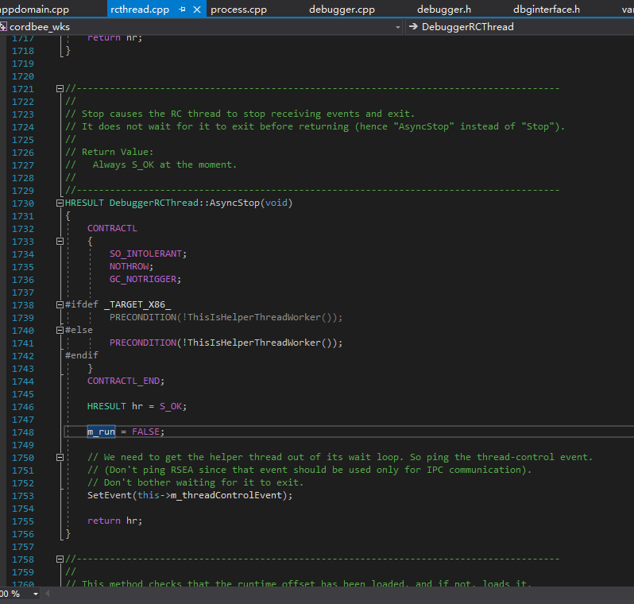

To figure it out, this code is simulating DebuggerRCThread::AsyncStop(), which is called by Debugger::StopDebugger(), so the purpose of ending an existing debugger can be achieved.

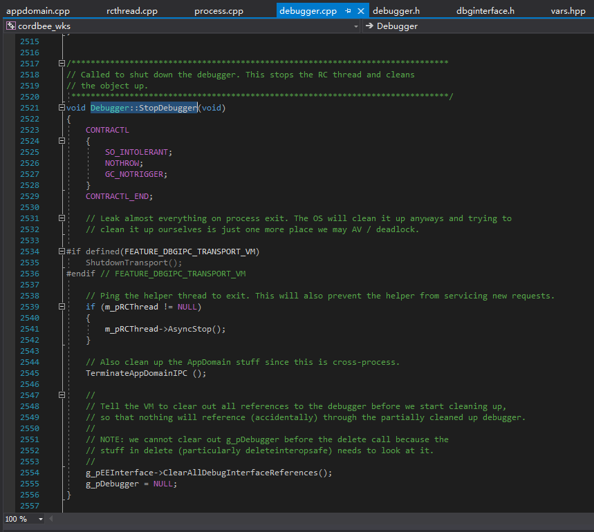

Of course, this doesn't stop the managed debugger from re-attaching to the current process. That's the point of the following code.

``` csharp
// This isn't needed but it will at least stop debuggers from attaching.
// Even if they did attach, they wouldn't get any messages since the debugger
// thread has exited. A user who tries to attach will be greeted with an
// "unable to attach due to different versions etc" message. This will not stop
// already attached debuggers. Killing the debugger thread will.
// Translation.
// It's not required, but it will at least stop the managed debugger attachment process.
// Even if the debugger attachment is successful, the debugger will not get any message because the debugger thread has quit.
// Attempting to attach a debugger will get a CORDBG_E_DEBUGGING_NOT_POSSIBLE ("Debugging is not possible due to incompatibility within the CLR implementation.") That kind of news.
// This (referring to setting the size field of the DebuggerIPCControlBlock to 0) does not stop the attached debugger. But ending a debugger thread can stop an attached debugger.
byte* pDebuggerIPCControlBlock = (byte*)*(IntPtr*)((byte*)pDebuggerRCThread + info.DebuggerRCThread_pDebuggerIPCControlBlock);
if (Environment.Version.Major == 2)
	// Under CLR 2.0, this is an array pointer (DebuggerIPCControlBlock**), while CLR 4.0+ is DebuggerIPCControlBlock*
	pDebuggerIPCControlBlock = (byte*)*(IntPtr*)pDebuggerIPCControlBlock;
// Set size field to 0. mscordbi!CordbProcess::VerifyControlBlock() will fail
// when it detects an unknown size.
// Translation.
// Set the size field to 0, mscordbi!CordbProcess::VerifyControlBlock() will fail when it finds the size unknown.
*(uint*)pDebuggerIPCControlBlock = 0;
// I added.
// mscordbi!CordbProcess::VerifyControlBlock() will be called when attaching the debugger, so after the size field is set to 0, the debugger cannot be attached!
```

We went straight to CordbProcess::VerifyControlBlock() in CoreCLR to see exactly what kind of validation there is.

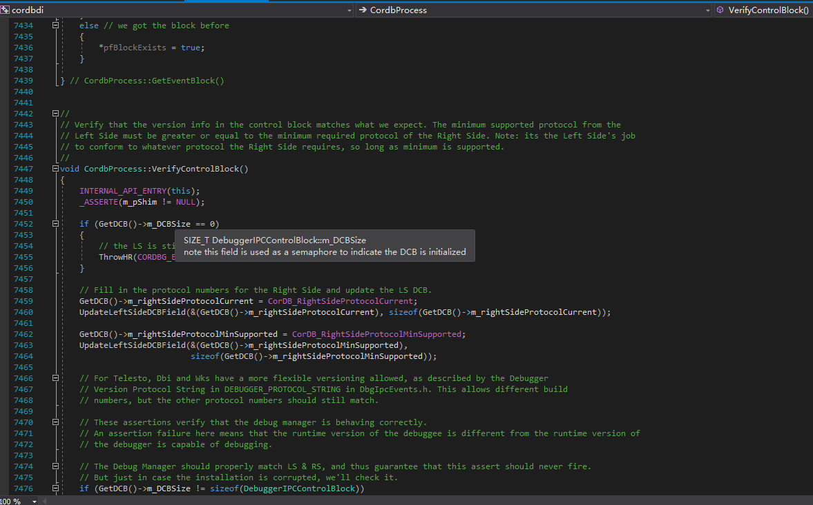
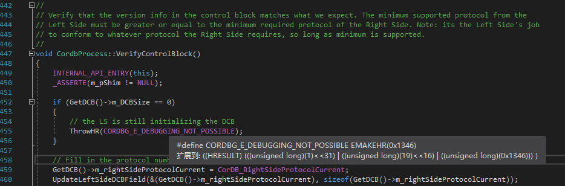
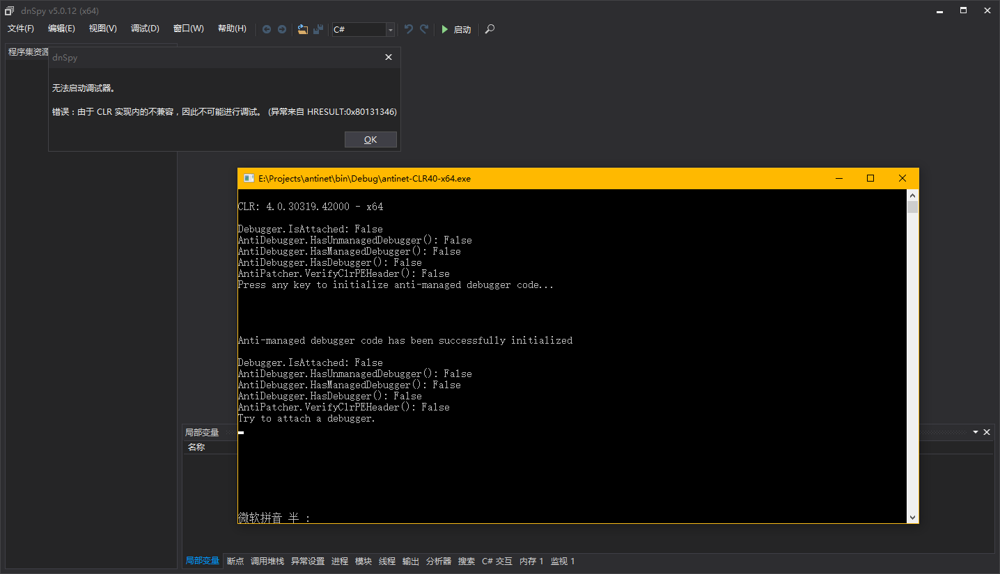

Let's see again where exactly m_DCBSize is defined and how to get it.

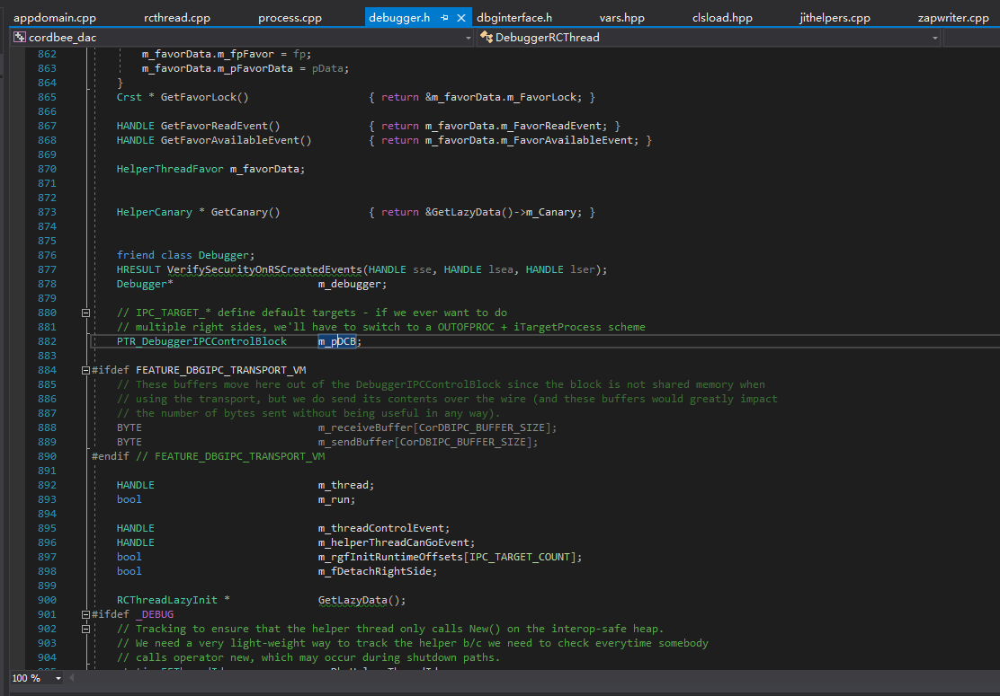
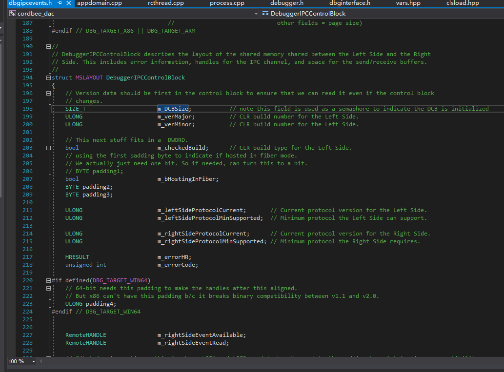

This code in 0xd4d will determine if it is currently .NET 2.0~3.5, after researching, we can find some reasons through SSCLI20.

Let's open the source code for SSCLI20 first. Search DebuggerRCThread in class view and find the field m\_rgDCB, which corresponds to the previous m\_pDCB, but with one more pointer.

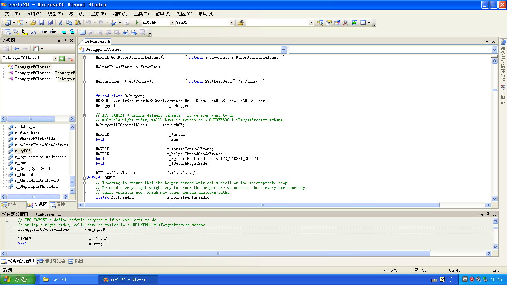

### debug sth. back and forth

0xd4d's code gets the address of the .data section through memory, we can directly modify the header of the section to achieve the purpose of anti-debugging.

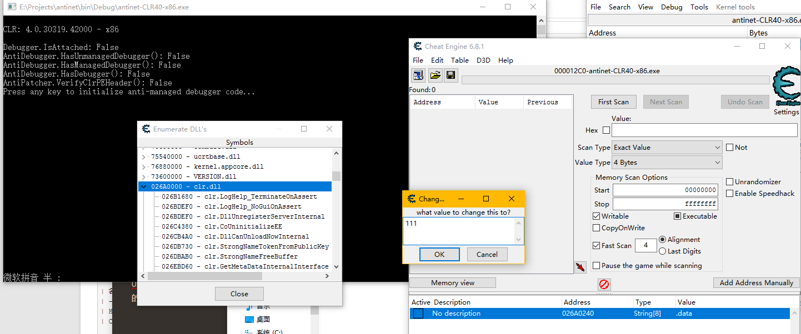
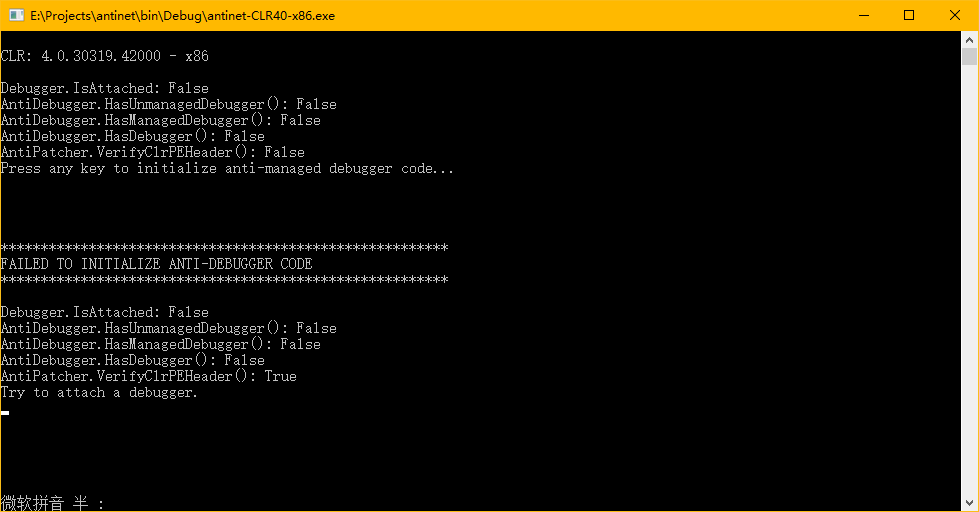

So we have a lot of ways to get past this back-and-forth debugging, like.
- If the .data section does not exist, exit the process directly, as the .data section is theoretically certain to exist.
- Read the RVA and Size of the .data section directly from the file, and then scan the corresponding location in memory.
- Verify that the PE header has not been modified, and if it has been modified, exit the process directly.
- ...

One of the most effective ways to verify the PE head is this method, why? Since we can't just delete the .data feature, we can forge the feature to make a fake node header and have AntiManagedDebugger modify it to something other than the real DebuggerRCThread instance. If we make sure that the PE header is consistent with the file, then we can conclude that the DebuggerRCThread instance we found via the .data section is real and valid.

This anti-debugging approach is very easy to detect again, so can we just change all the references to this global variable? The answer is no. I've done all sorts of tests, such as directly copying objects, before or after DllMain modifications, that have caused direct problems with the debugger.

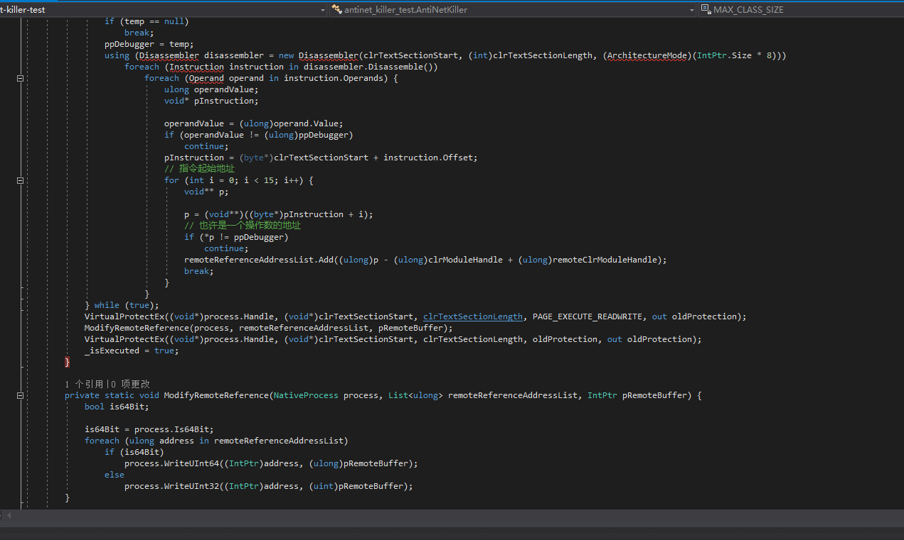
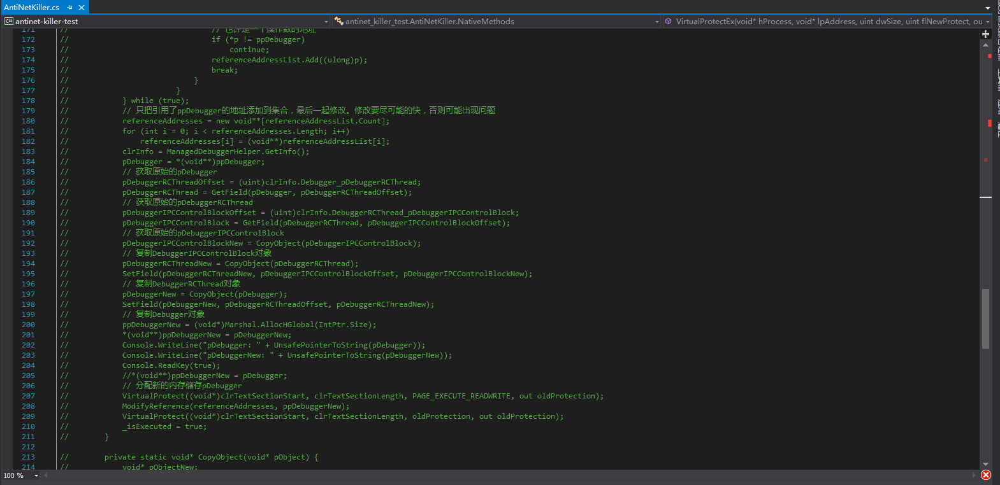

The code was written a long time ago, and I don't want to test it anymore. This method is extremely cumbersome, so I might as well just find the anti-debugging place and patch it off.

## Improved Antinet

### AntiPatcher

Since the AntiManagedDebugger written by 0xd4d has some minor bugs or something, we can add an AntiPatcher class to fix it.

The AntiPatcher class should verify that the PE header of the CLR module has not been modified.

``` csharp
private static void* _clrModuleHandle;
private static uint _clrPEHeaderCrc32Original;
private static bool _isInitialized;

private static void Initialize() {
	StringBuilder stringBuilder;
	byte[] clrFile;

	if (_isInitialized)
		return;
	switch (Environment.Version.Major) {
	case 2:
		_clrModuleHandle = GetModuleHandle("mscorwks.dll");
		break;
	case 4:
		_clrModuleHandle = GetModuleHandle("clr.dll");
		break;
	default:
		throw new NotSupportedException();
	}
	if (_clrModuleHandle == null)
		throw new InvalidOperationException();
	stringBuilder = new StringBuilder((int)MAX_PATH);
	if (!GetModuleFileName(_clrModuleHandle, stringBuilder, MAX_PATH))
		throw new InvalidOperationException();
	clrFile = File.ReadAllBytes(stringBuilder.ToString());
	fixed (byte* pPEImage = clrFile)
		_clrPEHeaderCrc32Original = DynamicCrc32.Compute(CopyPEHeader(pPEImage));
	_isInitialized = true;
}

private static byte[] CopyPEHeader(void* pPEImage) {
	uint imageBaseOffset;
	uint length;
	byte[] peHeader;

	GetPEInfo(pPEImage, out imageBaseOffset, out length);
	peHeader = new byte[length];
	fixed (byte* pPEHeader = peHeader) {
		for (uint i = 0; i < length; i++)
			pPEHeader[i] = ((byte*)pPEImage)[i];
		// Copy PE head
		*(void**)(pPEHeader + imageBaseOffset) = null;
		// Clears the ImageBase field of the optional header, which will change and cannot be used for checksum
	}
	return peHeader;
}

private static void GetPEInfo(void* pPEImage, out uint imageBaseOffset, out uint length) {
	byte* p;
	ushort optionalHeaderSize;
	bool isPE32;
	uint sectionsCount;
	void* pSectionHeaders;

	p = (byte*)pPEImage;
	p += *(uint*)(p + 0x3C);
	// NtHeader
	p += 4 + 2;
	// skip Signature + Machine
	sectionsCount = *(ushort*)p;
	p += 2 + 4 + 4 + 4;
	// skip NumberOfSections + TimeDateStamp + PointerToSymbolTable + NumberOfSymbols
	optionalHeaderSize = *(ushort*)p;
	p += 2 + 2;
	// skip SizeOfOptionalHeader + Characteristics
	isPE32 = *(ushort*)p == 0x010B;
	imageBaseOffset = isPE32 ? (uint)(p + 0x1C - (byte*)pPEImage) : (uint)(p + 0x18 - (byte*)pPEImage);
	p += optionalHeaderSize;
	// skip OptionalHeader
	pSectionHeaders = (void*)p;
	length = (uint)((byte*)pSectionHeaders + 0x28 * sectionsCount - (byte*)pPEImage);
}
```

Call Initialize() to get CRC32 from the file.

Let's write another method to verify if there is such a PE header in memory.

``` csharp
/// <summary>
/// Check if the PE header of the CLR module has been modified
/// </summary>
/// <returns> If modified, return <see langword="true"/></returns>
public static bool VerifyClrPEHeader() {
	return DynamicCrc32.Compute(CopyPEHeader(_clrModuleHandle)) != _clrPEHeaderCrc32Original;
}
```

### AntiDebugger

First of all, this class should have the functionality of the original AntiManagedDebugger, so we don't remove the AntiManagedDebugger class, and directly make a wrapper for this class.

``` csharp
private static bool _isManagedDebuggerPrevented;

/// <summary>
/// Prevent the managed debugger from debugging the current process。
/// </summary>
/// <returns></returns>
public static bool PreventManagedDebugger() {
	if (_isManagedDebuggerPrevented)
		return true;
	_isManagedDebuggerPrevented = AntiManagedDebugger.Initialize();
	return _isManagedDebuggerPrevented;
}
```

We then add a method for detecting unmanaged vs. managed debuggers.

``` csharp
/// <summary>
/// Check if any type of debugger exists.。
/// </summary>
/// <returns></returns>
public static bool HasDebugger() {
	return HasUnmanagedDebugger() || HasManagedDebugger();
	// Checking for the presence of unmanaged debuggers is faster and more efficient, and managed debuggers can be detected under CLR40.
}
```

HasUnmanagedDebugger implementation is very simple, we will xjun XAntiDebug syscall part of the delete on the line. syscall use the vulnerability of that part into C# code to take some time, for the time being did not do, and then have time to do again. After all, unmanaged debuggers debugging .NET programs are extremely painful, and our Anti targets should be primarily hosted debuggers like dnSpy.

``` csharp
/// <summary>
/// Check for the presence of unmanaged debuggers.
/// Under CLR20, use the managed debugger to debug the process, this method returns <see langword="false"/> because CLR20 does not use the normal debugging process and the Win32 function cannot detect the debugger.
/// Use the managed debugger to debug the process under CLR40, this method returns <see langword="true"/>.
/// </summary>
/// <returns></returns>
public static bool HasUnmanagedDebugger() {
	bool isDebugged;

	if (IsDebuggerPresent())
		return true;
	if (!CheckRemoteDebuggerPresent(GetCurrentProcess(), &isDebugged))
		return true;
	if (isDebugged)
		return true;
	try {
		CloseHandle((void*)0xDEADC0DE);
	}
	catch {
		return true;
	}
	return false;
}
```

Next came the implementation of HasManagedDebugger(), and this was the big one. The most effective and convenient way to detect the hosted debugger is to call Debugger.IsAttached, unfortunately this is too easy to modify, we just need to detect if it is modified. The good news is that the implementation of Debugger.IsAttached is actually inside the CLR and is also a [MethodImpl(MethodImplOptions.InternalCall)], meaning that the native code address of this method is the address of a function in the CLR module. As to why this is so, not the focus of this article, no explanation here, can research CoreCLR for yourself.

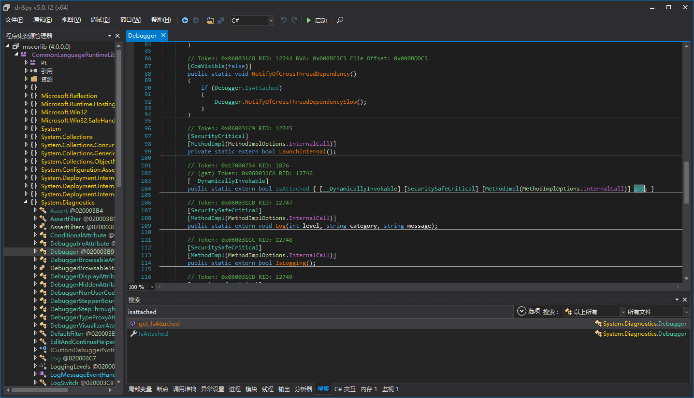
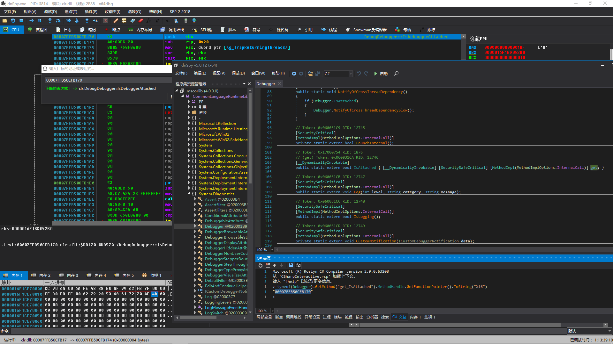

We add the initialization code, read the original code directly from clr.dll/mscorwks.dll, and calculate CRC32.

``` csharp
private delegate bool IsDebuggerAttachedDelegate();

private static bool _isManagedDebuggerPrevented;
private static bool _isManagedInitialized;
private static byte* _pIsDebuggerAttached;
private static IsDebuggerAttachedDelegate _isDebuggerAttached;
private static uint _isDebuggerAttachedLength;
private static uint _isDebuggerAttachedCrc32;

private static void InitializeManaged() {
	void* clrModuleHandle;
	StringBuilder stringBuilder;
	byte[] clrFile;

	if (_isManagedInitialized)
		return;
	switch (Environment.Version.Major) {
	case 2:
		_pIsDebuggerAttached = (byte*)typeof(Debugger).GetMethod("IsDebuggerAttached", BindingFlags.NonPublic | BindingFlags.Static).MethodHandle.GetFunctionPointer();
		// Unlike .NET 4.x, this Debugger.IsAttached get attribute calls IsDebuggerAttached(), not straight inside the CLR.
		clrModuleHandle = GetModuleHandle("mscorwks.dll");
		break;
	case 4:
		_pIsDebuggerAttached = (byte*)typeof(Debugger).GetMethod("get_IsAttached").MethodHandle.GetFunctionPointer();
		// Debugger.IsAttached's get property is a method with [MethodImpl(MethodImplOptions.InternalCall)] properties, meaning that the implementation is inside the CLR and there is no stub that points directly inside the CLR.
		// With x64dbg debugging, it is known that Debugger.get_IsAttached() corresponds to clr!DebugDebugger::IsDebuggerAttached().
		clrModuleHandle = GetModuleHandle("clr.dll");
		break;
	default:
		throw new NotSupportedException();
	}
	_isDebuggerAttached = (IsDebuggerAttachedDelegate)Marshal.GetDelegateForFunctionPointer((IntPtr)_pIsDebuggerAttached, typeof(IsDebuggerAttachedDelegate));
	if (clrModuleHandle == null)
		throw new InvalidOperationException();
	stringBuilder = new StringBuilder((int)MAX_PATH);
	if (!GetModuleFileName(clrModuleHandle, stringBuilder, MAX_PATH))
		throw new InvalidOperationException();
	clrFile = File.ReadAllBytes(stringBuilder.ToString());
	// Read the contents of the CLR module file
	fixed (byte* pPEImage = clrFile) {
		PEInfo peInfo;
		uint isDebuggerAttachedRva;
		uint isDebuggerAttachedFoa;
		byte* pCodeStart;
		byte* pCodeCurrent;
		ldasm_data ldasmData;
		bool is64Bit;
		byte[] opcodes;

		peInfo = new PEInfo(pPEImage);
		isDebuggerAttachedRva = (uint)(_pIsDebuggerAttached - (byte*)clrModuleHandle);
		isDebuggerAttachedFoa = peInfo.ToFOA(isDebuggerAttachedRva);
		pCodeStart = pPEImage + isDebuggerAttachedFoa;
		pCodeCurrent = pCodeStart;
		is64Bit = sizeof(void*) == 8;
		opcodes = new byte[0x200];
		// Allocate memory that is much larger than the actual function size
		while (true) {
			uint length;

			length = Ldasm.ldasm(pCodeCurrent, &ldasmData, is64Bit);
			if ((ldasmData.flags & Ldasm.F_INVALID) != 0)
				throw new NotSupportedException();
			CopyOpcode(&ldasmData, pCodeCurrent, opcodes, (uint)(pCodeCurrent - pCodeStart));
			if (*pCodeCurrent == 0xC3) {
				// First ret command found.
				pCodeCurrent += length;
				break;
			}
			pCodeCurrent += length;
		}
		// Copy Opcode until the first ret appears.
		_isDebuggerAttachedLength = (uint)(pCodeCurrent - pCodeStart);
		fixed (byte* pOpcodes = opcodes)
			_isDebuggerAttachedCrc32 = DynamicCrc32.Compute(pOpcodes, _isDebuggerAttachedLength);
	}
	_isManagedInitialized = true;
}

private static void CopyOpcode(ldasm_data* pLdasmData, void* pCode, byte[] opcodes, uint offset) {
	for (byte i = 0; i < pLdasmData->opcd_size; i++)
		opcodes[offset + pLdasmData->opcd_offset + i] = ((byte*)pCode)[pLdasmData->opcd_offset + i];
}
```

Ldasm was used here, and it was also after looking at xjun's XAntiDebug project that I learned about the disassembly engine. The decompile engine is very small, really only has 1 function, and I've attached the code I translated into C#.

``` csharp
/// <summary>
/// Disassemble one instruction
/// </summary>
/// <param name="code">pointer to the code for disassemble</param>
/// <param name="ld">pointer to structure ldasm_data</param>
/// <param name="is64">set this flag for 64-bit code, and clear for 32-bit</param>
/// <returns>length of instruction</returns>
public static uint ldasm(void* code, ldasm_data* ld, bool is64) {
	byte* p = (byte*)code;
	byte s, op, f;
	byte rexw, pr_66, pr_67;

	s = rexw = pr_66 = pr_67 = 0;

	/* dummy check */
	if (code == null || ld == null)
		return 0;

	/* init output data */
	*ld = new ldasm_data();

	/* phase 1: parse prefixies */
	while ((cflags(*p) & OP_PREFIX) != 0) {
		if (*p == 0x66)
			pr_66 = 1;
		if (*p == 0x67)
			pr_67 = 1;
		p++; s++;
		ld->flags |= F_PREFIX;
		if (s == 15) {
			ld->flags |= F_INVALID;
			return s;
		}
	}

	/* parse REX prefix */
	if (is64 && *p >> 4 == 4) {
		ld->rex = *p;
		rexw = (byte)((ld->rex >> 3) & 1);
		ld->flags |= F_REX;
		p++; s++;
	}

	/* can be only one REX prefix */
	if (is64 && *p >> 4 == 4) {
		ld->flags |= F_INVALID;
		s++;
		return s;
	}

	/* phase 2: parse opcode */
	ld->opcd_offset = (byte)(p - (byte*)code);
	ld->opcd_size = 1;
	op = *p++; s++;

	/* is 2 byte opcode? */
	if (op == 0x0F) {
		op = *p++; s++;
		ld->opcd_size++;
		f = cflags_ex(op);
		if ((f & OP_INVALID) != 0) {
			ld->flags |= F_INVALID;
			return s;
		}
		/* for SSE instructions */
		if ((f & OP_EXTENDED) != 0) {
			op = *p++; s++;
			ld->opcd_size++;
		}
	}
	else {
		f = cflags(op);
		/* pr_66 = pr_67 for opcodes A0-A3 */
		if (op >= 0xA0 && op <= 0xA3)
			pr_66 = pr_67;
	}

	/* phase 3: parse ModR/M, SIB and DISP */
	if ((f & OP_MODRM) != 0) {
		byte mod = (byte)(*p >> 6);
		byte ro = (byte)((*p & 0x38) >> 3);
		byte rm = (byte)(*p & 7);

		ld->modrm = *p++; s++;
		ld->flags |= F_MODRM;

		/* in F6,F7 opcodes immediate data present if R/O == 0 */
		if (op == 0xF6 && (ro == 0 || ro == 1))
			f |= OP_DATA_I8;
		if (op == 0xF7 && (ro == 0 || ro == 1))
			f |= OP_DATA_I16_I32_I64;

		/* is SIB byte exist? */
		if (mod != 3 && rm == 4 && !(!is64 && pr_67 != 0)) {
			ld->sib = *p++; s++;
			ld->flags |= F_SIB;

			/* if base == 5 and mod == 0 */
			if ((ld->sib & 7) == 5 && mod == 0) {
				ld->disp_size = 4;
			}
		}

		switch (mod) {
		case 0:
			if (is64) {
				if (rm == 5) {
					ld->disp_size = 4;
					if (is64)
						ld->flags |= F_RELATIVE;
				}
			}
			else if (pr_67 != 0) {
				if (rm == 6)
					ld->disp_size = 2;
			}
			else {
				if (rm == 5)
					ld->disp_size = 4;
			}
			break;
		case 1:
			ld->disp_size = 1;
			break;
		case 2:
			if (is64)
				ld->disp_size = 4;
			else if (pr_67 != 0)
				ld->disp_size = 2;
			else
				ld->disp_size = 4;
			break;
		}

		if (ld->disp_size != 0) {
			ld->disp_offset = (byte)(p - (byte*)code);
			p += ld->disp_size;
			s += ld->disp_size;
			ld->flags |= F_DISP;
		}
	}

	/* phase 4: parse immediate data */
	if (rexw != 0 && (f & OP_DATA_I16_I32_I64) != 0)
		ld->imm_size = 8;
	else if ((f & OP_DATA_I16_I32) != 0 || (f & OP_DATA_I16_I32_I64) != 0)
		ld->imm_size = (byte)(4 - (pr_66 << 1));

	/* if exist, add OP_DATA_I16 and OP_DATA_I8 size */
	ld->imm_size += (byte)(f & 3);

	if (ld->imm_size != 0) {
		s += ld->imm_size;
		ld->imm_offset = (byte)(p - (byte*)code);
		ld->flags |= F_IMM;
		if ((f & OP_RELATIVE) != 0)
			ld->flags |= F_RELATIVE;
	}

	/* instruction is too long */
	if (s > 15)
		ld->flags |= F_INVALID;

	return s;
}
```

There are also a bunch of definitions that you can read for yourself in my modified antinet, which will not be posted here.

At this point, we can add code to check if a hosted debugger exists.

``` csharp
/// <summary>
/// Use clr!DebugDebugger::IsDebuggerAttached() to check if a hosted debugger exists.
/// Note that this method does not detect the presence of unmanaged debuggers (such as OllyDbg, x64dbg).
/// </summary>
/// <returns></returns>
public static bool HasManagedDebugger() {
	byte[] opcodes;
	byte* pCodeStart;
	byte* pCodeCurrent;
	byte* pCodeEnd;
	ldasm_data ldasmData;
	bool is64Bit;

	InitializeManaged();
	if (_isDebuggerAttached())
		// There must be a hosted debugger attached at this point.
		return true;
	// There is no guarantee that the managed debugger is not debugging the current process
	if (_pIsDebuggerAttached[0] == 0x33 && _pIsDebuggerAttached[1] == 0xC0 && _pIsDebuggerAttached[2] == 0xC3)
		// This is a feature of dnSpy's anti-debugging
		return true;
	// Possible feature change, further verification
	opcodes = new byte[_isDebuggerAttachedLength];
	pCodeStart = _pIsDebuggerAttached;
	pCodeCurrent = pCodeStart;
	pCodeEnd = _pIsDebuggerAttached + _isDebuggerAttachedLength;
	is64Bit = sizeof(void*) == 8;
	while (true) {
		uint length;

		length = Ldasm.ldasm(pCodeCurrent, &ldasmData, is64Bit);
		if ((ldasmData.flags & Ldasm.F_INVALID) != 0)
			throw new NotSupportedException();
		CopyOpcode(&ldasmData, pCodeCurrent, opcodes, (uint)(pCodeCurrent - pCodeStart));
		pCodeCurrent += length;
		if (pCodeCurrent == pCodeEnd)
			break;
	}
	// Reproduce Opcodes
	if (DynamicCrc32.Compute(opcodes) ! = _isDebuggerAttachedCrc32)
		// If CRC32 is not equal, then CLR may have been patched
		return true;
	return false;
}
```

Some may ask why we don't just copy the machine code to the buffer to verify it, but only take the Opcode in it, because we have to take into account the existence of the repositioning table, so we can only detect if the Opcode has been modified, and to detect if the operands have been modified, the implementation is a bit of a problem.

Previously it was considered to verify the entire .text section of the CLR, but it failed. This part of the code can be found in my submission history at github, the first few submissions have it in [AntiPatcher.cs](https://github.com/wwh1004/antinet/blob/a030b2fae495154391c50bac7a1712d2be59fc23/antinet/AntiPatcher.cs), only it was commented out because it failed.

Why use.

``` csharp
if (_isDebuggerAttached())
	// There must be a hosted debugger attached at this point.
	return true;
```

Instead.

``` csharp
if (Debugger.IsAttched)
	// There must be a hosted debugger attached at this point.
	return true;
```

Because the get attribute of Debugger.IsAttched in .NET 2.0~3.5 is a hosted method, there is the possibility of being directly patched, which can lead to vulnerabilities in the detection of hosted debuggers under .

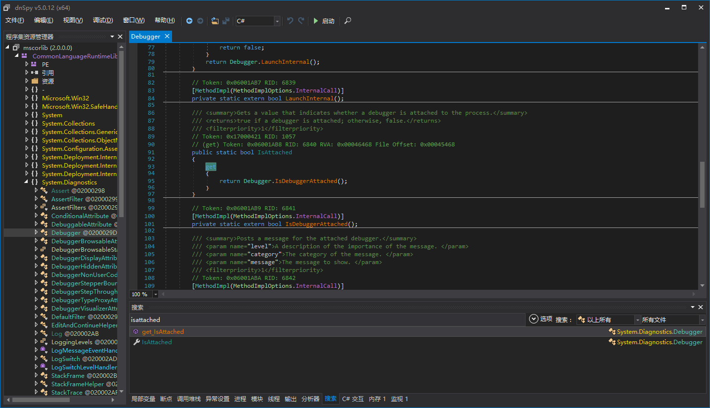
