# .NET JIT shelling guide and tool source code

## Foreword

JIT unpacking may be difficult for many people, because there is not much introduction on the Internet, and some tool source code is limited to jitDumper3 of yck1509 (author of ConfuserEx) and ManagedJiter and DNGuard_HVM_Unpacker modified by CodeCracker based on this tool There is Simple_MSIL_Decryptor (very unstable) written by CodeCracker himself.

To study JIT unpacking, you need to understand the clr source code. For .NET 2.0 ~ 3.5, you can see IDA decompile mscorwks.dll and mscorjit.dll or the source code of SSCLI. For .NET 4.0+, you can see the source code of coreclr. If I remember correctly, coreclr was forked from .NET 4.6.

.NET can be said to have 3 major versions, respectively .NET 2.0 .NET 4.0 .NET 4.5, these three versions of clr have changed a lot. The clr name of .NET 2.0 is mscorwks.dll, and the jit name is mscorjit.dll. In .NET 4.0, the clr name becomes clr.dll, the jit name becomes clrjit.dll, and there are a few changes in clr and jit internal structures. The .NET 4.5 clr name and jit name are the same as .NET 4.0, but the internal structure has changed a lot. The most obvious is the definition of the virtual table structure and function of the interface ICorJitInfo provided by clr to the jit compilation information NET 4.0 is completely different. Therefore, several tools released by CodeCracker need to be installed with NetBox or virtual machine to run .NET 4.0. Those tools of CodeCracker do not support .NET 4.5+.

** The content to be introduced in this article is correct in .NET 2.0 ~ 4.72. There are some changes in the latest .NET 4.8, but I did not go to see any changes, so this article does not discuss .NET 4.8. ** My tool won't work, and I'm too lazy to modify my tool. The source code will be posted in the second half of the article. It was uploaded to github a long time ago, and no instructions have been written.

## Introduction to CLR and JIT

In this part, I recommend reading the coreclr documentation [Book of the Runtime] (https://github.com/dotnet/coreclr/blob/master/Documentation/botr/README.md), very good information, for any version of CLR Yes, I do n’t need to repeat it.

## JIT compilation process

This thing should be very important and must be understood, otherwise the article will not understand in many places, and the source code of the shelling machine will not understand. Here is still recommended to see the coreclr documentation, [RyuJIT Ooverview] (https://github.com/dotnet/coreclr/blob/master/Documentation/botr/ryujit-overview.md) Although RyuJIT is .NET 4.5 or .NET 4.6 only Yes, but the compilation process of the old version of JIT is almost the same.

[Phases of RyuJIT] (https://github.com/dotnet/coreclr/blob/master/Documentation/botr/ryujit-overview.md#phases-of-ryujit) If you do n’t understand it, you can turn it directly, although there are many processes However, the only two stages to be understood are the Pre-import and Importation stages. These two stages will also call the ICorJitInfo interface, which is what we want to study.

### From DoPrestub to compileMethod

Now we can open the coreclr source code and find MethodDesc :: DoPrestub. The CLR will generate a stub for each method, and the stub will eventually jump to MethodDesc :: DoPrestub, which calls the JIT compiler from MethodDesc :: DoPrestub. Before compilation, MethodDesc :: DoPrestub will check the parameters and determine the method type, including the detection of generic parameters of generic methods.

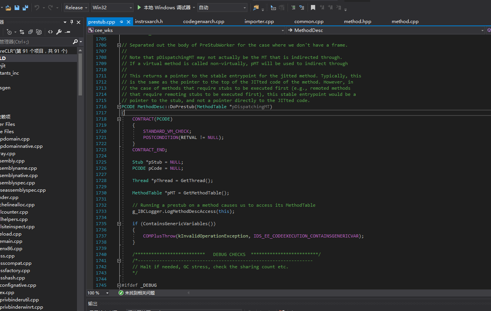

Eventually, DoPrestub will go to the compileMethod of jit's export function, and the corresponding code CILJit :: compileMethod can also be found in coreclr

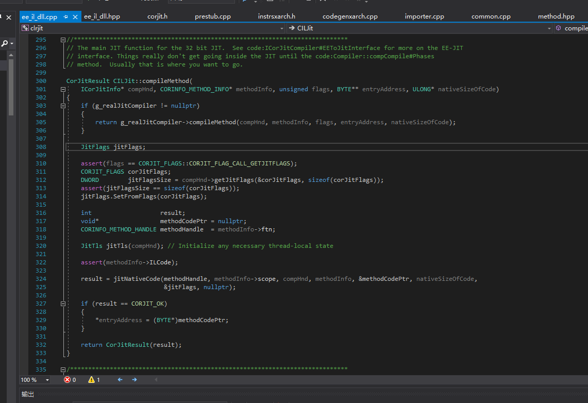

It can be said that all shells are decrypted through the Hook ICorJitCompiler virtual table without exception.

Some people may ask why not Hook lower-level functions, such as jitNativeCode, Compiler :: compCompile, etc. The reason is still very simple, Inline Hook these functions are very troublesome. Finding the addresses of these functions must also be matched by features. If the JIT changes a bit, the features will change, and matching will fail. This is one of the reasons why CodeCracker's sheller cannot run on .NET 4.5+.

Some people may ask Hook such a shallow export function, will there be an unsafe situation, the answer is no, because some shells also implement the ICorJitInfo interface, and decrypt the ICorJitInfo interface. The IL directly dumped is correct, but the token in the IL will be encrypted. Therefore, there is no basis for the decryption of the lower level Compiler :: compCompile of the shelling machine and the Hook lower level function on the Internet. The function of the Hook layer is the same, the IL to the dump will not change, the token is always Encrypted and decrypted operations are still performed at a lower level, and will not be restored to IL after decryption! ! !

CILJit :: compileMethod will not perform the actual compilation, it will call jitNativeCode and the Compiler class will be instantiated by jitNativeCode. In fact, jitNativeCode is also a wrapper responsible for calling Compiler :: compCompile.

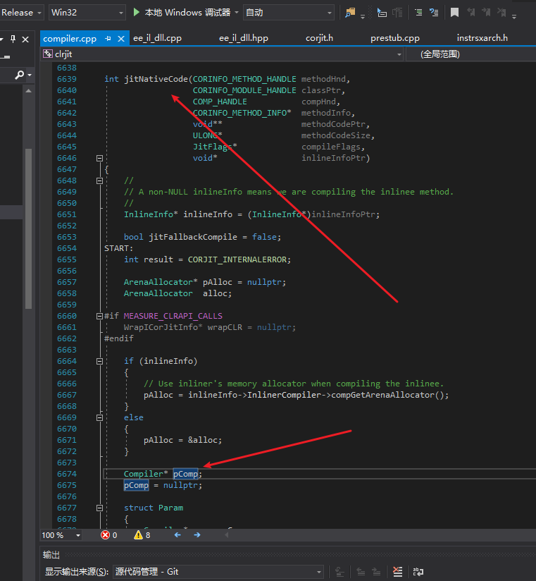

### Inside JIT

First post the JIT flow chart, if you don't understand it, you can look at this.

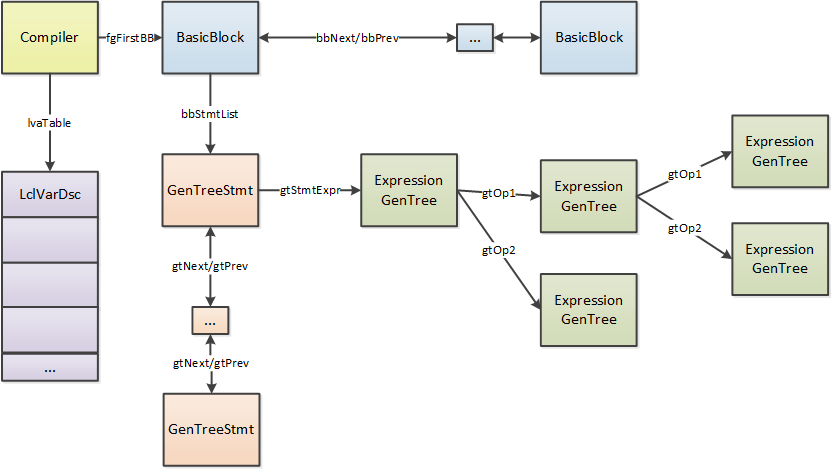

Compiler :: compCompile has two overloaded methods, let's start with the most superficial.

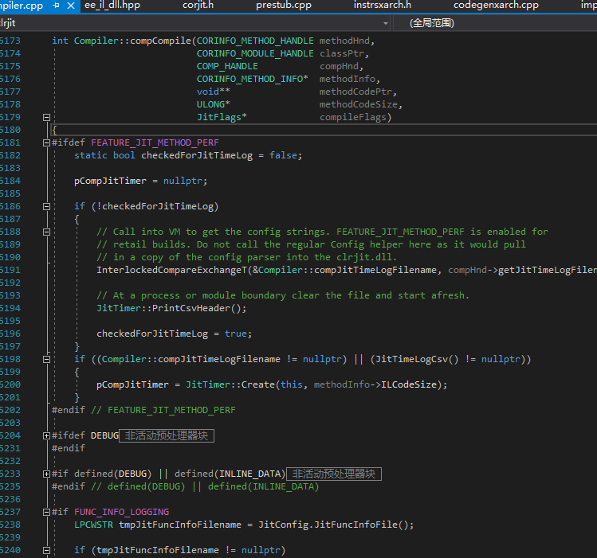

This is what jitNativeCode will call. CodeCracker's shelling machine achieves the effect of hook Compiler :: compCompile by calling Compiler :: compCompile in hook jitNativeCode, and dump IL is performed here.

The Compiler :: compCompile is still a wrapper, and there is no actual implementation.

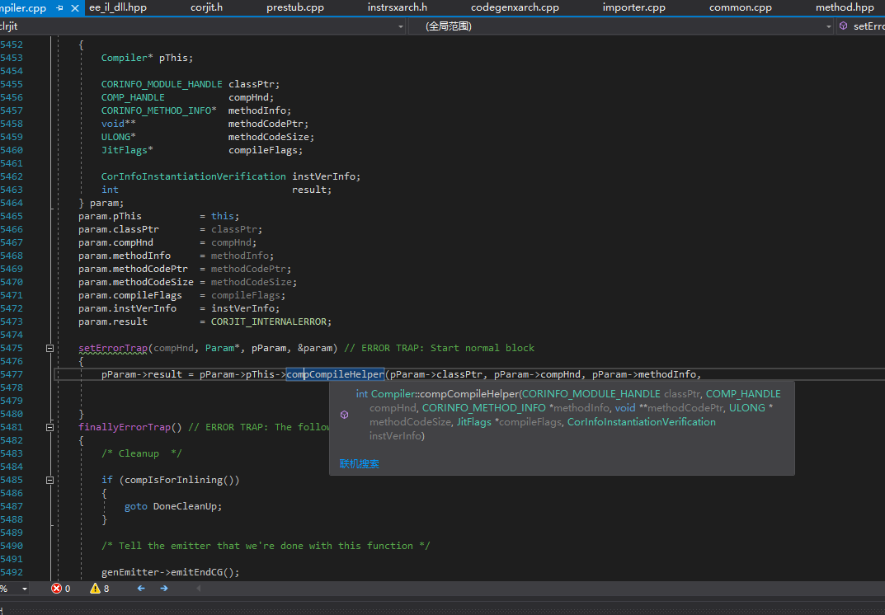

Next is Compiler :: compCompileHelper called by this function. This function initializes some information, EHcount is the number of exception handling clauses, and maxStack is the maximum number of stack elements.

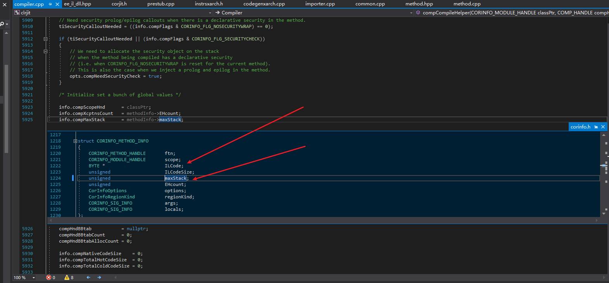

Next is the local variable table initialization.

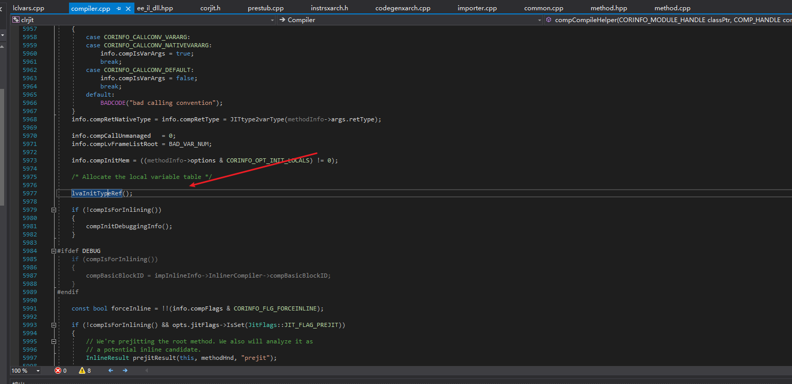

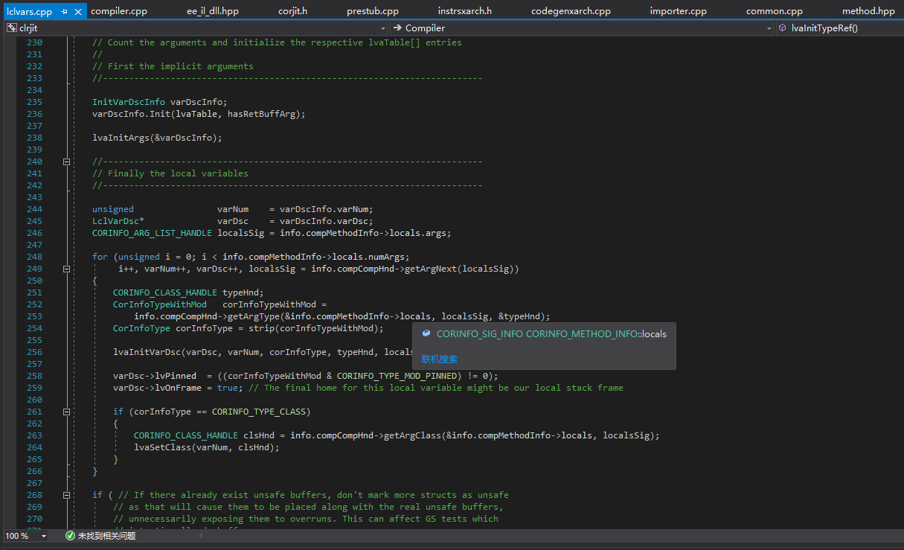

The locals are local variable information, and the corresponding structure is CORINFO_SIG_INFO.

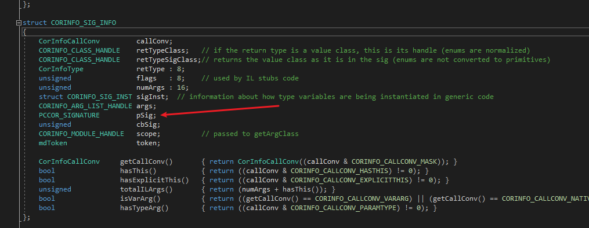

The field pSig points to LocalSig in the #Blob heap. The sheller can use this to dump local variable signatures. Of course, the shell can also directly erase the LocalSig, and provide local variable information to jit through the interface of ICorJitInfo, because jit also uses the interface of ICorJitInfo to obtain local variable information, rather than directly parse CORINFO_SIG_INFO.pSig. So in some cases, the local variable signature obtained by dump pSig is invalid. How to decrypt or dump it? Everyone has studied it by myself, and I will not disclose that much.

Now we return to Compiler :: compCompileHelper and continue to explore the compilation process. We can see that the function fgFindBasicBlocks is called

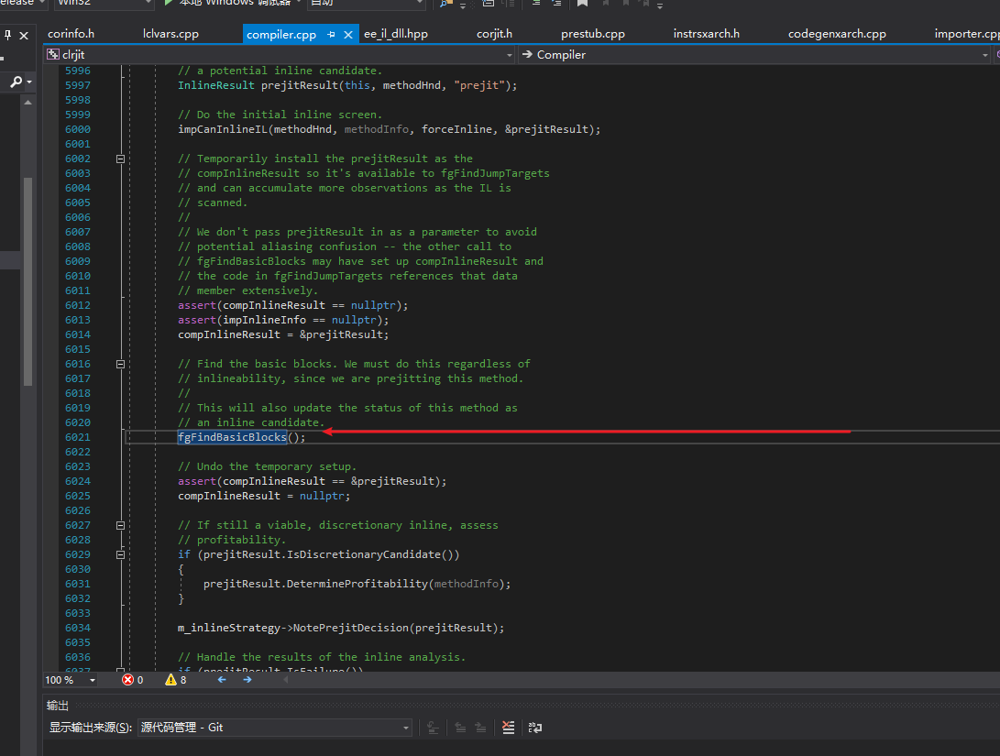

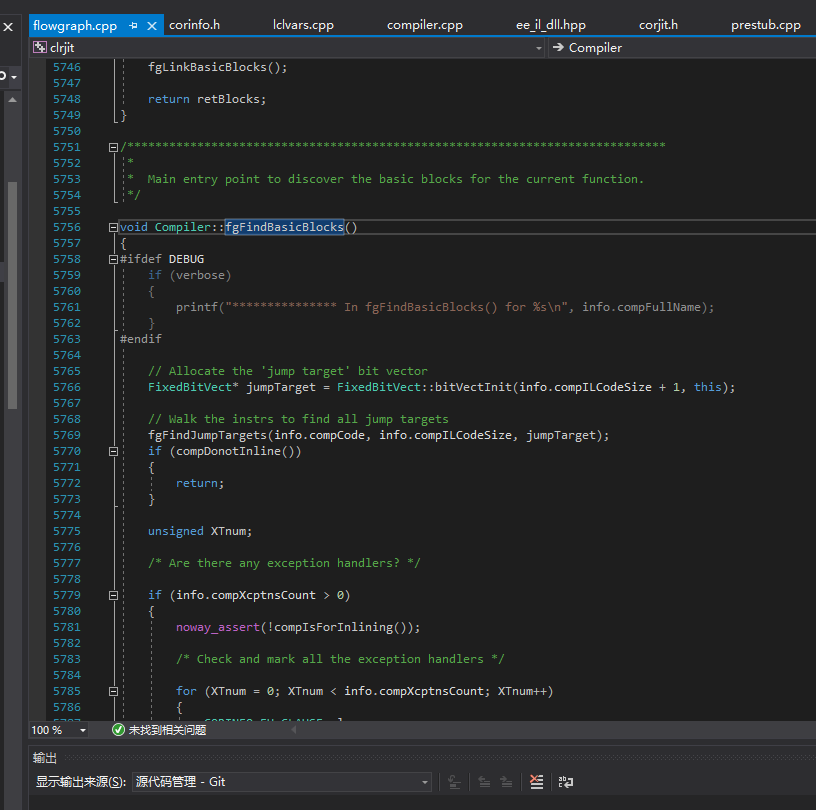

fgFindBasicBlocks is the entry function for generating basic blocks. Like my control flow analysis library, the basic blocks must be generated to continue the analysis. This function will call ICorJitInfo :: getEHinfo to get information about the exception handling clause.

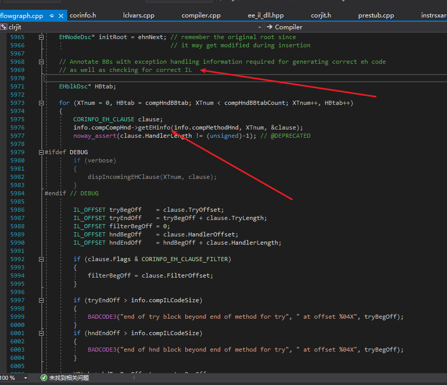

This CORINFO_EH_CLAUSE structure is also what we need for shelling.

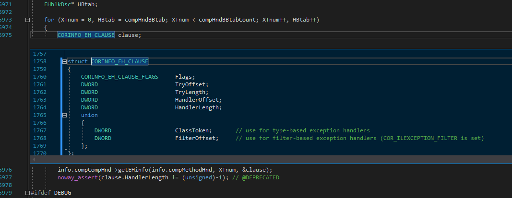

Now, we have obtained the three major information required by the decryption method body, IL code, local variables, and exception handling clauses. But remember I said earlier that if the operand is a token in the IL instruction, the token is encrypted? Yes, so we have to go deeper into JIT.

We should come to importer.cpp, where JIT will convert the IL instruction to GenTree through ICorJitInfo, where the token needs to be converted into the JIT internal definition, so the token will not be restored into the IL code, and the self-written code needs to be decrypted and restored.

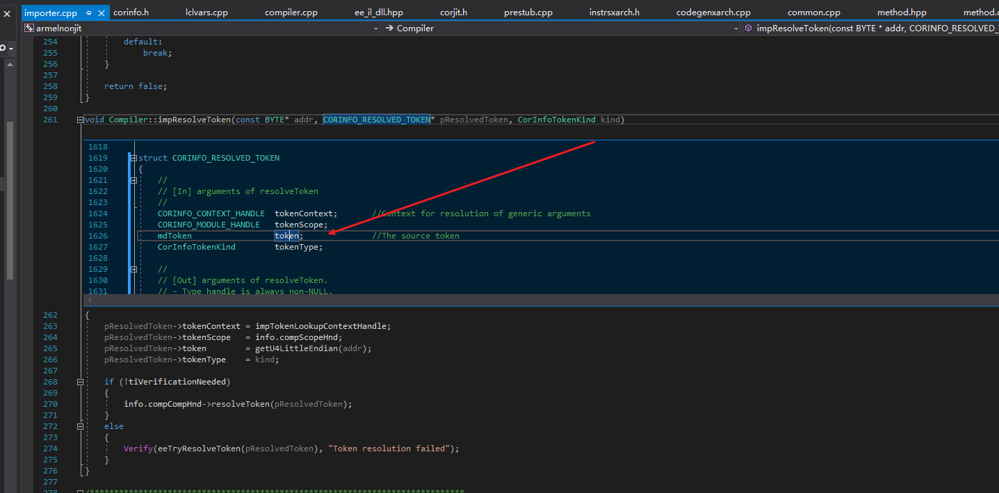

This is the token-related function of .NET 4.5+. NET 4.5+ introduces the CORINFO_RESOLVED_TOKEN structure, which is also used by coreclr. The token inside is the token of the operand in the IL instruction. In .NET 2.0 ~ 3.5 .NET In 4.0, there is also an embedGenericHandle for obtaining tokens. This function is used by CodeCracker's sheller to decrypt the token.

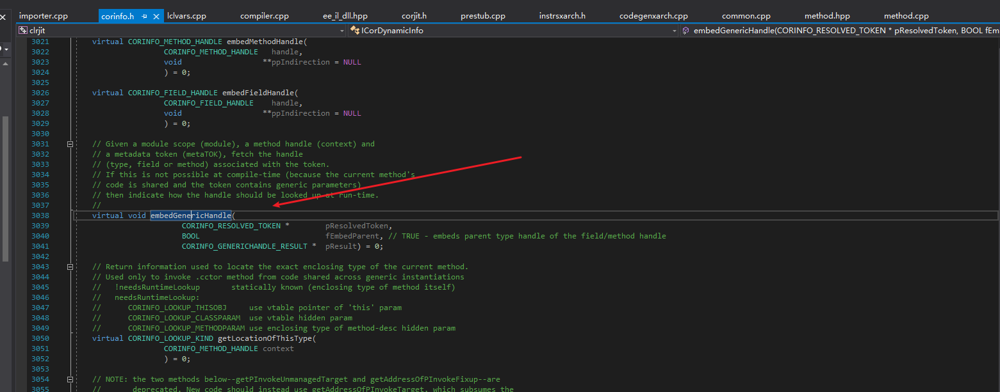

We understand the entire JIT compilation process.

## JitUnpacker

This is a shelling machine that I wrote with Thrush. It was written around September last year. Now the entire framework has been open sourced. The code to remove DNG and other shells has been removed, leaving only the general shelling part. So it is more appropriate to call it JitUnpacker-Framework, GitHub: [JitUnpacker-Framework] (https://github.com/wwh1004/JitUnpacker-Framework) I will not continue to maintain this warehouse after a one-time open source, only for research use, pay attention! ! !

If you want to study JIT unpacking, I still highly recommend looking at the code of my open source version of JitUnpacker first. This JitUnpacker supports .NET 2.0 ~ 3.5 .NET 4.0 ~ 4.72 (.NET 4.8 is not supported, I did not install .NET 4.8, so No support). And the structure definitions are all correct, with comments in key places. CodeCracker's sheller code is too messy, and support for generics and value types is not very good. The most important thing is that the structure definition is wrong, and part of the code is wrong, which will mislead people.

### Introduction

The whole shelling machine has 2 parts.

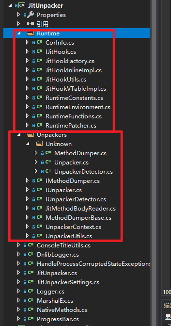

The first is the content in the folder Runtime, and the second is the content in the Unpackers folder.

Runtime provides runtime related information, such as DoPrestub packaging, JitHook interface and the like.

Unpackers is the code of the unpacking logic, it is enough to implement the three interfaces of IMethodDumper IUnpacker IUnpackerDetector. The Unknown folder is something similar to the de4dot parameter -p un, which can handle shells that have not been unhulled.

### Runtime

This is the packaging of CORINFO_METHOD_INFO, because the CORINFO_METHOD_INFO structure is different in .NET 2.0 and .NET 4.0+, so there is a packaging.

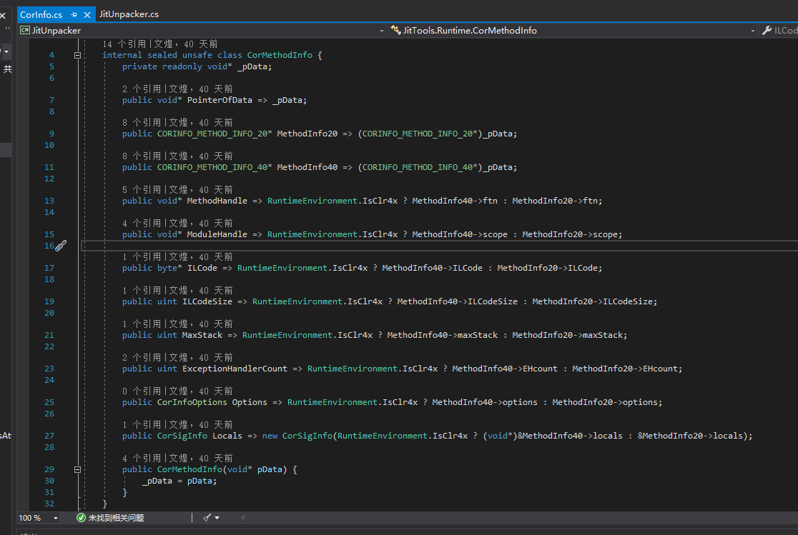

This is the interface of JitHook. Implement this interface to provide the required information for IMethodDumper. At present, the hooking method of the CodeCracker shelling machine (accurately yck1509, CodeCracker only made some modifications) and the compileMethod virtual table hooking method have been built in.

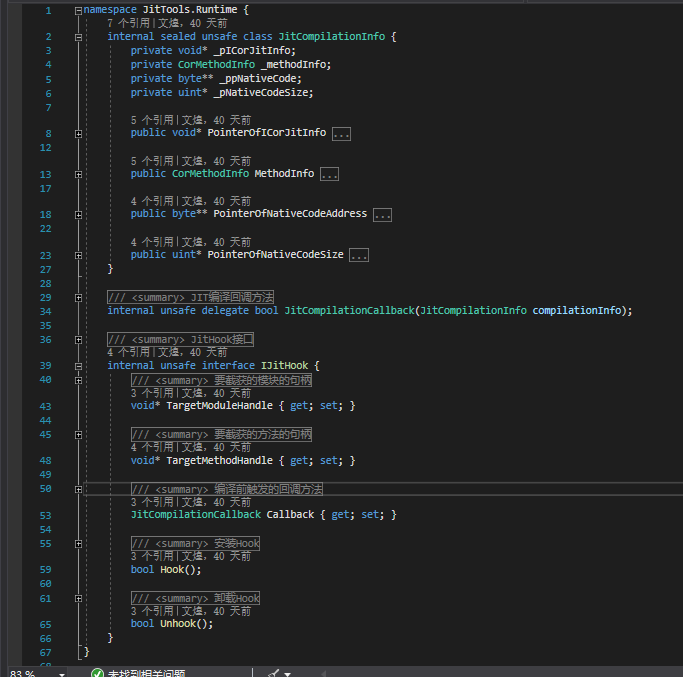

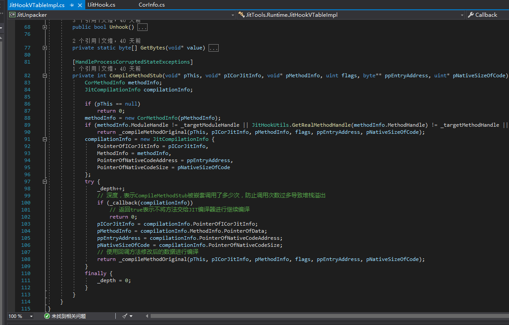

Because of the existence of the value type, with UnboxingStub, when comparing method handles, we can't directly compare, we need this.

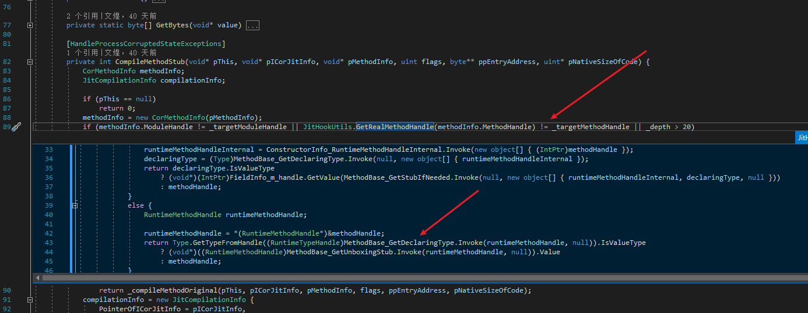

Next is RuntimePatcher. The first thing to patch is canInline. If you do n’t patch it here, let some methods be compiled inline and the shell will be wrong. Then there is the detection of the class static constructor. When compiling the method, DoPrestub will check whether the class static constructor has been run. If it has not been run, the CLR will first run the class static constructor, causing the code outside of our sheller to run. The last patch is generic detection, DoPrestub will detect generic parameters, if there are no generic parameters, it will prohibit compilation.

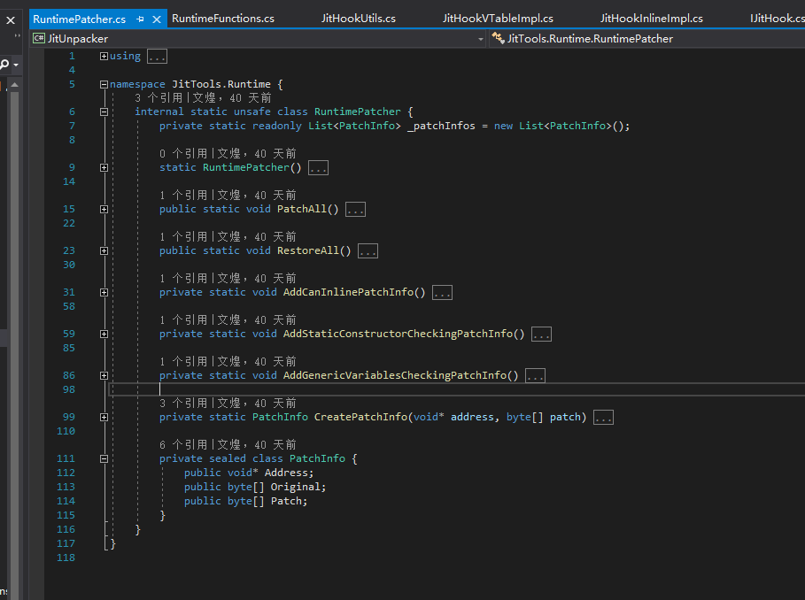

The code for running detection of static constructor is not found in coreclr, so it will not be posted. The following is a generic parameter detection.

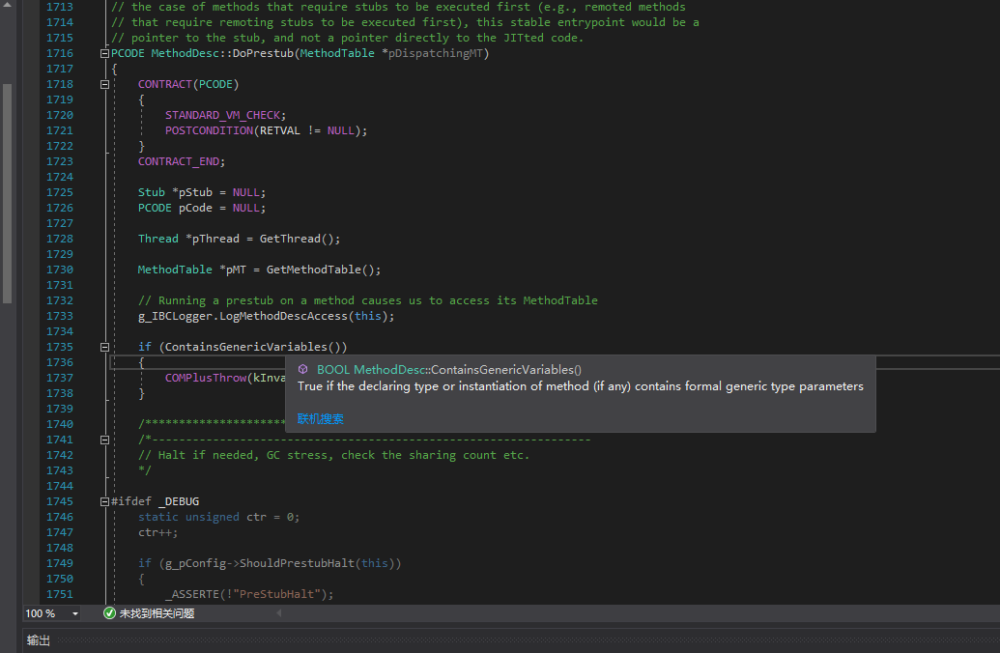

### other

Here are some miscellaneous things. The first thing to mention is LoadMethodHandles. CodeCracker's code will handle generics in particular, but that is wrong.

我直接调用ResolveMethodHandle。

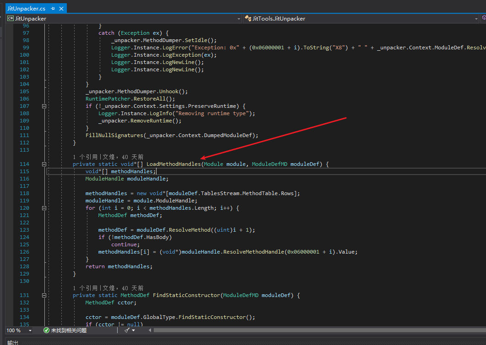

CodeCracker intends to instantiate generic methods, but in fact this is useless. I specifically looked at the coreclr source code and tested it. The method handle obtained in this way is the same as that obtained by directly calling ResolveMethodHandle.

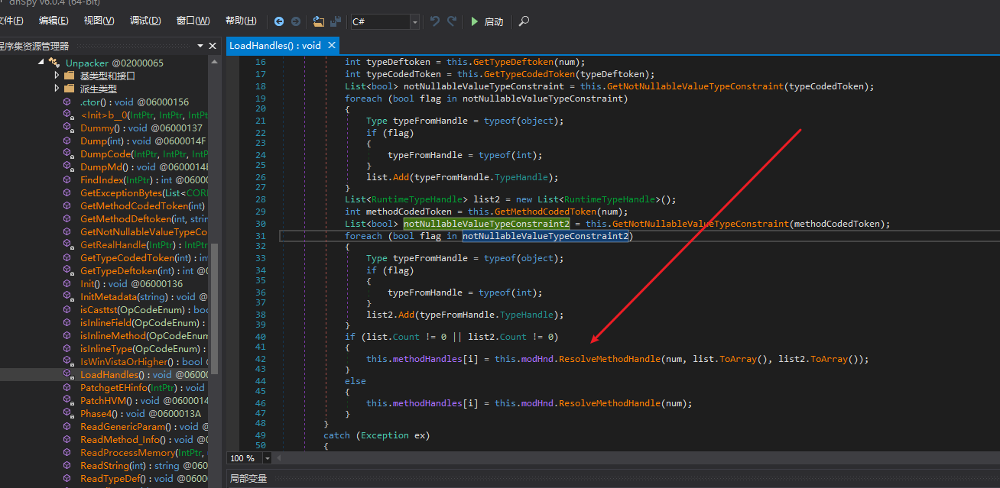

The second thing to mention is the UnboxingStub inside the CLR. The CLR will generate this when processing the value type method. If you directly DoPrestub, the CLR will not let the JIT compile this method. You must call GetWrappedMethodDesc and use this return value to DoPrestub can trigger JIT.

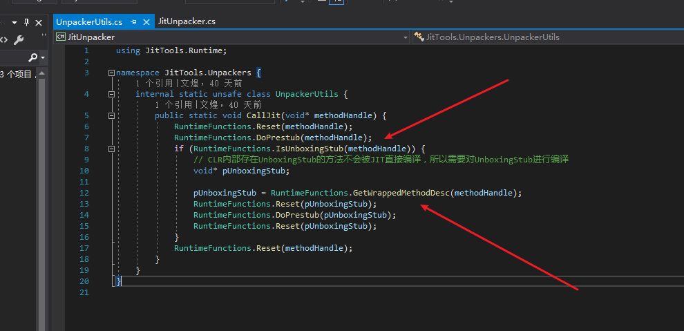

CodeCracker's processing method is to directly Invoke, and then directly write 0xC3 in the compCompile hook, which is the ret instruction.

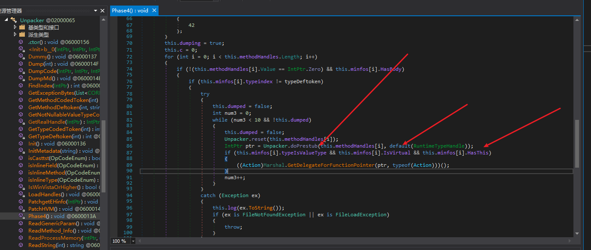

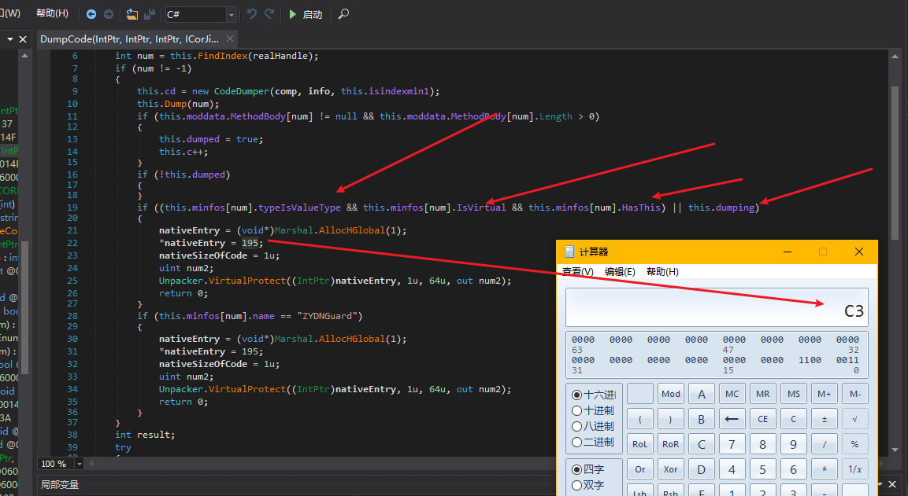

This completes the introduction of JIT shelling.

### Instructions

From https://github.com/wwh1004/JitUnpacker-Framework clone my code to local, pay attention to clone the submodules together. Then compile and generate the file. You will see a .bat file

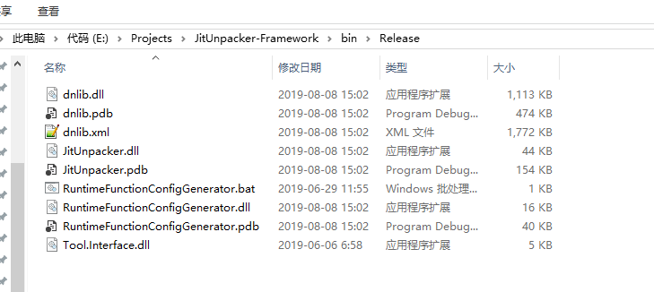

Then download my ToolLoader https://github.com/wwh1004/ToolLoader which is compiled, after downloading only need to copy these 5 files.

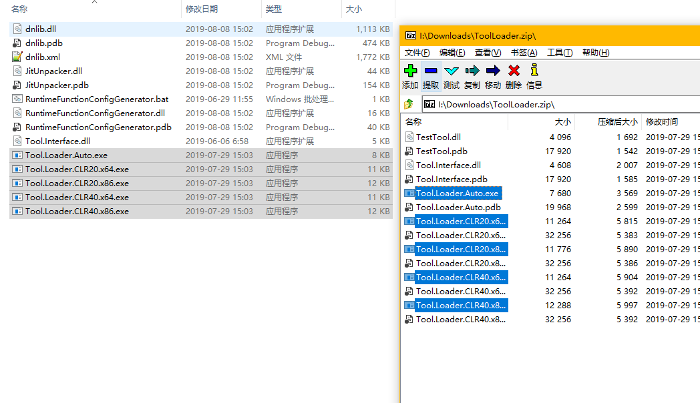

Now, you need to download the symbol file of mscorwks.dll mscorjit.dll clr.dll clrjit.dll, please do n’t ask me how to download, x64dbg windbg can be downloaded, and then modify YOUR_SYMBOLS_PATH

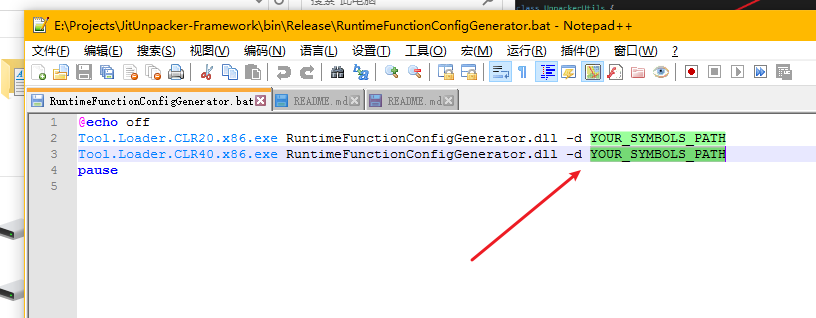

For example, mine is E: \ Symbols, then change it to this and save it.

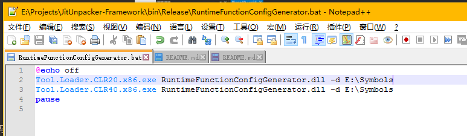

Running RuntimeFunctionConfigGenerator.bat will generate two configuration files "JitUnpacker.RuntimeFunctions.CLR20.x86.config" and "JitUnpacker.RuntimeFunctions.CLR40.x86.config".

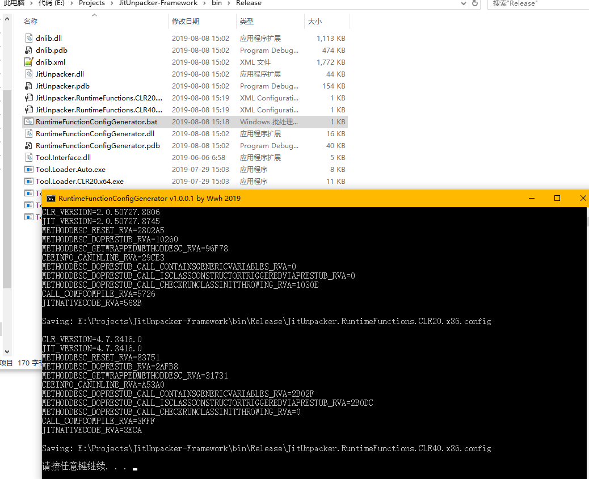

Copy the files to be unpacked, including related dlls, to the directory where JitUnpacker.dll is located, shift + right-click the folder, and select to open the command line window here.

You can look at the JitUnpacker parameters first

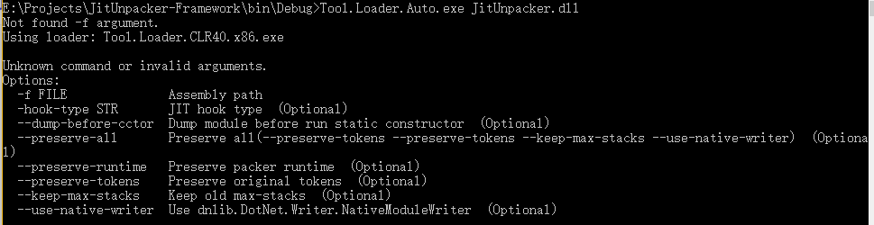

-f specifies the path of the file to be unpacked

-hook-type Specify the type of jithook, what type can be found through this source code, the default is inlinehook

The other parameters can be understood by myself.

Find a CodeCracker tool for demonstration, such as SimpleByteArrayInit.exe, using dnSpy can know that this is .NET 2.0 x86

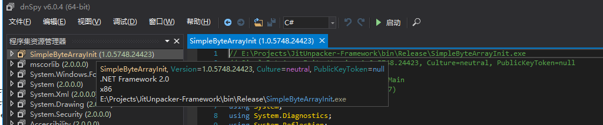

Then enter "Tool.Loader.CLR20.x86.exe JitUnpacker.dll -f SimpleByteArrayInit.exe" in the command line and press Enter.

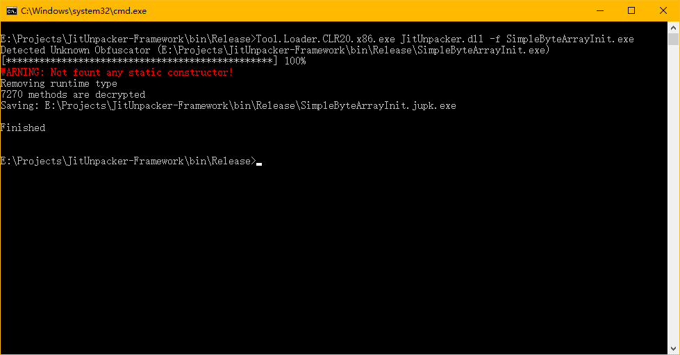

## Write at the end

** I don't take orders, don't ask me privately, and don't add my friends through various chat methods! ! ! **

** DNG and other shell unpacking code will not appear in the open source version of JitUnpacker-Framework, and do n’t ask me the code of the private version of JitUnpacker, these will not be released! ! ! **

** If you do not understand the article, or do not use the tools given in the article, you can do more research on your own, I will not reply. At the beginning, when there was no information at all, and the source code of CodeCracker was still a bunch of errors, I still studied bit by bit with Thrush and wrote this shelling machine. **

** If the sheller has bugs, or cannot work on a certain .NET version, try other .NET versions, I will not continue to update this open source version of JitUnpacker-Framework, this repository is for research use only! ! ! **
