# .Dynamic decryption and anti-dynamic decryption under .NET

## Foreword

de4dot has not been updated for a long time, and there are no ready tools for removing some shells. If you want to get rid of them, you can only write tools yourself.

There are generally two ways to decrypt under .NET, static decryption and dynamic decryption. Static decryption is faster, but it is very difficult to write static decryption tools, and the compatibility is not necessarily very good (for example, most decryption of de4dot is static Decryption, as soon as the shell is updated, de4dot must be updated).

So we need to use dynamic decryption. Dynamic decryption is not without its shortcomings. For example, the biggest shortcoming is that the decrypted assembly must be able to run normally. But compared to the advantages of easy development, easy maintenance, good compatibility, etc., this shortcoming is not much. This article will introduce some simple dynamic decryption and anti-dynamic decryption.

## Agile.NET string encryption

### analysis

Let's start with the simplest, first try Agile.NET string encryption. I sent an UnpackMe before, and I do n’t know if anyone got it. Let's take a look at Agile.NET's string encryption first, which is relatively simple and dynamic decryption.

We use dnSpy to open UnpackMe and see what the string is encrypted.

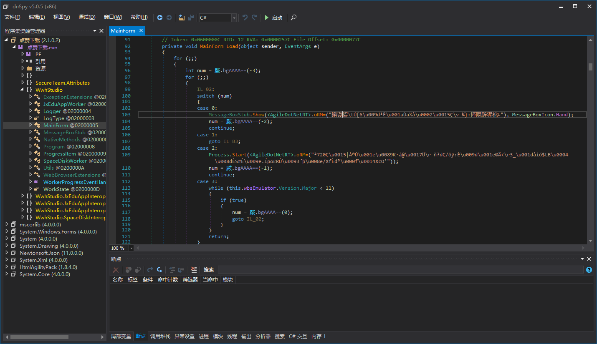

It can be seen that all the character strings become a string of garbled characters, which are then passed to a special method. This special method converts the garbled character string into a normal character string, that is, decryption.

We click on this method to see how the string is decrypted inside this method.

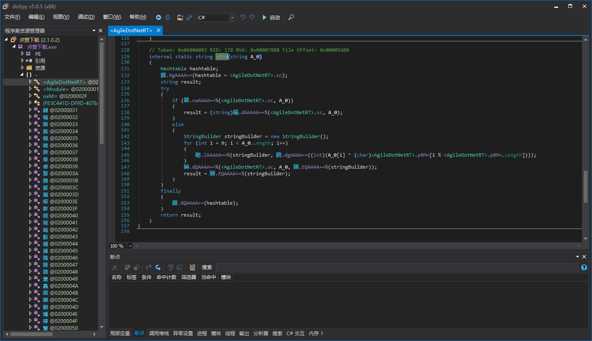

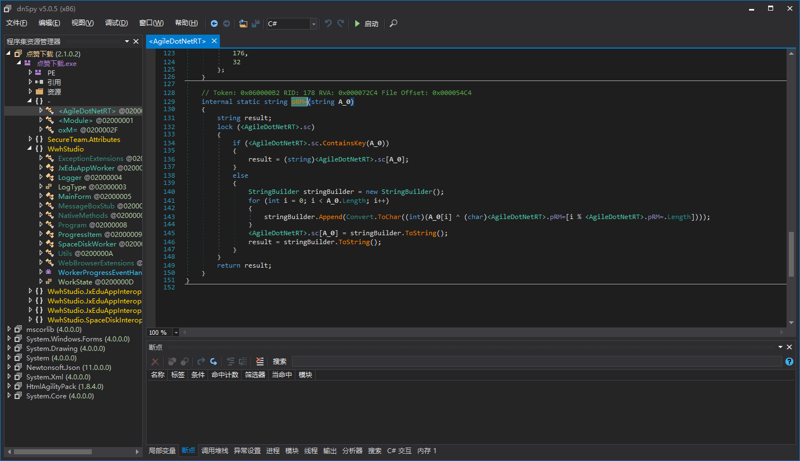

As you can see, this decryption is very simple, mainly Xor. In order to facilitate the explanation, I removed the agent-management call first, otherwise I can't see what this string decryptor method looks like. (We will explain Agile.NET's agent-management call later, don't worry here.)

Such simple decryption, we can write a static decryption, of course, and it is not complicated, and the efficiency is still higher, but this article explains dynamic decryption. So next we explain how to write a dynamic decryption by ourselves.

### Write a decryption tool

In the previous figure, we can see that Agile.NET's string encryption is very simple, just encrypt the string itself, and then pass it to the string decryptor. This is at least true at the C # level, but is it also true at the IL level, is there any other confusion? Let's switch the decompilation mode of dnSpy from C # to IL.

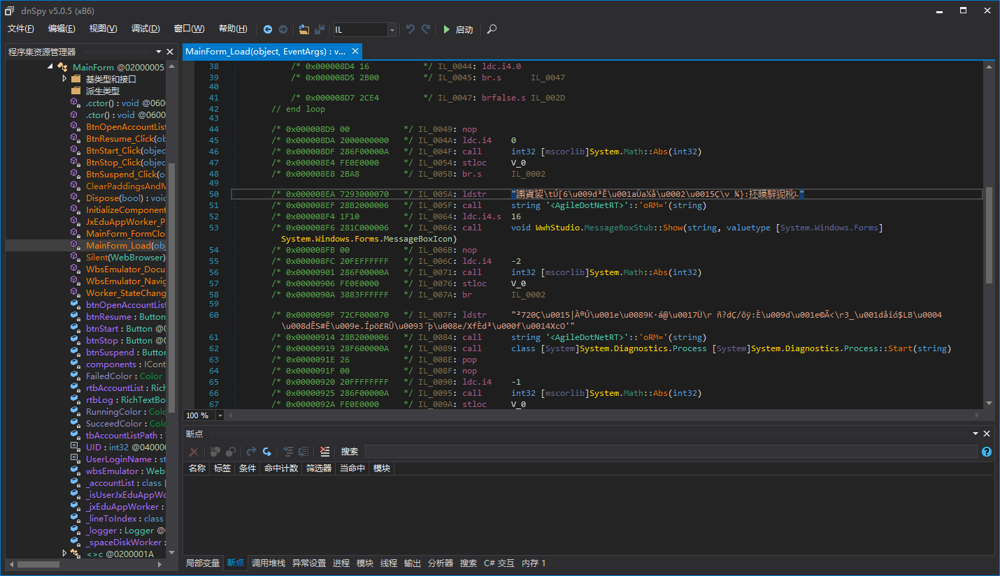

As you can see, this is really what C # shows, push the string onto the stack, and then call the string decryptor method. (This is the case for Agile.NET, but it does not mean that other shells are the same. This needs to be analyzed in detail.) In this way, it is easier to write decryption tools.

Here, by the way, for the convenience of explanation, we write the simplest decryption tool, which cannot automatically recognize the runtime version of the target program like de4dot, that is, automatically adapts to the .NET 2.0 4.0 program. If you want to write adaptive, you can read the de4dot code yourself. The code of de4dot is actually quite complicated, there are too many design patterns, so I did not use sub-processes like de4dot. I used Loader, let Loader load our decryption tool, and we manually select Loader. It doesn't matter if you don't understand this text, if you write more decryption tools, you will understand what this text is saying. We continue.

We create a new project, and the target of the project is the same version as the program to be decrypted. For example, our UnpackMe is .NET 4.5, we choose 4.5. (Actually, 4.0 is fine, because the clr version is the same, but the details are not too detailed. You can study some technical details of .NET yourself.)

Add the following code, make a good frame, initialize the field, and then write the code in ExecuteImpl ().

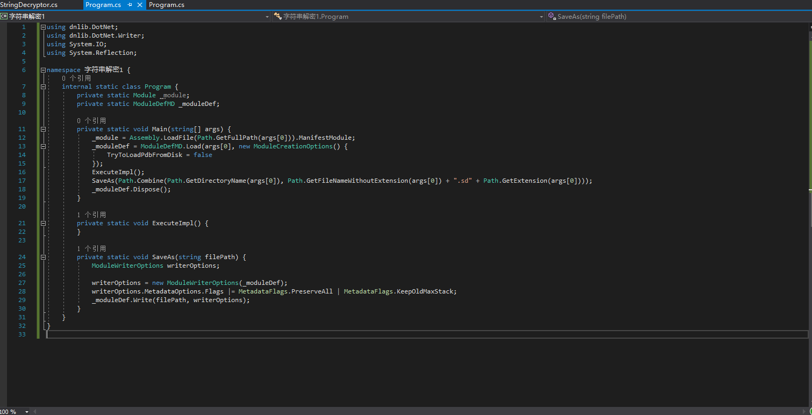

Let's use dnSpy to see what are the characteristics of the Agile.NET string decryptor method, we first locate this method.

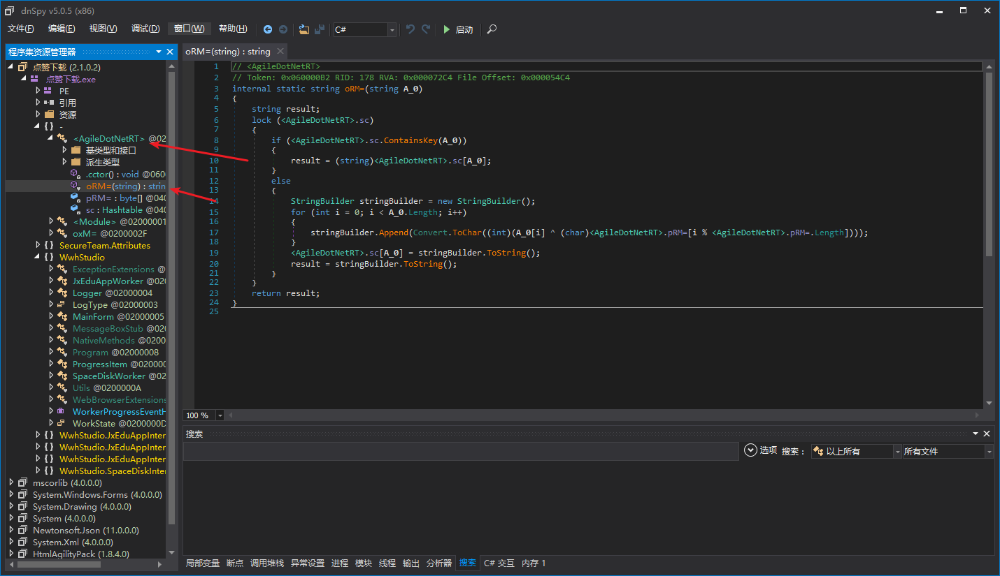

It can be seen that the string decryptor method is the empty &lt;AgileDotNetRT&gt; class in the namespace and the method signature of the string decryptor itself should be string (string). This means that the string decryptor has only one argument and is of the string type, and the return value is also string, so that we can use features to locate to the string decryptor.

We write the location code like this. (Of course, it's okay to be different than mine, as long as it can be accurately located.) This code is all added to the ExecuteImpl() method.

``` csharp
TypeDef agileDotNetRT;
MethodDef decryptorDef;
MethodBase decryptor;

agileDotNetRT = _moduleDef.Types.First(t => t.Namespace == string.Empty && t.Name == "<AgileDotNetRT>");
// Find namespace empty with class "<AgileDotNetRT>"
decryptorDef = agileDotNetRT.Methods.First(m => m.Parameters.Count == 1 && m.Parameters[0].Type.TypeName == "String" && m.ReturnType.TypeName == "String");
// Find a method in the class that has only one parameter with the parameter type String and the return value type String
decryptor = _module.ResolveMethod(decryptorDef.MDToken.ToInt32());
// Convert dnlib's MethodDef to MethodBase in .NET reflection
```

In order to iterate through all the methods in ModuleDefMD more quickly, we need an extension method. We write it this way.

``` csharp
internal static class ModuleDefExtensions {
	public static IEnumerable<MethodDef> EnumerateAllMethodDefs(this ModuleDefMD moduleDef) {
		uint methodTableLength;

		methodTableLength = moduleDef.TablesStream.MethodTable.Rows;
		// Get the length of the Method table. 
		for (uint rid = 1; rid <= methodTableLength; rid++)
			yield return moduleDef.ResolveMethod(rid);
	}
}
```

The Method table mentioned in the code above is a table in the .

Perhaps the reader is still wondering why we write this way, can't we iterate through each method like this?

``` csharp
foreach (TypeDef typeDef in _moduleDef.Types)
	foreach (MethodDef methodDef in typeDef.Methods) {
		...
		...
	}
```

Watching should be fine, however, this will traverse methods that are not in the nested type. For example, this is a nested type, a class B is declared in a class, B is the nested type.

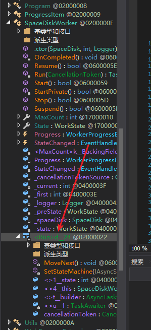
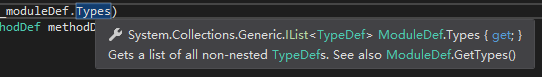

So this won't work, ModuleDef.Types won't return nested types, we need to use ModuleDef.GetTypes(). We need to write 2 foreach per iterative method, so why not just use an extended method instead.

``` csharp
foreach (MethodDef methodDef in _moduleDef.EnumerateAllMethodDefs()) {
	IList<Instruction> instructionList;

	if (!methodDef.HasBody)
		continue;
	instructionList = methodDef.Body.Instructions;
	for (int i = 0; i < instructionList.Count; i++) {
	}
}
```

This way we can iterate through all the methods that have CliBody's method. Let's switch to dnSpy again and see how Agile.NET calls the string decryptor method.


So, we locate the string to be decrypted this way, and decrypt the string and replace it back.

``` csharp
if (instructionList[i].OpCode.Code == Code.Call && instructionList[i].Operand == decryptorDef && instructionList[i - 1].OpCode.Code == Code.Ldstr) {
	// 这里判断特征
	instructionList[i].OpCode = OpCodes.Nop;
	instructionList[i].Operand = null;
	// i对应的指令是Call XXXX，我们把这一条指令nop掉
	instructionList[i - 1].Operand = decryptor.Invoke(null, new object[] { instructionList[i - 1].Operand });
	// i-1对应的指令是ldstr，我们调用字符串解密器方法，然后把解密后的字符串替换回去
}
```

That way, our string decryption tool is written.

## Agile.NET's proxy call

This decryption of the generation-reasoning call is one of the most difficult in this presentation, and it is highly recommended to skip this section if the reader does not understand the string decryption above.

### analysis

We'll still open that UnpackMe with dnSpy first.

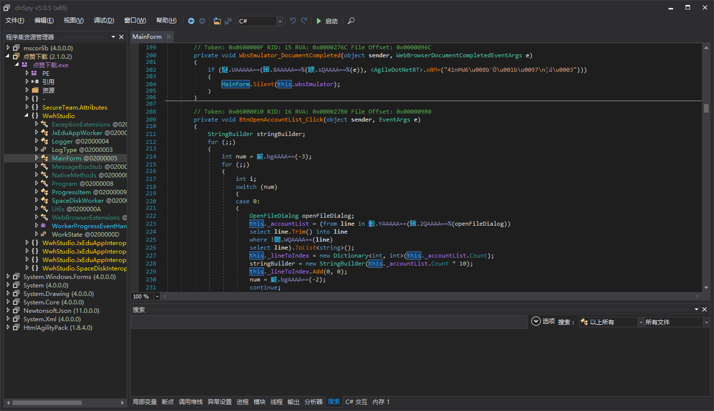

It can be seen that some calls to external methods are obfuscated, and calls to the current set of methods are not obfuscated. Let's debug again and see what these commissions are.

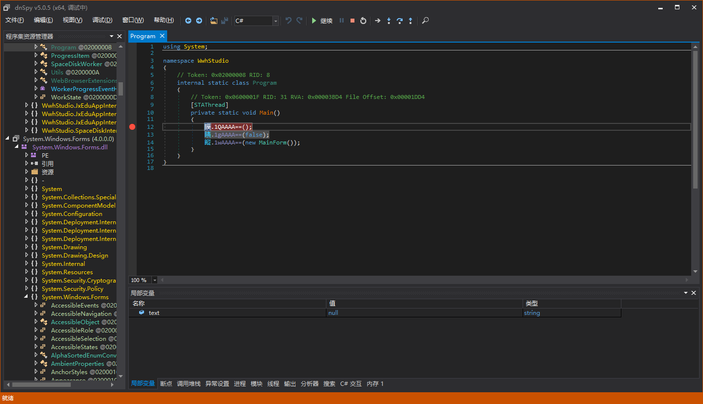

Press F11 and it's straight to here, no joy.

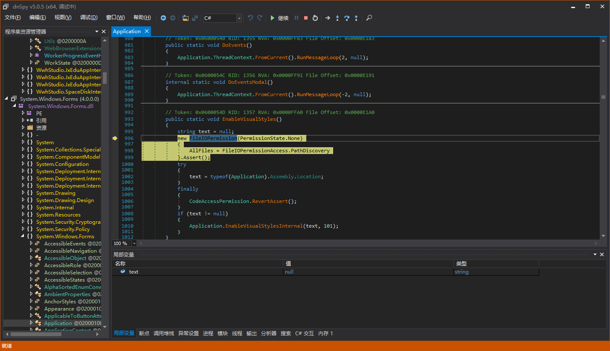

Let's look at where this delegated field is initialized and we can find something.

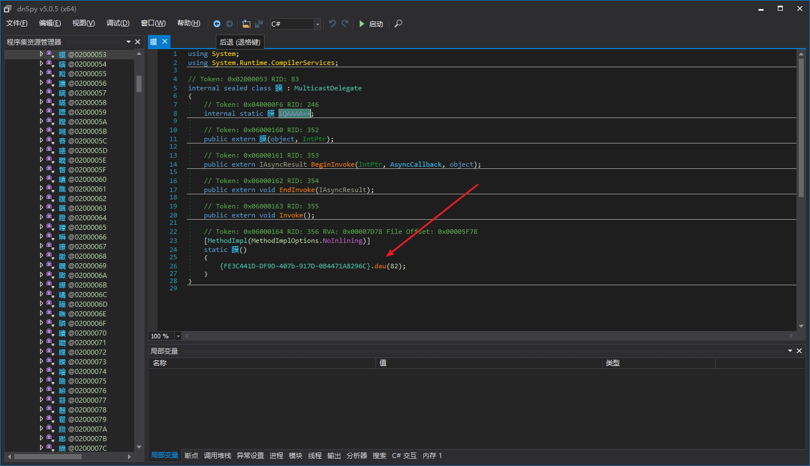

We go to the DAU method and the dnSpy decompile results are as follows.

``` csharp
using System;
using System.Reflection;
using System.Reflection.Emit;

// Token: 0x02000030 RID: 48
public class {FE3C441D-DF9D-407b-917D-0B4471A8296C}
{
	// Token: 0x040000C2 RID: 194
	private static ModuleHandle Fzw=;

	// Token: 0x040000C3 RID: 195
	public static string Cho= = "{FE3C441D-DF9D-407b-917D-0B4471A8296C}";

	// Token: 0x060000B3 RID: 179 RVA: 0x00007984 File Offset: 0x00005B84
	static {FE3C441D-DF9D-407b-917D-0B4471A8296C}()
	{
		{FE3C441D-DF9D-407b-917D-0B4471A8296C}.Fzw= = Assembly.GetExecutingAssembly().GetModules()[0].ModuleHandle;
	}

	// Token: 0x060000B4 RID: 180 RVA: 0x000079A8 File Offset: 0x00005BA8
	[Obfuscation]
	public static void dau(int proxyDelegateTypeToken)
	{
		Type typeFromHandle;
		try
		{
			typeFromHandle = Type.GetTypeFromHandle({FE3C441D-DF9D-407b-917D-0B4471A8296C}.Fzw=.ResolveTypeHandle(33554433 + proxyDelegateTypeToken));
		}
		catch
		{
			return;
		}
		FieldInfo[] fields = typeFromHandle.GetFields(BindingFlags.Static | BindingFlags.NonPublic | BindingFlags.GetField);
		int i = 0;
		while (i < fields.Length)
		{
			FieldInfo fieldInfo = fields[i];
			string text = fieldInfo.Name;
			bool flag = false;
			if (text.EndsWith("%"))
			{
				flag = true;
				text = text.TrimEnd(new char[]
				{
					'%'
				});
			}
			byte[] value = Convert.FromBase64String(text);
			uint num = BitConverter.ToUInt32(value, 0);
			MethodInfo methodInfo;
			try
			{
				methodInfo = (MethodInfo)MethodBase.GetMethodFromHandle({FE3C441D-DF9D-407b-917D-0B4471A8296C}.Fzw=.ResolveMethodHandle((int)(num + 167772161u)));
			}
			catch
			{
				goto IL_1D1;
			}
			goto IL_A7;
			IL_1D1:
			i++;
			continue;
			IL_A7:
			Delegate value2;
			if (methodInfo.IsStatic)
			{
				try
				{
					value2 = Delegate.CreateDelegate(fieldInfo.FieldType, methodInfo);
					goto IL_1C4;
				}
				catch (Exception)
				{
					goto IL_1D1;
				}
			}
			ParameterInfo[] parameters = methodInfo.GetParameters();
			int num2 = parameters.Length + 1;
			Type[] array = new Type[num2];
			array[0] = typeof(object);
			for (int j = 1; j < num2; j++)
			{
				array[j] = parameters[j - 1].ParameterType;
			}
			DynamicMethod dynamicMethod = new DynamicMethod(string.Empty, methodInfo.ReturnType, array, typeFromHandle, true);
			ILGenerator ilgenerator = dynamicMethod.GetILGenerator();
			ilgenerator.Emit(OpCodes.Ldarg_0);
			if (num2 > 1)
			{
				ilgenerator.Emit(OpCodes.Ldarg_1);
			}
			if (num2 > 2)
			{
				ilgenerator.Emit(OpCodes.Ldarg_2);
			}
			if (num2 > 3)
			{
				ilgenerator.Emit(OpCodes.Ldarg_3);
			}
			if (num2 > 4)
			{
				for (int k = 4; k < num2; k++)
				{
					ilgenerator.Emit(OpCodes.Ldarg_S, k);
				}
			}
			ilgenerator.Emit(flag ? OpCodes.Callvirt : OpCodes.Call, methodInfo);
			ilgenerator.Emit(OpCodes.Ret);
			try
			{
				value2 = dynamicMethod.CreateDelegate(typeFromHandle);
			}
			catch (Exception)
			{
				goto IL_1D1;
			}
			try
			{
				IL_1C4:
				fieldInfo.SetValue(null, value2);
			}
			catch
			{
			}
			goto IL_1D1;
		}
	}

	// Token: 0x060000B5 RID: 181 RVA: 0x00007BD8 File Offset: 0x00005DD8
	public {FE3C441D-DF9D-407b-917D-0B4471A8296C}()
	{
	}
}
```

This code is still relatively simple, pass the token of the proxy-rational type, then iterate through each field in the type, get the MemberRef Token of the proxy-rational method through the field name, then ReolveMethod. if it is a static method, create a delegate directly, if it is an instance method, create a method to call using DynamicMethod. Static decryption may also be simpler than dynamic decryption.

### Writing decryption tools

We still write a framework like this. Then add the code to ExecuteImpl().

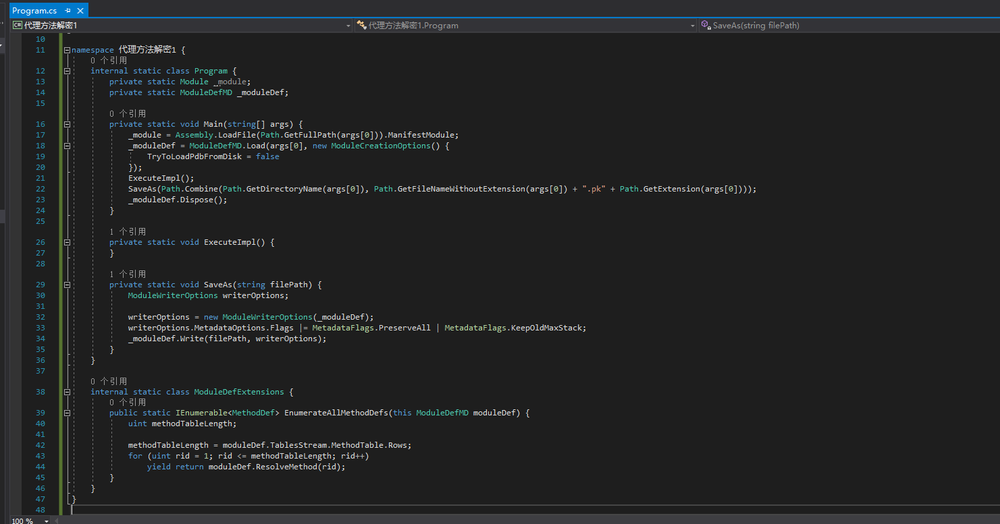

We find the place where the generation-rational field is initialized, by feature.

``` csharp
TypeDef[] globalTypes;
MethodDef decryptor;

globalTypes = _moduleDef.Types.Where(t => t.Namespace == string.Empty).ToArray();
// Find all types with empty namespaces
decryptor = globalTypes.Where(t => t.Name.StartsWith("{", StringComparison.Ordinal) && t.Name.EndsWith("}", StringComparison.Ordinal)).Single().Methods.Single(m => !m.IsInstanceConstructor && m.Parameters.Count == 1);
// Find generation - understand the secret method
```

Since the static constructor of all generation-rational classes automatically decrypts the real method, we do not need to manually call the generation-rational method decryptor. We just need to iterate through the fields of these generation-rational classes to find the MemberRef to which the fields correspond.

``` csharp
foreach (TypeDef typeDef in globalTypes) {
	MethodDef cctor;

	cctor = typeDef.FindStaticConstructor();
	if (cctor == null || !cctor.Body.Instructions.Any(i => i.OpCode == OpCodes.Call && i.Operand == decryptor))
		continue;
	// Find out the type of static constructor that invokes a generation-understanding dense method.
}
```

As long as the static constructor of a class calls the decryptor, that class is a surrogate class. We traverse the fields of the generation-rational class.

``` csharp
foreach (FieldInfo fieldInfo in _module.ResolveType(typeDef.MDToken.ToInt32()).GetFields(BindingFlags.NonPublic | BindingFlags.Static)) {
	int proxyFieldToken;
	FieldDef proxyFieldDef;
	MethodBase realMethod;

	proxyFieldToken = fieldInfo.MetadataToken;
	proxyFieldDef = _moduleDef.ResolveField((uint)proxyFieldToken - 0x04000000);
	realMethod = ((Delegate)fieldInfo.GetValue(null)).Method;
}
```

The realMethod here may also be a dynamic method created by the Agile.NET runtime, since it supports the callvirt instruction. We write a way to tell if it's a dynamic method.

``` csharp
private static bool IsDynamicMethod(MethodBase methodBase) {
	if (methodBase == null)
		throw new ArgumentNullException(nameof(methodBase));

	try {
		int token;

		token = methodBase.MetadataToken;
		// The Token that gets the dynamic method throws an InvalidOperationException exception.
	}
	catch (InvalidOperationException) {
		return true;
	}
	return false;
}
```

We first determine if it is a dynamic method, and then we replace it.

``` csharp
if (IsDynamicMethod(realMethod)) {
	DynamicMethodBodyReader dynamicMethodBodyReader;
	IList<Instruction> instructionList;

	dynamicMethodBodyReader = new DynamicMethodBodyReader(_moduleDef, realMethod);
	dynamicMethodBodyReader.Read();
	instructionList = dynamicMethodBodyReader.GetMethod().Body.Instructions;
	ReplaceAllOperand(proxyFieldDef, instructionList[instructionList.Count - 2].OpCode, (MemberRef)instructionList[instructionList.Count - 2].Operand);
}
else
	ReplaceAllOperand(proxyFieldDef, realMethod.IsVirtual ? OpCodes.Callvirt : OpCodes.Call, (MemberRef)_moduleDef.Import(realMethod));
```

The implementation of ReplaceAllOperand is as follows.

``` csharp
private void ReplaceAllOperand(FieldDef proxyFieldDef, OpCode callOrCallvirt, MemberRef realMethod) {
	if (proxyFieldDef == null)
		throw new ArgumentNullException(nameof(proxyFieldDef));
	if (realMethod == null)
		throw new ArgumentNullException(nameof(realMethod));

	foreach (MethodDef methodDef in _moduleDef.EnumerateAllMethodDefs()) {
		IList<Instruction> instructionList;

		if (!methodDef.HasBody)
			continue;
		// Iterate only the methods with CilBody
		instructionList = methodDef.Body.Instructions;
		for (int i = 0; i < instructionList.Count; i++) {
			// ldsfld    class xxx xxx::'xxx'
			// ...
			// call      instance void xxx::Invoke()
			if (instructionList[i].OpCode != OpCodes.Ldsfld || instructionList[i].Operand != proxyFieldDef)
				continue;
			for (int j = i; j < instructionList.Count; j++) {
				// Start with i to find the nearest call
				if (instructionList[j].OpCode.Code != Code.Call || !(instructionList[j].Operand is MethodDef) || ((MethodDef)instructionList[j].Operand).DeclaringType != ((TypeDefOrRefSig)proxyFieldDef.FieldType).TypeDefOrRef)
					continue;
				instructionList[i].OpCode = OpCodes.Nop;
				instructionList[i].Operand = null;
				// Clear  ldsfld    class xxx xxx::'xxx'
				instructionList[j].OpCode = callOrCallvirt;
				instructionList[j].Operand = realMethod;
				// replace call      instance void xxx::Invoke()
				break;
			}
		}
	}
}
```

## ConfuserEx's AntiTamper

### analysis

A good while back, I also made a post about AntiTamper. That post was about static decryption, and it seems that compatibility is still a bit of a problem, so let's try dynamic decryption this time. Let's open the project ConfuserEx first.

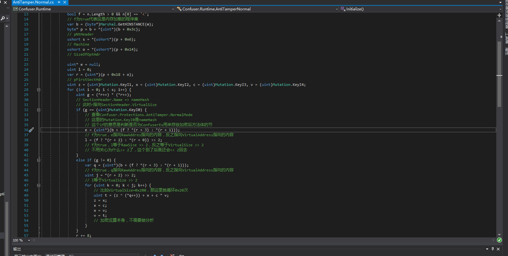
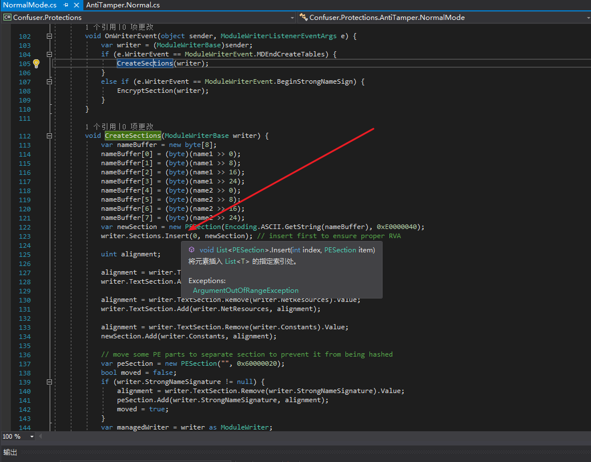

This one I annotated previously, AntiTamper's principle is to put all method bodies into a single Section, and then decrypt them using the hash of the other Sections. So if the file itself is tampered with, the runtime decryption of Section will certainly fail. This Section is always inserted by ConfuserEx before the other Sections, and it's overall encrypted, so it's easy to decrypt dynamically.

### Writing decryption tools

As usual, write a framework and put the code in ExecuteImpl().

Let's add a PEInfo class.

``` csharp
[StructLayout(LayoutKind.Sequential, Pack = 1)]
internal unsafe struct IMAGE_SECTION_HEADER {
	public static uint UnmanagedSize = (uint)sizeof(IMAGE_SECTION_HEADER);

	public fixed byte Name[8];
	public uint VirtualSize;
	public uint VirtualAddress;
	public uint SizeOfRawData;
	public uint PointerToRawData;
	public uint PointerToRelocations;
	public uint PointerToLinenumbers;
	public ushort NumberOfRelocations;
	public ushort NumberOfLinenumbers;
	public uint Characteristics;
}

internal sealed unsafe class PEInfo {
	private readonly void* _pPEImage;
	private readonly uint _sectionsCount;
	private readonly IMAGE_SECTION_HEADER* pSectionHeaders;

	public void* PEImage => _pPEImage;

	public uint SectionsCount => _sectionsCount;

	public IMAGE_SECTION_HEADER* SectionHeaders => pSectionHeaders;

	public PEInfo(void* pPEImage) {
		byte* p;
		ushort optionalHeaderSize;

		_pPEImage = pPEImage;
		p = (byte*)pPEImage;
		p += *(uint*)(p + 0x3C);
		// NtHeader
		p += 4 + 2;
		// Skip Signature + Machine
		_sectionsCount = *(ushort*)p;
		p += 2 + 4 + 4 + 4;
		// skip NumberOfSections + TimeDateStamp + PointerToSymbolTable + NumberOfSymbols
		optionalHeaderSize = *(ushort*)p;
		p += 2 + 2;
		// skip SizeOfOptionalHeader + Characteristics
		p += optionalHeaderSize;
		// skip OptionalHeader
		pSectionHeaders = (IMAGE_SECTION_HEADER*)p;
	}
}
```

We then read the RVA and Size of the first Section. call the module static constructor and finally restore back.

``` csharp
PEInfo peInfo;
IMAGE_SECTION_HEADER sectionHeader;
byte[] section;

peInfo = new PEInfo((void*)Marshal.GetHINSTANCE(_module));
sectionHeader = peInfo.SectionHeaders[0];
section = new byte[sectionHeader.SizeOfRawData];
RuntimeHelpers.RunModuleConstructor(_module.ModuleHandle);
Marshal.Copy((IntPtr)((byte*)peInfo.PEImage + sectionHeader.VirtualAddress), _peImage, (int)sectionHeader.PointerToRawData, (int)sectionHeader.SizeOfRawData);
```

The _peImage here is a byte array representing the byte array form of the set to be decrypted. Dynamic decryption of AntiTamper does not even require the use of dnlib, which is much easier than static decryption. Once decrypted, just manually Patch off the AntiTamper runtime.

## anti-dynamic decryption (computing)

Dynamic decryption has its own drawbacks, such as being easy to detect. The article wrote 3 dynamic decryption, in fact the principle is similar, the core is the reflection API, we can use this to write some anti-dynamic decryption code.

- At its simplest, we can detect the source of the call, like ILProtector, and if the caller of the current method is the lowest-level Invoke method, then it's an illegal call.
- We can also go to the extreme and detect the entire call stack, such as whether the call stack has the word de4dot in it.
- GetAssemblies() to get all the loaded assemblies and determine if there are any illegal assemblies in it.
- If an application is an executable and will not be referenced by other assemblies, you can use Assembly.GetEntryAssembly() to check if the entry assembly is itself.
