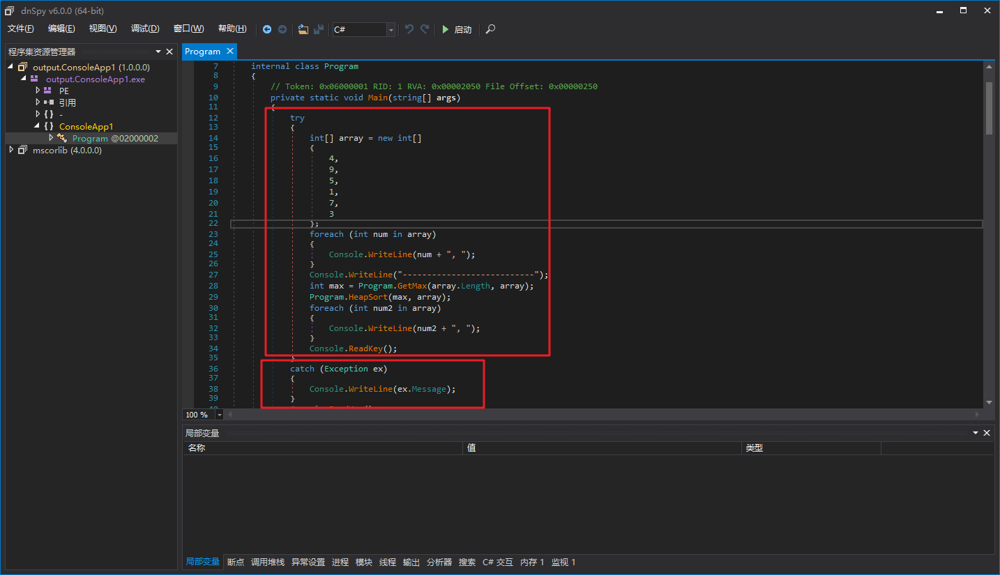
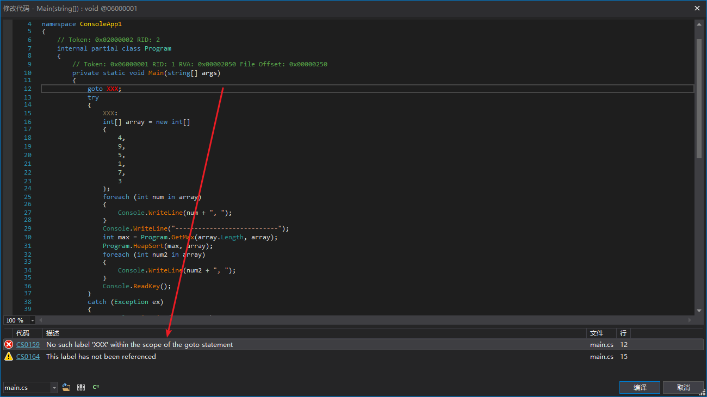
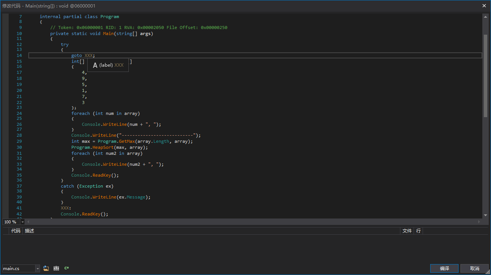
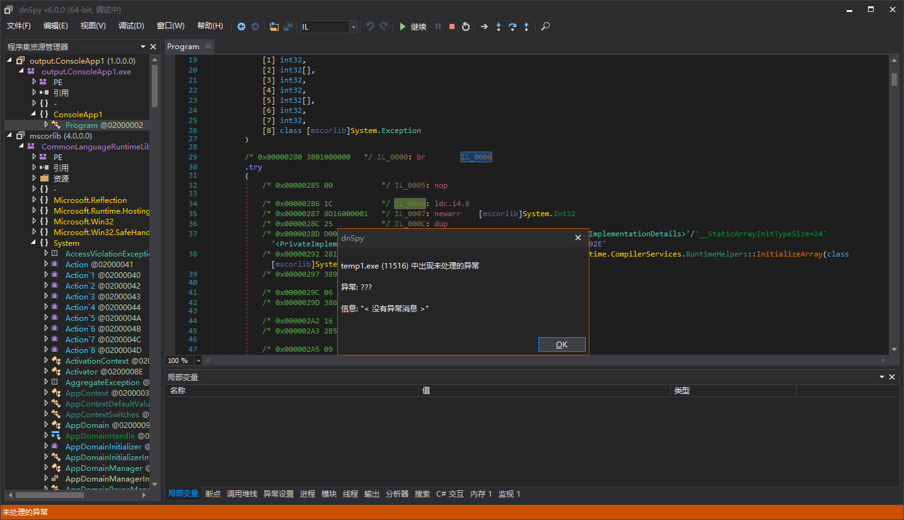
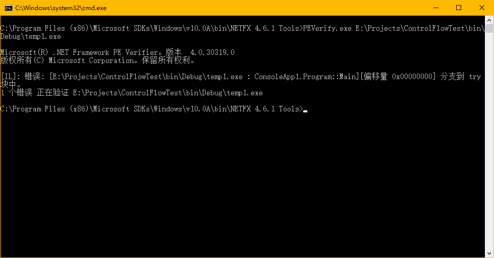

# NET Control Flow Analysis (I) - A Primer

## preamble

The new year has begun again, and the articles posted last year should only be basic, this year we study the hard ones. Personally, I think the 3 most difficult protections under .NET should be.

- IL-class virtual machine
- Control flow confusion
- Jit Hook

If these protections are not removed, either one of them will greatly hinder our analysis of an assemblage using dnSpy.

Today we'll take a brief introduction to what I consider one of the difficulties of control flow, which presupposes that you have some knowledge of IL. If you read it, then congratulations. For some simple control stream obfuscation, you can write your own anti-obfuscation tool now. If I didn't read it, that's okay, this one takes its time, and it took me a while to study this myself. Don't read this article and don't go through the motions, be sure to open the VS, write your own code and follow the article step by step.

Previously I wrote the Control Flow Analysis project just to learn about control flow and to understand the underlying implementation and principles. Although there are ready-made projects, such as the 0xd4d Big God, the dnSpy author of de4dot.blocks, de4dot is open source for the GPLv3 protocol, and the project itself is not maintained, the key is that there are few comments in the project. If there's a bug that you can only fix yourself and have time to read what someone else has written and what it means, why not write a project yourself and start from scratch?

The control flow thing is very abstract, and <del>I'm not particularly familiar with the drawing libraries (mostly lazy and don't have much time to learn them)</del>, so we just use the most violent and easy way to convert the control flow into a string of information for debugging. I remember in a previous post I made, a classmate said he wanted a video commentary. It just so happens that control flow is not something that can be explained in a few lines, so I'm going to make a video to add some things that can't be explained in the article. ** Learned the Lower Flow Chart class library this morning, and there is code at the end of the article to draw out the control flow!!!! **

I don't know if you've noticed, but the article has a "(a)" in the title. Because this stuff is kind of complicated, an article is tired to say, tired to write and tired to watch. So if there's time, there may be "(two)", "(three)", etc.

This article is just a primer and will not involve any control flow obfuscation, we just want to build a framework that can analyze the control flow, represent the control flow, and feed the results of the analysis and processing into the method body.

The whole project code is more, go to empty lines, comments, only one symbol of the line to count the number of code lines is also 2k+. So only the more critical codes are mentioned below, the rest can be viewed by downloading the attachment. The attachment code is complete and can be added directly to the new project.

Video Address.：[https://www.bilibili.com/video/av42023976](https://www.bilibili.com/video/av42023976)

## defined structure

**Front row reminder: the structure defined in the article is slightly different from that in de4dot.blocks, but the thinking is pretty much the same **

It takes a good frame to build a house, and a good choice of materials for a frame. We want to define a structure that can **non-destructively** transform linear instruction flows, exception handling clauses, and local variables in the method body into a more analytically friendly structure.


For example, IDA will be truncated before the jump to become a code snippet, this snippet we can become a Block, we can use various jump statements to convert a method body into many Blocks, that is, "blocks".

Of course, things are far from that simple, and we go back to .NET and find that there is such a thing as an exception handling clause in .NET.



For example, there are 2 red boxes in the figure, the first one is try and the second one is catch, if the execution of try is normal, then it will not enter catch, so we also need to rely on the exception handling clause to chunk the method body.

So is that the end of it? Definitely not, a TRY or a CATCH can be called a scope, we can jump from a smaller range of child scopes to a larger range of parent scopes, but we can't jump from a larger range of parent scopes to a smaller range of child scopes.





The code for the first graph is illegal, while the code for the second graph is legal.

At the IL level, what does it mean that we can only jump to the first statement of a scope and not to other statements of the scope?





The first graph of the BR jumps to the second statement of the TRY block, such that it is illegal.

What to do to get out of the try block? use[leave](https://docs.microsoft.com/zh-cn/dotnet/api/system.reflection.emit.opcodes.leave)instruction。

In C#, to prevent this from happening, there is also the above-mentioned "large range can't go into small range, small range can go into large range".

The catch block is not directly referenced by any jump instruction and only goes into the catch block if an exception appears within the try block.

At this point, we can define the structure as follows (some code has been omitted).

``` csharp
public enum ScopeBlockType {
	Normal,
	Try,
	Filter,
	Catch,
	Finally,
	Fault
}
public interface IBlock {
	IBlock Scope { get; set; }
	bool HasExtraData { get; }
	void PushExtraData(object obj);
	void PopExtraData();
	T PeekExtraData<T>();
}
public abstract class BlockBase : IBlock {
	private IBlock _scope;
	private Stack<object> _extraDataStack;
	public IBlock Scope {
		get => _scope;
		set => _scope = value;
	}
	public bool HasExtraData => _extraDataStack != null && _extraDataStack.Count != 0;
	public T PeekExtraData<T>() {
		return (T)_extraDataStack.Peek();
	}
	public void PopExtraData() {
		_extraDataStack.Pop();
	}
	public void PushExtraData(object obj) {
		if (_extraDataStack == null)
			_extraDataStack = new Stack<object>();
		_extraDataStack.Push(obj);
	}
}
public sealed class BasicBlock : BlockBase {
	private List<Instruction> _instructions;
	private OpCode _branchOpcode;
	private BasicBlock _fallThrough;
	private BasicBlock _conditionalTarget;
	private List<BasicBlock> _switchTargets;
	public List<Instruction> Instructions {
		get => _instructions;
		set => _instructions = value;
	}
	public bool IsEmpty => _instructions.Count == 0;
	public OpCode BranchOpcode {
		get => _branchOpcode;
		set => _branchOpcode = value;
	}
	public BasicBlock FallThrough {
		get => _fallThrough;
		set => _fallThrough = value;
	}
	public BasicBlock ConditionalTarget {
		get => _conditionalTarget;
		set => _conditionalTarget = value;
	}
	public List<BasicBlock> SwitchTargets {
		get => _switchTargets;
		set => _switchTargets = value;
	}
}
public abstract class ScopeBlock : BlockBase {
	protected List<IBlock> _blocks;
	protected ScopeBlockType _type;
	public List<IBlock> Blocks {
		get => _blocks;
		set => _blocks = value;
	}
	public IBlock FirstBlock {
		get => _blocks[0];
		set => _blocks[0] = value;
	}
	public IBlock LastBlock {
		get => _blocks[_blocks.Count - 1];
		set => _blocks[_blocks.Count - 1] = value;
	}
	public ScopeBlockType Type {
		get => _type;
		set => _type = value;
	}
}
public sealed class TryBlock : ScopeBlock {
	private readonly List<ScopeBlock> _handlers;
	public List<ScopeBlock> Handlers => _handlers;
}
public sealed class FilterBlock : ScopeBlock {
	private HandlerBlock _handler;
	public HandlerBlock Handler {
		get => _handler;
		set => _handler = value;
	}
}
public sealed class HandlerBlock : ScopeBlock {
	private ITypeDefOrRef _catchType;
	public ITypeDefOrRef CatchType {
		get => _catchType;
		set => _catchType = value;
	}
}
public sealed class MethodBlock : ScopeBlock {
	private List<Local> _variables;
	public List<Local> Variables {
		get => _variables;
		set => _variables = value;
	}
}
```

Let me explain this definition, here is a very strange BlockBase, and ExtraData, this ExtraData can be understood as additional data, sometimes we analyze the control flow, need to bind a piece of data and a block together, this is when ExtraData comes into play. We need Stack&lt;T&gt;, which is the type of stack, can be first in, last out, very much in line with our programming habits, Push data when initializing, Peek when using, Pop when using is good.

BasicBlock is the smallest unit called a BasicBlock. To make it easier, if the last instruction in the base block changes the control flow, we delete the last instruction in the base block, assign it to the field _branchOpcode, and then assign the jump targets to _fallThrough, _conditionalTarget, _switchTargets. This makes it much easier for us to update the jump relationships between control flows.

Many basic blocks together can be turned into one scope block, which is called a ScopeBlock, and of course the ScopeBlocks can be nested with each other, for example one ScopeBlock contains another ScopeBlock.

## Command flow to block

The blocks in the subheading refer to the structure we defined earlier, for example BasicBlock is called Basic Block.

Returning to the disassembled control flow diagram shown by IDA, we can see that the control flow is actually a directional diagram.


This vector map may have rings, self-loops, and one point may be connected to many points. We can use the "diagram" some ideas (this is not difficult, Baidu search BFS, DFS, there are diagrams, figure out these three is OK)

We add a class called "BlockParser" and add the following code.

``` csharp
public sealed class BlockParser {
	private readonly IList<Instruction> _instructions;
	private readonly IList<ExceptionHandler> _exceptionHandlers;
	private readonly IList<Local> _variables;

    public BlockParser(IList<Instruction> instructions, IList<ExceptionHandler> exceptionHandlers, IList<Local> variables) {
		if (instructions == null)
			throw new ArgumentNullException(nameof(instructions));
		if (exceptionHandlers == null)
			throw new ArgumentNullException(nameof(exceptionHandlers));
		if (variables == null)
			throw new ArgumentNullException(nameof(variables));
		if (HasNotSupportedInstruction(instructions))
			throw new NotSupportedException("存在不受支持的指令。");

		_instructions = instructions;
		_exceptionHandlers = exceptionHandlers;
		_variables = variables;
	}

	private static bool HasNotSupportedInstruction(IEnumerable<Instruction> instructions) {
		foreach (Instruction instruction in instructions)
			switch (instruction.OpCode.Code) {
			case Code.Jmp:
				return true;
			}
		return false;
	}
}
```

The jmp instruction we do not need to deal with, because it is very cumbersome to deal with, normal .NET program will not appear inside this instruction, want to know what jmp is, you can see [MSDN](https://docs.microsoft.com/zh-cn/dotnet/api/system.reflection.emit.opcodes.jmp), IL jmp and compiled jmp is not one thing.

First we have to analyze the potential entrances. Why is that potential? Because the method body can be confused and filled with instructions that cannot be executed, such as this.

! [Alt text](. /7.png)

The red box section is the basic block that will not be used, although the first statement in the red box at IL_0005 is indeed an entry point.

We add the following fields.

``` csharp
private bool[] _isEntrys;
private int[] _blockLengths;
```

_isEntrys indicates whether an instruction is a potential entry point. If so, then there is a record in _blockLengths that indicates how many instructions are in the base block represented by this entry point.	

We can then scan directly from the beginning to the end of the method body to get the 2 messages mentioned above.

``` csharp
private void AnalyzeEntrys() {
	_isEntrys = new bool[_instructions.Count];
	_isEntrys[0] = true;
	for (int i = 0; i < _instructions.Count; i++) {
		Instruction instruction;

		instruction = _instructions[i];
		switch (instruction.OpCode.FlowControl) {
		case FlowControl.Branch:
		case FlowControl.Cond_Branch:
		case FlowControl.Return:
		case FlowControl.Throw:
			if (i + 1 != _instructions.Count)
				// If the current instruction is not the last one, then the next one is the new entry
				_isEntrys[i + 1] = true;
			if (instruction.OpCode.OperandType == OperandType.InlineBrTarget)
				// brX
				_isEntrys[_instructionDictionary[(Instruction)instruction.Operand]] = true;
			else if (instruction.OpCode.OperandType == OperandType.InlineSwitch)
				// switch
				foreach (Instruction target in (IEnumerable<Instruction>)instruction.Operand)
					_isEntrys[_instructionDictionary[target]] = true;
			break;
		}
	}
	foreach (ExceptionHandlerInfo exceptionHandlerInfo in _exceptionHandlerInfos) {
		_isEntrys[exceptionHandlerInfo.TryStartIndex] = true;
		if (exceptionHandlerInfo.TryEndIndex != _instructions.Count)
			_isEntrys[exceptionHandlerInfo.TryEndIndex] = true;
		// try
		if (exceptionHandlerInfo.FilterStartIndex != -1)
			_isEntrys[exceptionHandlerInfo.FilterStartIndex] = true;
		// filter
		_isEntrys[exceptionHandlerInfo.HandlerStartIndex] = true;
		if (exceptionHandlerInfo.HandlerEndIndex != _instructions.Count)
			_isEntrys[exceptionHandlerInfo.HandlerEndIndex] = true;
		// handler
	}
}
```

Next, we start with DFS or BFS for each entry, eliminate invalid entry points with a jump command, and create the base block.

DFS, or depth-first search, has a very bad point, which is that if the method body is too big and there are too many jumps, the stack may overflow, because depth-first search is recursive. bfs, or breadth-first search, the code will be more than DFS, but not by much. In the future, many of our algorithms will use recursive operations, so we choose the DFS with less code, and when we want to chunk, we can create a new thread, specify a 4MB 16MB stack, absolutely no overflow.

``` csharp
private void AnalyzeReferencesAndCreateBasicBlocks(int startIndex) {
	if (!_isEntrys[startIndex])
		throw new InvalidOperationException("Entrance identification error.");


	int exitIndex;
	Instruction exit;
	int nextEntryIndex;

	exitIndex = FindExitIndex(startIndex, out _blockLengths[startIndex]);
	_basicBlocks[startIndex] = new BasicBlock(EnumerateInstructions(startIndex, _blockLengths[startIndex]));
	exit = _instructions[exitIndex];
	switch (exit.OpCode.FlowControl) {
	case FlowControl.Branch:
		// Branch blocks are referenced.
		nextEntryIndex = _instructionDictionary[(Instruction)exit.Operand];
		if (_blockLengths[nextEntryIndex] == 0)
			// Branch blocks not analyzed
			AnalyzeReferencesAndCreateBasicBlocks(nextEntryIndex);
		break;
	case FlowControl.Cond_Branch:
		// Next block and branch block is referenced
		nextEntryIndex = exitIndex + 1;
		if (nextEntryIndex < _instructions.Count && _blockLengths[nextEntryIndex] == 0)
			// The next instruction is the entry to the new unanalyzed block
			AnalyzeReferencesAndCreateBasicBlocks(nextEntryIndex);
		if (exit.OpCode.OperandType == OperandType.InlineBrTarget) {
			// bxx
			nextEntryIndex = _instructionDictionary[(Instruction)exit.Operand];
			if (_blockLengths[nextEntryIndex] == 0)
				AnalyzeReferencesAndCreateBasicBlocks(nextEntryIndex);
		}
		else if (exit.OpCode.OperandType == OperandType.InlineSwitch) {
			// switch
			foreach (Instruction nextEntry in (IEnumerable<Instruction>)exit.Operand) {
				nextEntryIndex = _instructionDictionary[nextEntry];
				if (_blockLengths[nextEntryIndex] == 0)
					AnalyzeReferencesAndCreateBasicBlocks(nextEntryIndex);
			}
		}
		break;
	case FlowControl.Call:
	case FlowControl.Next:
		// The next block is referenced.
		nextEntryIndex = exitIndex + 1;
		if (_blockLengths[nextEntryIndex] == 0)
			// We don't need to judge whether we've come to the end
			// If there's no ret, br, throw, etc., the instruction goes to the end of the block, indicating that there's something wrong with the control flow of the method body
			AnalyzeReferencesAndCreateBasicBlocks(nextEntryIndex);
		break;
	}
}
```

This is the core code that creates a valid, used base block through DFS. Of course, this created basic block is still linear, without any block-to-block information.

Then we want to add branches for these basic blocks, i.e. add the jump relationship between the block and the block (no relationship is included).

``` csharp
private void AddBranchs() {
	BasicBlock nextBasicBlock;

	nextBasicBlock = null;
	for (int i = _basicBlocks.Length - 1; i >= 0; i--) {
		BasicBlock basicBlock;
		List<Instruction> instructions;
		int lastInstructionIndex;
		Instruction lastInstruction;

		basicBlock = _basicBlocks[i];
		if (basicBlock == null)
			continue;
		instructions = basicBlock.Instructions;
		lastInstructionIndex = instructions.Count - 1;
		lastInstruction = instructions[lastInstructionIndex];
		switch (lastInstruction.OpCode.FlowControl) {
		case FlowControl.Branch:
			basicBlock.BranchOpcode = lastInstruction.OpCode;
			basicBlock.FallThrough = _basicBlocks[_instructionDictionary[(Instruction)lastInstruction.Operand]];
			instructions.RemoveAt(lastInstructionIndex);
			break;
		case FlowControl.Cond_Branch:
			if (nextBasicBlock == null)
				// nextBasicBlock should not be null, because we have removed the invalid code before
				throw new InvalidOperationException();
			basicBlock.BranchOpcode = lastInstruction.OpCode;
			basicBlock.FallThrough = nextBasicBlock;
			if (lastInstruction.OpCode.Code == Code.Switch) {
				Instruction[] switchTargets;

				switchTargets = (Instruction[])lastInstruction.Operand;
				basicBlock.SwitchTargets = new List<BasicBlock>(switchTargets.Length);
				for (int j = 0; j < switchTargets.Length; j++)
					basicBlock.SwitchTargets.Add(_basicBlocks[_instructionDictionary[switchTargets[j]]]);
			}
			else
				basicBlock.ConditionalTarget = _basicBlocks[_instructionDictionary[(Instruction)lastInstruction.Operand]];
			instructions.RemoveAt(lastInstructionIndex);
			break;
		case FlowControl.Call:
		case FlowControl.Next:
			if (nextBasicBlock == null)
				throw new InvalidOperationException();
			basicBlock.BranchOpcode = OpCodes.Br;
			basicBlock.FallThrough = nextBasicBlock;
			break;
		case FlowControl.Return:
		case FlowControl.Throw:
			basicBlock.BranchOpcode = lastInstruction.OpCode;
			instructions.RemoveAt(lastInstructionIndex);
			break;
		}
		nextBasicBlock = basicBlock;
	}
}
```

Handle some simple cases that may not need to be converted to a tree structure, i.e. no need to add inclusion relationships between the basic blocks. But in the vast majority of cases, we need to convert to a tree structure (MethodBlock as we defined earlier).

The block-to-block inclusion relationship is only relevant to the exception handling clause, we just need to combine the basic blocks contained in try/catch together.

Before that, we have to define a new structure for the exception handling clause. We can mark the entry point of a try, which is the first basic block in the try scope, to indicate that there is an exception handling clause here. Because at the same entry point, it may be that a try block has multiple handlers, for example.

``` csharp
try {
	code...
}
catch (Exception1) {
	code...
}
catch (Exception2) {
	code...
}
```

There may also be more complex cases where there are nested relationships between the TRIES.

``` csharp
try {
	try {
		code...
	}
	catch {
		code...
	}
	code...
}
catch (Exception1) {
	code...
}
catch (Exception2) {
	code...
}
```

With these in mind, our structure can be defined in this way. Of course, it doesn't have to be defined that way. Just because I prefer to define it that way and find it convenient. If you have a more convenient structure, it can also be defined in your way that will serve the ultimate purpose.

``` csharp
private sealed class LinkedExceptionHandlerInfo {
	private readonly ExceptionHandlerInfo _value;
	private readonly List<ExceptionHandlerInfo> _handlers;
	private List<LinkedExceptionHandlerInfo> _children;

	public ExceptionHandlerInfo TryInfo => _value;

	public List<ExceptionHandlerInfo> Handlers => _handlers;

	public bool HasChildren => _children != null && _children.Count != 0;

	public List<LinkedExceptionHandlerInfo> Children {
		get {
			if (_children == null)
				_children = new List<LinkedExceptionHandlerInfo>();
			return _children;
		}
	}
}
```

Then we have to analyze the relationship between the exception handling clauses, saved in the structure just defined.

We add a spurious exception handling clause called dummy. dummy is the parent of any exception handling clause and this will allow us to perform a recursive operation to merge all blocks in a scope into one scope.

``` csharp
private LinkedExceptionHandlerInfo _linkedExceptionHandlerInfoRoot;

private void AnalyzeExceptionHandlers() {
	_linkedExceptionHandlerInfoRoot = new LinkedExceptionHandlerInfo(new ExceptionHandlerInfo(0, int.MaxValue));
	// Create Dummy
	foreach (ExceptionHandlerInfo exceptionHandlerInfo in _exceptionHandlerInfos) {
		bool isTryEqual;
		LinkedExceptionHandlerInfo scope;

		if (!exceptionHandlerInfo.IsVisited) {
			Debug.Assert(false);
			// Normally we do not encounter invalid exceptions, and currently no shells add invalid exceptions.
			continue;
		}
		scope = _linkedExceptionHandlerInfoRoot.FindParent(exceptionHandlerInfo, out isTryEqual);
		if (isTryEqual)
			scope.Handlers.Add(exceptionHandlerInfo);
		else {
			List<LinkedExceptionHandlerInfo> children;
			LinkedExceptionHandlerInfo child;

			children = scope.Children;
			child = new LinkedExceptionHandlerInfo(exceptionHandlerInfo);
			if (!scope.HasChildren)
				children.Add(child);
			else {
				int subChildCount;

				subChildCount = 0;
				for (int i = 0; i < children.Count; i++) {
					LinkedExceptionHandlerInfo subChild;

					subChild = children[i];
					// Determine whether a child is the scope of a subChild
					if (child.TryInfo.HasChild(subChild.TryInfo)) {
						child.Children.Add(subChild);
						subChildCount++;
					}
					else
						// Advance subChild
						children[i - subChildCount] = subChild;
				}
				children.RemoveRange(children.Count - subChildCount, subChildCount);
				children.Add(child);
			}
		}
	}
}
```

Remember our previous declaration of the interface IBlock, where the structure of all blocks is inherited from IBlock, indicating that it is a block.

We add a field_blocks to represent the array of this interface.

``` csharp
private IBlock[] _blocks;

private void CombineExceptionHandlers(LinkedExceptionHandlerInfo linkedExceptionHandlerInfo) {
	ExceptionHandlerInfo tryInfo;
	TryBlock tryBlock;

	if (linkedExceptionHandlerInfo.HasChildren)
		// Find the minimum exception handling block.
		foreach (LinkedExceptionHandlerInfo child in linkedExceptionHandlerInfo.Children)
			CombineExceptionHandlers(child);
	tryInfo = linkedExceptionHandlerInfo.TryInfo;
	tryBlock = new TryBlock(EnumerateNonNullBlocks(tryInfo.TryStartIndex, tryInfo.TryEndIndex));
	RemoveBlocks(tryInfo.TryStartIndex, tryInfo.TryEndIndex);
	_blocks[tryInfo.TryStartIndex] = tryBlock;
	// try
	foreach (ExceptionHandlerInfo handlerInfo in linkedExceptionHandlerInfo.Handlers) {
		AddHandler(tryBlock, handlerInfo);
		RemoveBlocks(handlerInfo.FilterStartIndex == -1 ? handlerInfo.HandlerStartIndex : handlerInfo.FilterStartIndex, handlerInfo.HandlerEndIndex);
	}
	// filter/handler
}
```

This way, we have a block-to-block containment relationship, a complete tree structure, and the next step is to remove the null from the _blocks array, and we have a MethodBlock.

## Displaying blocks as text

The control flow is abstract, without special treatment, you can't look at the river and see what branches are flowing from where to where. Let's use one of the simplest ways of converting to a string to show the block here.

We start by adding a Helper class called BlockEnumerator, which helps us to iterate through all the blocks that exist in an IBlock.

It goes something like this.

``` csharp
public abstract class BlockEnumerator {
	protected void Enumerate(IEnumerable<IBlock> blocks);
	protected void Enumerate(IBlock block);
	protected virtual void OnBasicBlock(BasicBlock basicBlock);
	protected virtual void OnScopeBlockEnter(ScopeBlock scopeBlock);
	protected virtual void OnScopeBlockLeave(ScopeBlock scopeBlock);
	protected virtual void OnTryBlockEnter(TryBlock tryBlock);
	protected virtual void OnTryBlockLeave(TryBlock tryBlock);
	protected virtual void OnFilterBlockEnter(FilterBlock filterBlock);
	protected virtual void OnFilterBlockLeave(FilterBlock filterBlock);
	protected virtual void OnHandlerBlockEnter(HandlerBlock handlerBlock);
	protected virtual void OnHandlerBlockLeave(HandlerBlock handlerBlock);
	protected virtual void OnMethodBlockEnter(MethodBlock methodBlock);
	protected virtual void OnMethodBlockLeave(MethodBlock methodBlock);
}
```

We inherit this class, write a class called BlockPrinter, and rewrite the virtual function of OnXXBlockXX in the base class. If we encounter a basic block, for example, we can go like this.

``` csharp
protected override void OnBasicBlock(BasicBlock basicBlock) {
	StringBuilder branchInfo;

	if (_needNewLine)
		_buffer.AppendLine();
	WriteLine("// " + GetBlockIdString(basicBlock) + (basicBlock.IsEmpty ? " (empty)" : string.Empty));
	for (int i = 0; i < basicBlock.Instructions.Count; i++)
		WriteLine(basicBlock.Instructions[i].ToString());
	branchInfo = new StringBuilder();
	branchInfo.Append("// opcode:" + basicBlock.BranchOpcode.ToString());
	if (basicBlock.BranchOpcode.FlowControl == FlowControl.Branch)
		branchInfo.Append(" | fallthrough:" + GetBlockIdString(basicBlock.FallThrough));
	else if (basicBlock.BranchOpcode.FlowControl == FlowControl.Cond_Branch) {
		branchInfo.Append(" | fallthrough:" + GetBlockIdString(basicBlock.FallThrough));
		if (basicBlock.BranchOpcode.Code == Code.Switch) {
			branchInfo.Append(" | switchtarget:{");
			foreach (BasicBlock target in basicBlock.SwitchTargets)
				branchInfo.Append(GetBlockIdString(target) + " ");
			branchInfo[branchInfo.Length - 1] = '}';
		}
		else
			branchInfo.Append(" | condtarget:" + GetBlockIdString(basicBlock.ConditionalTarget));
	}
	WriteLine(branchInfo.ToString());
	_needNewLine = true;
}
```

Other types of IBlocks are treated the same, the code is not posted, it's in the attachment.

## Block conversion back to command flow

Converting instruction streams to blocks is a complex process, and converting blocks back to instruction streams is much simpler.

First, we need to convert the tree blocks back to a linear basic array of blocks, isn't this the opposite of the step in "Stream to block"?

After converting to basic blocks, we can more easily generate jump statements and exception handling clauses in metadata.

We start by adding a class called BlockInfo, and instances of this class are added to each basic block as additional data.

If a base block is the entry point for an exception handling clause, then the _tryBlocks for this base block of BlockInfo will not be null and we can use the additional information to generate the exception handling clause.

``` csharp
private sealed class BlockInfo {
	private readonly int _index;
	private readonly Instruction _branchInstruction;
	private readonly List<TryBlock> _tryBlocks;
	private bool _canSkip;

	public int Index => _index;

	public Instruction BranchInstruction => _branchInstruction;

	public List<TryBlock> TryBlocks => _tryBlocks;

	/// <summary>
	/// Indicates whether the current block can be skipped (the current block must be only one BR instruction, the target of the BR is the next basic block)
	/// </summary>
	public bool CanSkip {
		get => _canSkip;
		set => _canSkip = value;
	}
}
```

Add a class called BlockLayouter. this class can convert MethodBlock into a collection of many basic blocks and add additional data to the basic blocks

``` csharp
private sealed class BlockLayouter : BlockEnumerator {
	private readonly List<BasicBlock> _basicBlocks;
	private readonly List<TryBlock> _lastTryBlocks;
	private int _index;

	public BlockLayouter(List<BasicBlock> basicBlocks) {
		if (basicBlocks == null)
			throw new ArgumentNullException(nameof(basicBlocks));

		_basicBlocks = basicBlocks;
		_lastTryBlocks = new List<TryBlock>();
	}

	public void LayoutAndCreateBlockInfo(MethodBlock methodBlock) {
		Enumerate(methodBlock);
	}

	protected override void OnBasicBlock(BasicBlock basicBlock) {
		basicBlock.PushExtraData(new BlockInfo(_index, _lastTryBlocks));
		_basicBlocks.Add(basicBlock);
		_lastTryBlocks.Clear();
		_index++;
	}

	protected override void OnTryBlockEnter(TryBlock tryBlock) {
		_lastTryBlocks.Add(tryBlock);
	}
}
```

We use the converted List&lt;BasicBlock&gt;to generate the instruction flow.

``` csharp
private void GenerateInstructions() {
	_instructions = new List<Instruction>();
	for (int i = 0; i < _basicBlocks.Count - 1; i++) {
		BasicBlock basicBlock;

		basicBlock = _basicBlocks[i];
		if (basicBlock.IsEmpty && basicBlock.BranchOpcode.Code == Code.Br && basicBlock.FallThrough == _basicBlocks[i + 1])
			basicBlock.PeekExtraData<BlockInfo>().CanSkip = true;
	}
	// Setting up CanSkip
	foreach (BasicBlock basicBlock in _basicBlocks) {
		Instruction branchInstruction;

		branchInstruction = basicBlock.PeekExtraData<BlockInfo>().BranchInstruction;
		branchInstruction.OpCode = basicBlock.BranchOpcode;
		if (branchInstruction.OpCode.FlowControl == FlowControl.Branch)
			branchInstruction.Operand = GetFirstInstruction(basicBlock.FallThrough);
		else if (branchInstruction.OpCode.FlowControl == FlowControl.Cond_Branch)
			if (branchInstruction.OpCode.Code == Code.Switch) {
				Instruction[] switchTargets;

				switchTargets = new Instruction[basicBlock.SwitchTargets.Count];
				for (int i = 0; i < switchTargets.Length; i++)
					switchTargets[i] = GetFirstInstruction(basicBlock.SwitchTargets[i]);
				branchInstruction.Operand = switchTargets;
			}
			else
				branchInstruction.Operand = GetFirstInstruction(basicBlock.ConditionalTarget);
	}
	// Add Jump Command
	for (int i = 0; i < _basicBlocks.Count; i++) {
		BasicBlock basicBlock;
		BlockInfo blockInfo;
		Instruction branchInstruction;
		BasicBlock nextBasicBlock;

		basicBlock = _basicBlocks[i];
		blockInfo = basicBlock.PeekExtraData<BlockInfo>();
		if (blockInfo.CanSkip)
			continue;
		branchInstruction = blockInfo.BranchInstruction;
		nextBasicBlock = i + 1 == _basicBlocks.Count ? null : _basicBlocks[i + 1];
		if (branchInstruction.OpCode.Code == Code.Br) {
			AppendInstructions(basicBlock, basicBlock.FallThrough == nextBasicBlock);
			// For an unconditional jump instruction, the branch instruction can be omitted if the direct to block is the next block
		}
		else if (branchInstruction.OpCode.FlowControl == FlowControl.Cond_Branch) {
			AppendInstructions(basicBlock, false);
			if (basicBlock.FallThrough != nextBasicBlock)
				// Need to fix the jump.
				_instructions.Add(new Instruction(OpCodes.Br, GetFirstInstruction(basicBlock.FallThrough)));
		}
		else
			AppendInstructions(basicBlock, false);

	}
}

private void AppendInstructions(BasicBlock basicBlock, bool canSkipBranchInstruction) {
	if (!basicBlock.IsEmpty)
		_instructions.AddRange(basicBlock.Instructions);
	if (!canSkipBranchInstruction)
		_instructions.Add(basicBlock.PeekExtraData<BlockInfo>().BranchInstruction);
}
```

The CanSkip in the code represents whether this block is a base block with only BR jump instructions, no other instructions, and the target of BR is the next base block. If so, this basic block can be omitted and not dealt with at all. If the jump instruction for a basic block is BR and the target is also the next basic block, then we only need to add the other instructions for this basic block, not the jump instruction.

The next step is to generate the exception handling clause. The core code is this.

``` csharp
private void GenerateExceptionHandlers() {
	_exceptionHandlers = new List<ExceptionHandler>();
	for (int i = _basicBlocks.Count - 1; i >= 0; i--) {
		// The innermost exception block should be declared first. (Error: 0x801318A4)
		// So we iterate backwards.
		BasicBlock basicBlock;
		List<TryBlock> tryBlocks;

		basicBlock = _basicBlocks[i];
		tryBlocks = basicBlock.PeekExtraData<BlockInfo>().TryBlocks;
		if (tryBlocks == null || tryBlocks.Count == 0)
			continue;
		for (int j = tryBlocks.Count - 1; j >= 0; j--) {
			TryBlock tryBlock;

			tryBlock = tryBlocks[j];
			foreach (ScopeBlock scopeBlock in tryBlock.Handlers)
				if (scopeBlock is FilterBlock) {
					FilterBlock filterBlock;

					filterBlock = (FilterBlock)scopeBlock;
					_exceptionHandlers.Add(GetExceptionHandler(tryBlock, GetFirstBasicBlock(filterBlock.FirstBlock), filterBlock.Handler));
				}
				else {
					HandlerBlock handlerBlock;

					handlerBlock = (HandlerBlock)scopeBlock;
					_exceptionHandlers.Add(GetExceptionHandler(tryBlock, null, handlerBlock));
				}
		}
	}
}
```

There is also a list of local variables that have been generated, which will not be posted here. In fact, my code for generating local variables may be a bit cumbersome, directly changing to traversing all the basic blocks, finding the local variables first encountered and adding them to the list is much easier. With the whole project packed away, I was too lazy to change.

## Draw the control flow.

This is a new section, I also learned to draw control flow temporarily this morning, here is the effect picture directly posted. Then this drawn control stream doesn't seem to be able to show the relationship of the anomaly handling block.

! [Alt text](. /8.png)

! [Alt text](. /9.png)

The red line indicates an unconditional jump and the green line indicates a conditional jump. It doesn't seem to do much good to draw it, it just looks more comfortable.

## Download

Control Flow Analysis Project download address.
[Baidu Cloud](https://pan.baidu.com/s/1LngQL7wd8Ank3Kn6Mh-7wQ) Extraction code: mms4

Control flow drawing project download address (no source code, decompile the compressed package inside the ConsoleApp1.exe can be).
[Baidu Cloud](https://pan.baidu.com/s/1VMZBZKBxud29j9DtHupOPg) pickup code: nbpe
