# NET Control Flow Analysis (II) - Anti-Muddling

## Preface

It was going to be written in 2 pieces, because one part was easy and the other part was hard, very hard. But come to think of it, it's okay for an article to be written, because it's all about the anti-hype. But it's estimated that the article will be very long and the word count very high.

This article is still to be read in order, the first half of the article is easy and the second half is hard and requires some knowledge from the first half.

The first half is simpler and will talk about some of the more general code and ideas.

The second half of the game is more of a confrontation, with a real-world explanation of ConfuserEx's control flow confusion removal. Why ConfuserEx control flow confusion? Because I find ConfuserEx's control flow confusion to be the hardest, at least inside the shells I've encountered. The other shells are a simple switch(num), a num=x inside the case is gone, while the control flow obfuscation of ConfuserEx is linear, the next basic block to be executed is related to the last basic block to be executed, cannot statically decrypt the switch obfuscation, must be executed virtually.

## Basic

### Recursive model.

Very often a method will have a try block inside it, in which case a method block will have a small scope, which is the try block. Control stream obfuscation is only obfuscated within the same scope, not across it. What does that mean?

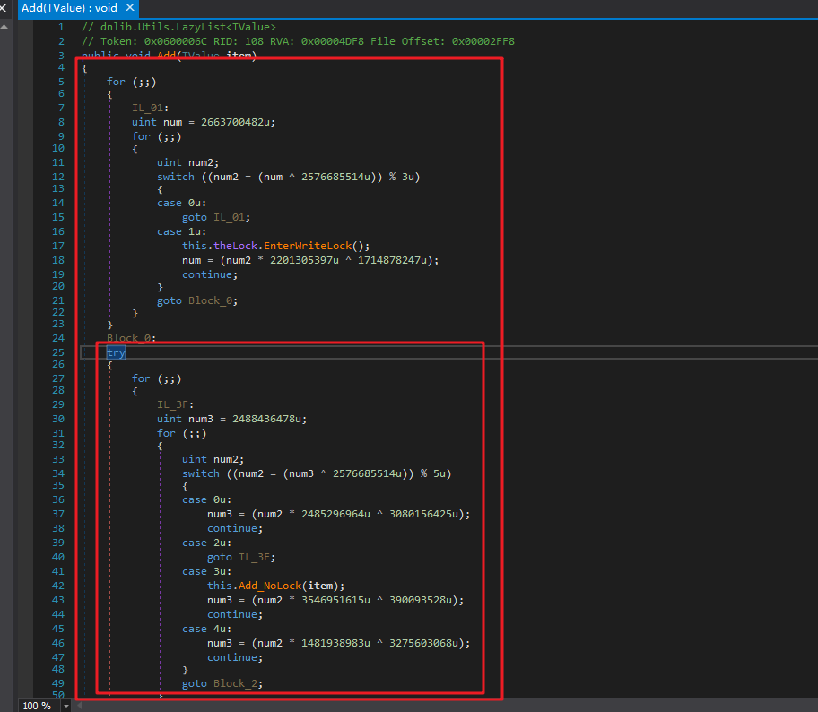

The big red box, for example, is a scope, and the place where the try is included can be seen as a whole, and the control flow is confused without breaking the try into multiple parts. And inside the TRY is a scope, not a whole, that can be broken into multiple parts to continue the confusion.

So we're going to write the Helper class to simplify the operation of iterating through each scope to counter obfuscate. This class is called BlockRecursiveModel and the code is in the appendix to the previous article in this series. Here's a screenshot of what it looks like.

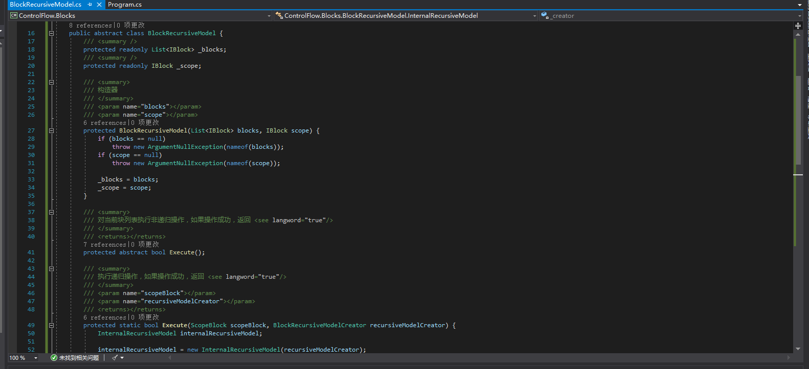

### Block sequencer.

Why sort? The first thing is to reduce the code size, if not sorted, the IL code might look like this, with unconditional jump instructions br everywhere, making it almost impossible to read the IL code.

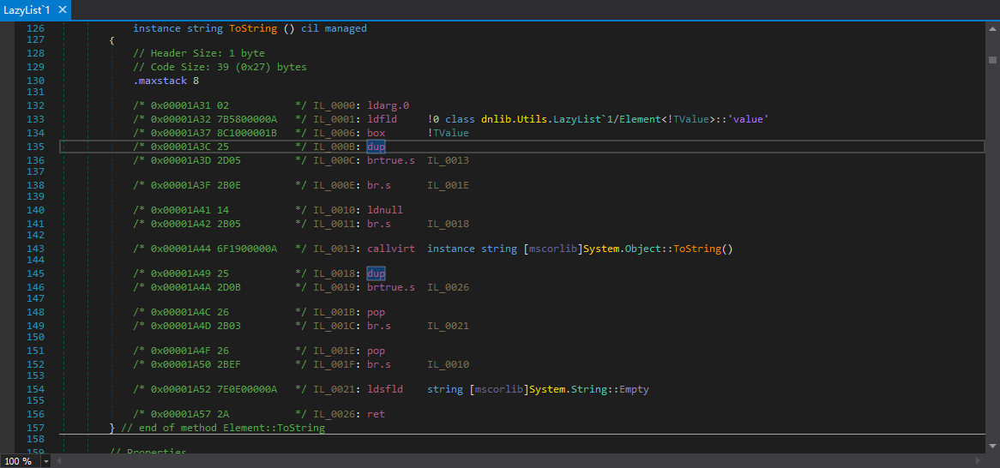

And the logic is much clearer after the sorting.

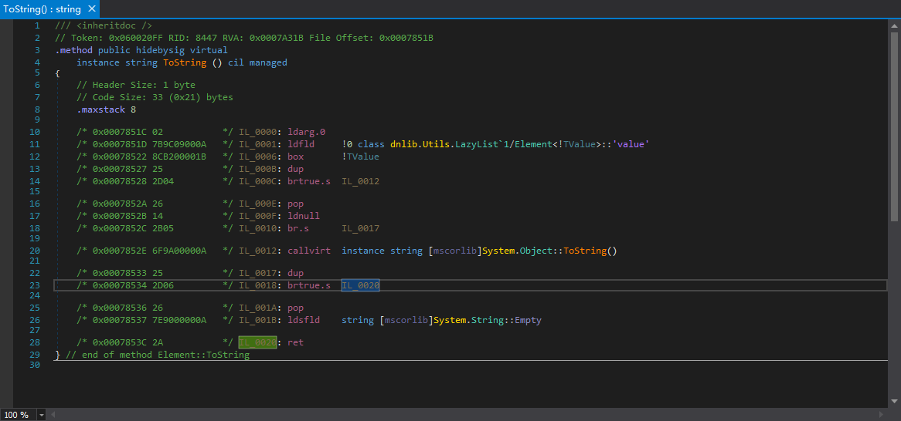

It's just a very simple body of methods. If it's a complex method body, the code will swell a lot and sequencing becomes very important.

Of course, sorting only has an effect on the generated instruction flow, it has no effect on the control flow after we analyze the tree structure, that is, the control flow after it is divided into blocks.

After the chunks are stored in List&lt;T&gt;in whatever order, the structure is actually the same.

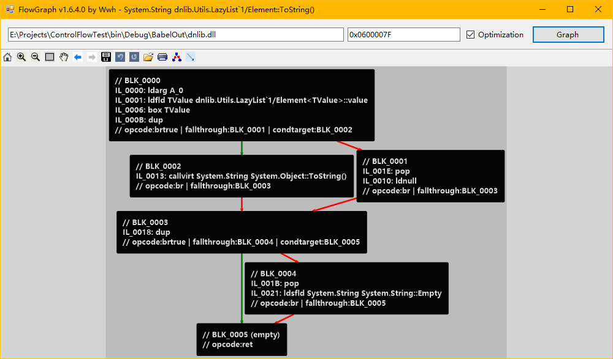

This is the tool I wrote and the compiled program will be attached at the end of the article.

With the BlockRecursiveModel just mentioned, the code for block sorting is actually very simple, we have to first analyze the direct reference relationship between block and block in the same scope, and then use the topological sorting. Some people may say that topological sorting can only be done with a ringless graph, but we can use topological sorting here, so I won't explain why, just try it myself.

To analyze the citation relationship, we still need to define an additional piece of information to store the results of our analysis.

``` csharp
private sealed class BlockInfo {
	private readonly List<IBlock> _references;
	private bool _isVisited;

	public List<IBlock> References => _references;

	public bool IsVisited {
		get => _isVisited;
		set => _isVisited = value;
	}
}
```

References indicate references, meaning which blocks will be jumped to.

``` csharp
private void AddXref(BasicBlock source, BasicBlock target) {
	IBlock targetRoot;
	List<IBlock> references;

	targetRoot = target.GetRootBlock(_scope);
	if (targetRoot == null)
		// We don't deal with the ones that go outside the scope.
		return;
	references = source.GetRootBlock(_scope).PeekExtraData<BlockInfo>().References;
	if (!references.Contains(targetRoot))
		references.Add(targetRoot);
}

public static IBlock GetRootBlock(this IBlock block, IBlock scope) {
	if (block == null)
		throw new ArgumentNullException(nameof(block));
	if (scope == null)
		throw new ArgumentNullException(nameof(scope));

	while (true) {
		if (block.Scope == scope)
			return block;
		else
			block = block.Scope;
		if (block == null)
			return null;
	}
}
```

The source in the code represents the base block to which the jump will occur and the target represents the base block to which the jump will occur.

After analyzing all the reference relationships, we can just use the topological sorting.

``` csharp
private sealed class TopologicalSorter {
	private readonly List<IBlock> _blocks;
	private readonly Stack<IBlock> _blockStack;

	public TopologicalSorter(List<IBlock> blocks) {
		if (blocks == null)
			throw new ArgumentNullException(nameof(blocks));

		_blocks = blocks;
		_blockStack = new Stack<IBlock>(_blocks.Count);
	}

	public Stack<IBlock> Sort() {
		DfsSort(_blocks[0]);
		return _blockStack;
	}

	private void DfsSort(IBlock block) {
		BlockInfo blockInfo;

		blockInfo = block.PeekExtraData<BlockInfo>();
		blockInfo.IsVisited = true;
		for (int i = blockInfo.References.Count - 1; i >= 0; i--)
			if (!blockInfo.References[i].PeekExtraData<BlockInfo>().IsVisited)
				DfsSort(blockInfo.References[i]);
		_blockStack.Push(block);
	}
}
```

The complete code for the whole sorting is in the zip file attached to the previous post, called BlockSorter.cs

### Remove NOP

Removing the NOP is very simple because we have already converted it to a block, iterate through each basic block and remove the NOP from each basic block.

If it's simple, then why even mention it?

Because our goal is to make all situations as simple as possible, into one situation so that we can handle it much easier. And the presence of the NOP may affect our ability to identify features.

### Basic block inline.

What do you mean by inline, like this.

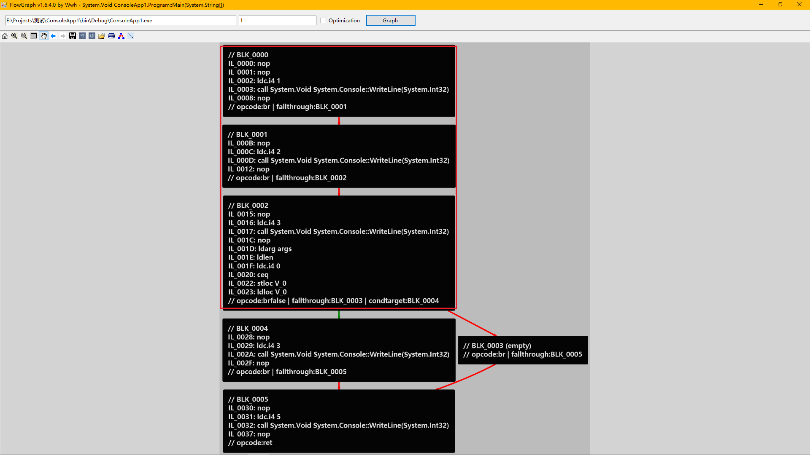

The 3 basic blocks in the red box are what can be inline together, why? Because BLK_0002 is only referenced by a basic block, so is BLK_0001, which is only referenced by a basic block, and the referent is an unconditional jump, then we can inline. BLK_0004 is only referenced by a basic block, but the referent BLK_0002 is a conditional jump, we can not inline.

After the inline.

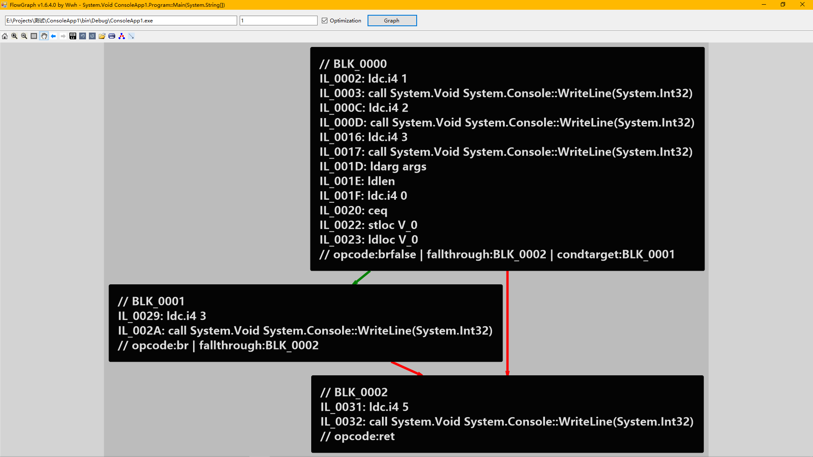

Isn't the effect noticeable, with a much clearer control flow and no redundancy?

This tool has an Optimization option, which will inline all the blocks that can be inlined together, clear the NOP, and sort the blocks.

In addition to this, we can also inline a case where a basic block is empty and the jump instruction is an unconditional jump instruction br. In this case, we can inline whatever jump instruction the referencing party has, regardless of how many referencing parties.

For example.

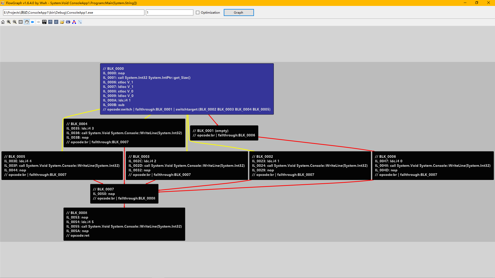

Here BLK_0007 is an empty block (nop instruction equals non-existent, we'll optimize it out), and the jump instruction is the unconditional jump instruction br. Although BLK_0007 has BLK_0002 BLK_0003 BLK_0004 BLK_0005 BLK_0006 with 5 references, we can all inline it.

Inline effect.

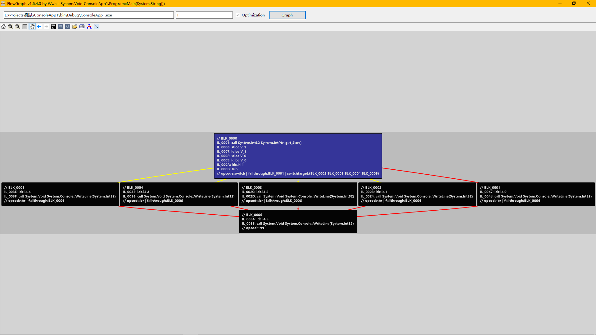

The source code of this control stream is actually very simple, it is a switch+goto compiled in Debug mode.

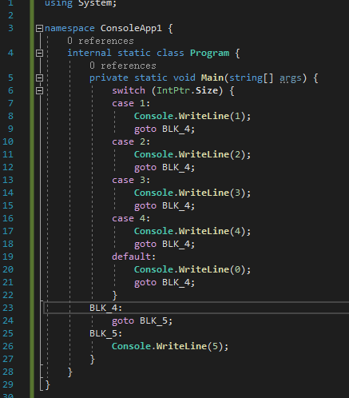

Just a side note, isn't this code generation more like the control flow diagram we have open after optimization?

This is where the inline bull comes in and can greatly simplify the control flow. Although it's impressive, the implementation is more complex than the code above.

It's actually not much more complicated, the code is just put out, it's actually 200 lines.

``` csharp
using System.Collections.Generic;
using ControlFlow.Blocks;
using dnlib.DotNet.Emit;

namespace ControlFlow.Deobfuscation {
	/// <summary>
	/// Basic block A that can be removed, failure to remove may prevent us from analyzing.
	/// 1. A basic block A has no other instructions, only the unconditional jump instruction br
	/// 2. a base block B unconditionally jumps to a base block A with the same scope, and A is only referenced by B
	/// </summary>
	public sealed class BlockInliner : BlockRecursiveModel {
		private BlockInliner(List<IBlock> blocks, IBlock scope) : base(blocks, scope) {
		}

		/// <summary>
		/// inline
		/// </summary>
		/// <param name="methodBlock"></param>
		/// <returns></returns>
		public static bool Inline(MethodBlock methodBlock) {
			bool result;

			methodBlock.PushExtraDataAllBasicBlocks(() => new BlockInfo());
			new BlockXref(methodBlock, AddXref).Analyze();
			// We need to analyze all the reference relationships between the blocks before we can complete the inline
			result = Execute(methodBlock, (blocks, scope) => new BlockInliner(blocks, scope));
			methodBlock.PopExtraDataAllBasicBlocks();
			return result;
		}

		private static void AddXref(BasicBlock source, BasicBlock target) {
			List<BasicBlock> references;
			List<BasicBlock> dereferences;

			references = source.PeekExtraData<BlockInfo>().References;
			if (!references.Contains(target))
				references.Add(target);
			dereferences = target.PeekExtraData<BlockInfo>().Dereferences;
			if (!dereferences.Contains(source))
				dereferences.Add(source);
		}

		/// <summary />
		protected override bool Execute() {
			bool isModified;
			bool next;

			if (_blocks.Count < 2)
				return false;
			isModified = FixEntryBlockIfBrOnly();
			// If the entry to the scope (i.e. the first block of the scope) is an empty block, we specialize in
			do {
				for (int i = 1; i < _blocks.Count; i++) {
					// Skip the entry block. This code can't handle the entry block.
					BasicBlock target;
					BlockInfo targetInfo;

					target = _blocks[i] as BasicBlock;
					// target represents blocks that may be able to be merged
					if (target == null)
						// Scope blocks cannot be merged to other blocks
						continue;
					targetInfo = target.PeekExtraData<BlockInfo>();
					if (CanInline(target, targetInfo)) {
						UpdateReferencesOfDereferences(target, targetInfo);
						// Update the TARGET reverse reference citation.
						UpdateDereferencesOfReferences(target, targetInfo);
						// Update the back-reference of the TARGET reference
						targetInfo.IsInlineed = true;
					}
				}
				next = _blocks.RemoveAll(block => block is BasicBlock && block.PeekExtraData<BlockInfo>().IsInlineed) != 0;
				if (next)
					isModified = true;
			} while (next);
			return isModified;
		}

		private static bool CanInline(BasicBlock target, BlockInfo targetInfo) {
			if (target.IsEmpty && target.BranchOpcode.Code == Code.Br) {
				// Empty BR jump blocks that can be merged unconditionally
				return true;
			}
			else {
				BasicBlock dereference;

				if (targetInfo.Dereferences.Count != 1)
					// A target can only be inlined when it is referenced by a block
					return false;
				dereference = targetInfo.Dereferences[0];
				if (dereference.BranchOpcode.Code != Code.Br)
					// The block that references the current block must be the base block, and the last instruction must be br
					// If leave, it means that the back-reference is from another scope, target and back-reference are not in the same scope, then we cannot inline the target.
					return false;
				return true;
			}
		}

		private static void UpdateReferencesOfDereferences(BasicBlock target, BlockInfo targetInfo) {
			foreach (BasicBlock dereference in targetInfo.Dereferences) {
				if (dereference.BranchOpcode.Code == Code.Br) {
					// br unconditional jump, direct inline base block
					if (!target.IsEmpty)
						dereference.Instructions.AddRange(target.Instructions);
					dereference.BranchOpcode = target.BranchOpcode;
					dereference.FallThrough = target.FallThrough;
					dereference.ConditionalTarget = target.ConditionalTarget;
					dereference.SwitchTargets = target.SwitchTargets;
				}
				else {
					// To determine on a case-by-case basis where target is used
					if (dereference.FallThrough == target)
						dereference.FallThrough = target.FallThrough;
					if (dereference.ConditionalTarget == target)
						dereference.ConditionalTarget = target.FallThrough;
					if (dereference.SwitchTargets != null)
						for (int j = 0; j < dereference.SwitchTargets.Count; j++)
							if (dereference.SwitchTargets[j] == target)
								dereference.SwitchTargets[j] = target.FallThrough;
				}
				ListReplace(dereference.PeekExtraData<BlockInfo>().References, target, targetInfo.References);
				// Replace the target in the reference of the target reverse reference with the target reference
			}
		}

		private static void UpdateDereferencesOfReferences(BasicBlock target, BlockInfo targetInfo) {
			foreach (BasicBlock reference in targetInfo.References)
				ListReplace(reference.PeekExtraData<BlockInfo>().Dereferences, target, targetInfo.Dereferences);
			// Replace the target in the back reference of the target reference with the back reference of the target
		}

		private static void ListReplace<T>(List<T> list, T oldItem, List<T> newItems) {
			if (newItems.Count > 1) {
				list.Remove(oldItem);
				foreach (T newItem in newItems)
					if (!list.Contains(newItem))
						list.Add(newItem);
			}
			else if (newItems.Count == 1) {
				for (int i = 0; i < list.Count; i++)
					if (ReferenceEquals(list[i], oldItem))
						list[i] = newItems[0];
			}
		}

		private bool FixEntryBlockIfBrOnly() {
			if (!IsBrOnlyBlock(_blocks[0]))
				return false;

			BasicBlock entryBlock;
			IBlock fallThroughRoot;

			entryBlock = (BasicBlock)_blocks[0];
			fallThroughRoot = GetNonBrOnlyFallThrough(entryBlock).GetRootBlock(_scope);
			_blocks[_blocks.IndexOf(fallThroughRoot)] = entryBlock;
			_blocks[0] = fallThroughRoot;
			// We only exchange the location of the entry base block and the block that br-only eventually arrives
			// So FixEntryBlockIfBrOnly must be called at the beginning, and then the current scope block's entry can be fixed
			return false;
		}

		private static bool IsBrOnlyBlock(IBlock block) {
			BasicBlock basicBlock;

			basicBlock = block as BasicBlock;
			return basicBlock != null && IsBrOnlyBlock(basicBlock);
		}

		private static bool IsBrOnlyBlock(BasicBlock basicBlock) {
			return basicBlock.IsEmpty && basicBlock.BranchOpcode.Code == Code.Br;
		}

		private static BasicBlock GetNonBrOnlyFallThrough(BasicBlock basicBlock) {
			return IsBrOnlyBlock(basicBlock) ? GetNonBrOnlyFallThrough(basicBlock.FallThrough) : basicBlock;
		}

		private sealed class BlockInfo {
			private List<BasicBlock> _references;
			private List<BasicBlock> _dereferences;
			private bool _isInlineed;

			public List<BasicBlock> References {
				get => _references;
				set => _references = value;
			}

			public List<BasicBlock> Dereferences {
				get => _dereferences;
				set => _dereferences = value;
			}

			public bool IsInlineed {
				get => _isInlineed;
				set => _isInlineed = value;
			}

			public BlockInfo() {
				_references = new List<BasicBlock>();
				_dereferences = new List<BasicBlock>();
			}
		}
	}
}
```

Still emphasize again, the control flow analysis series of articles will certainly not be simple, it is not possible to look at it from a horse's eye, to fully understand the code posted above, or to compile the above code (put the source code released in the previous article compiled), to VS inside the single-step debugging, little by little to see the complete process.

### Standardization

The 3 previously written vignettes are all operations required for standardization. What is standardization? Keeping control flowing down to the bare minimum is standardization. After standardizing the control flow, it will be very easy for us to match features, and the cleanup effect can be much improved.

Code.

``` csharp
/// <summary>
/// Creating standardized method blocks
/// </summary>
/// <param name="methodDef"></param>
/// <returns></returns>
public static MethodBlock CreateStandardMethodBlock(this MethodDef methodDef) {
	if (methodDef == null)
		throw new ArgumentNullException(nameof(methodDef));

	MethodBlock methodBlock;

	methodBlock = methodDef.CreateMethodBlock();
	methodBlock.Standardize();
	return methodBlock;
}

/// <summary>
/// Standardize method blocks (remove NOP, inline, sort)
/// </summary>
/// <param name="methodBlock"></param>
public static void Standardize(this MethodBlock methodBlock) {
	if (methodBlock == null)
		throw new ArgumentNullException(nameof(methodBlock));

	NopRemover.Remove(methodBlock);
	BlockSorter.Sort(methodBlock);
	// The purpose here is not to sort, but to remove invalid blocks, otherwise the BlockInliner inline may not be thorough
	BlockInliner.Inline(methodBlock);
	BlockSorter.Sort(methodBlock);
	// topological order (math.)
}
```

## Switch confusion.

I currently encountered the most difficult control flow confusion should be ConfuserEx Switch confusion, can handle ConfuserEx Switch confusion, other control flow confusion should be no problem, so here only ConfuserEx. compiled tools at the end of the article also have.

ConfuserEx control flow obfuscation has many modes, here only ConfuserEx-GUI added control flow obfuscation, also known as Switch-Normal mode. Other modes can be found in the official documentation [Control Flow Protection - Wiki](https://github.com/yck1509/ConfuserEx/wiki/Control-Flow-Protection). The other models of anti-mixing, the principles of which are similar, will not be repeated.

Then regarding some Mod versions of ConfuserEx, none of the changes in control stream obfuscation are particularly large, and the anti-obfuscation principle is the same.

### Analysis.

Find a ConfuserEx plus control flow obfuscation program and use dnSpy to see the features first.

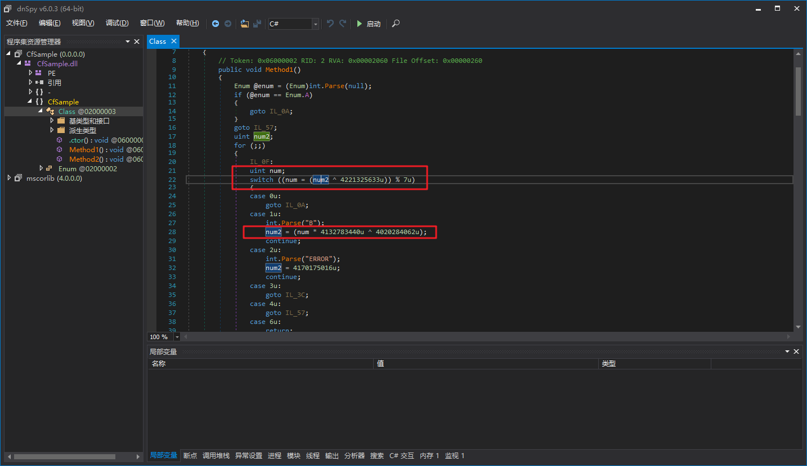

Obviously, this can't be statically decrypted, the next case to jump to is related to the previous case. dnSpy looks at 2 local variables controlling the control flow, is that actually the case?

No! One of these NUMs is decompiler generated.

Let's look at IL.

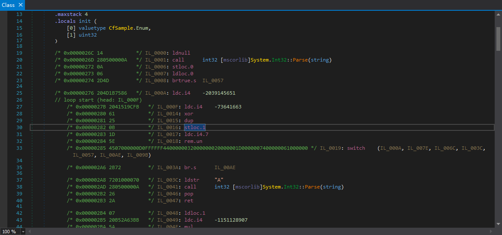

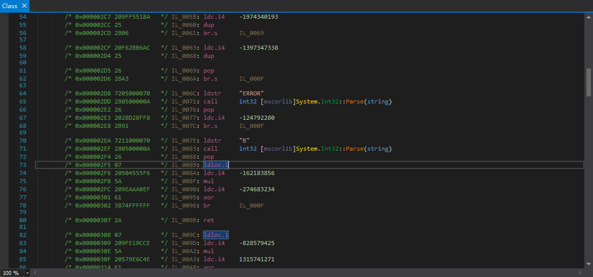

Only the local variable V_1 was used.

Why are the constants in the control stream mix generated by ConfuserEx particularly large? The key is still a residual operation, such as x % 7, then the range of results is {0, 1, 2, 3, 4, 5, 6}, which is exactly 7 results.

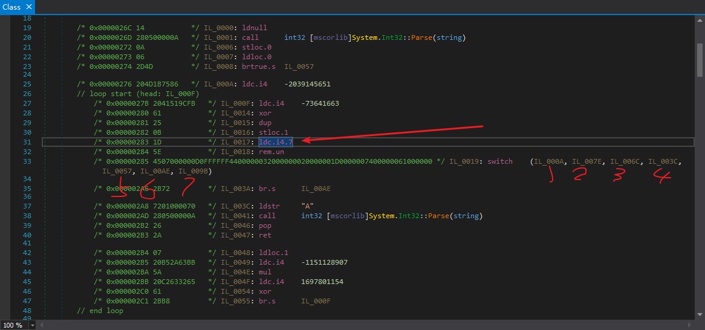

In this switch, for example, there are 7 conditional jump targets, then it is % 7, that is, divide by 7 for the remainder.

We will also note that there are 2 cases of assigning values to num, one related to the value of num itself and one unrelated.

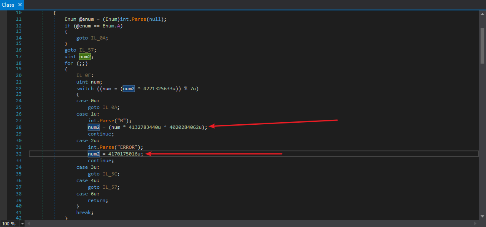

Why is there a direct num = ??????? ;and you're done with the code? Isn't it stronger to use contextual, i.e. linear, coding all the time? This one was certainly not intentional by the ConfuserEx author, and there's a reason for that. We can look at the ConfuserEx source code and find the answer here.

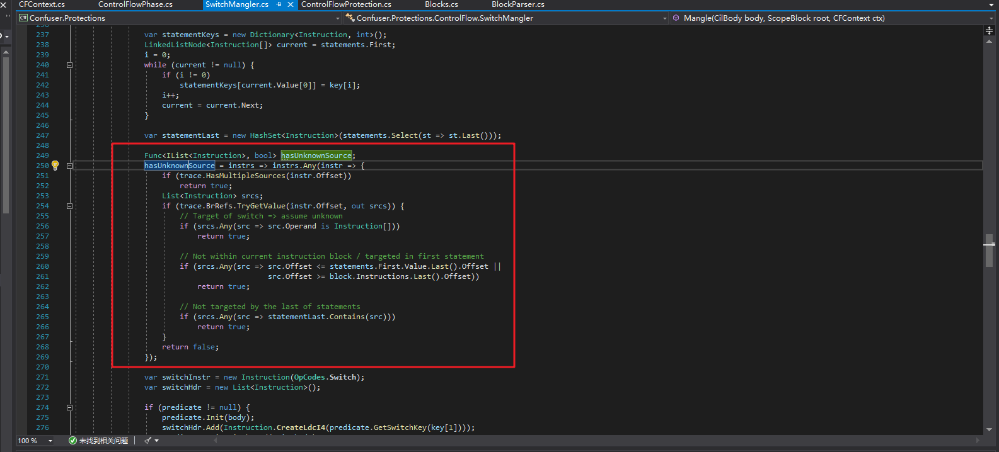

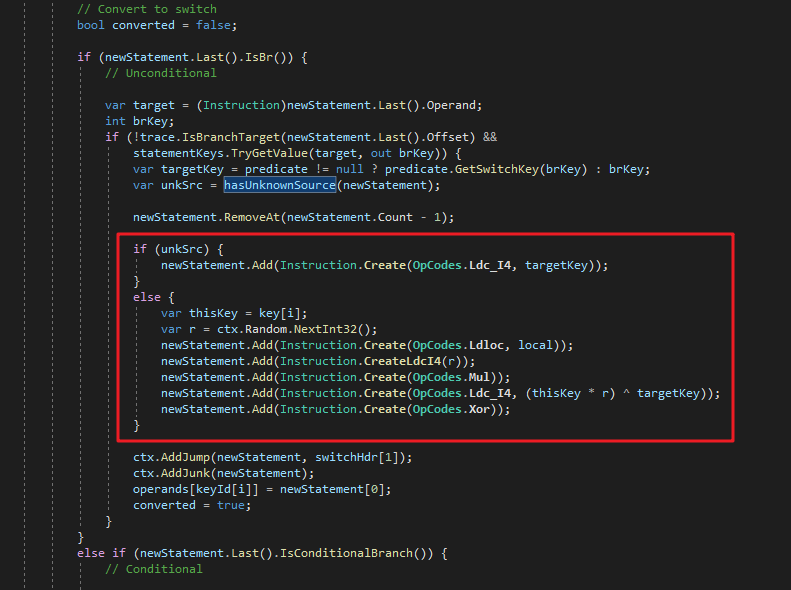

This code means that if a base block A has an unknown source, meaning that there are non-known base blocks that jump to base block A, then no linearly decoded code is generated. Because if it is an unknown base block that jumps to base block A, then the value of num at this point is uncertain, and if we still use num = num * xxxx ^ xxxx;, it will cause the decoded num to be wrong.

So one conclusion we can draw from this linear Switch confusion is this

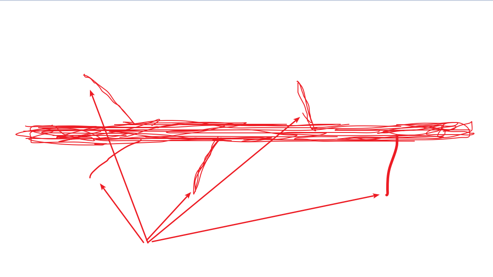

Linear Switch confusion is like a pile of mixed up lines in the diagram that go straight to the inside and won't clean up the confusion. The linear Switch obfuscation has and has at least one entry point for the unknown source, which is the few fine lines pointed by the arrows in the figure, which is where the ConfuserEx Switch obfuscation is assigned directly to num.

Let's take a look at the tool FlowGraph (with optimization turned on).

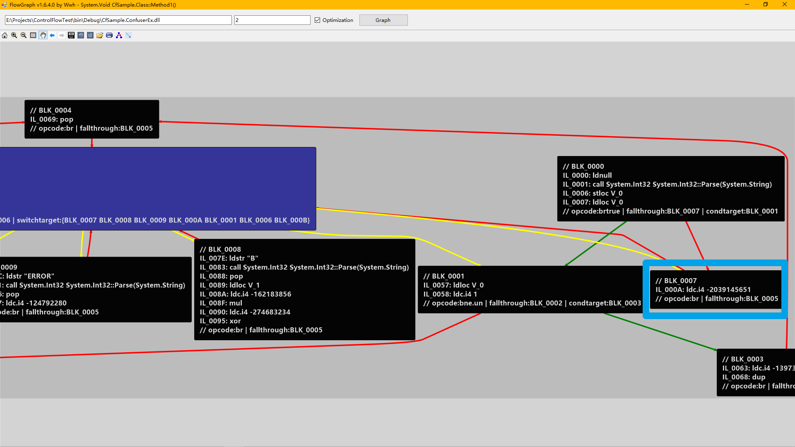

The blue box circled out is an entry point for this linear Switch.

We can look again at other bodies of methods, and the same is true.

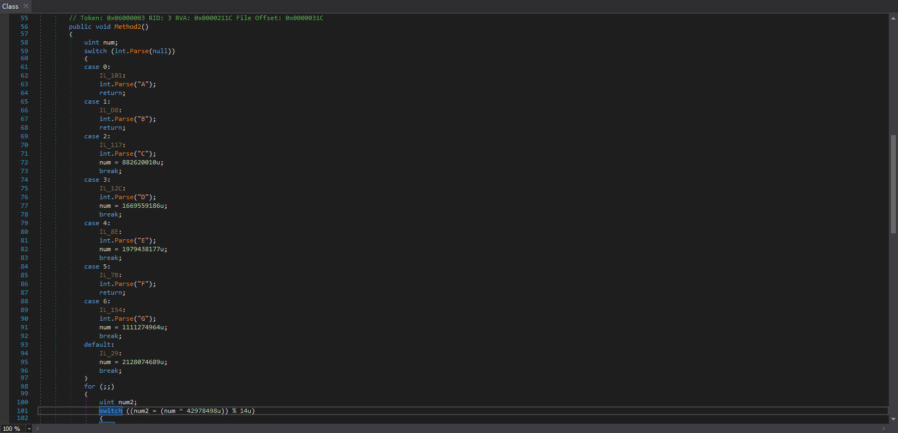

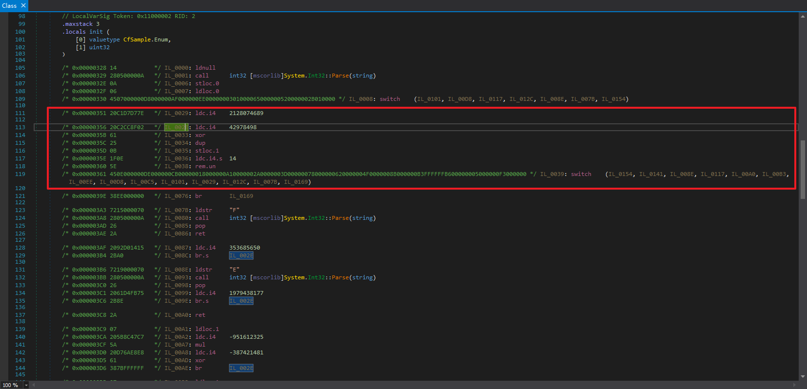

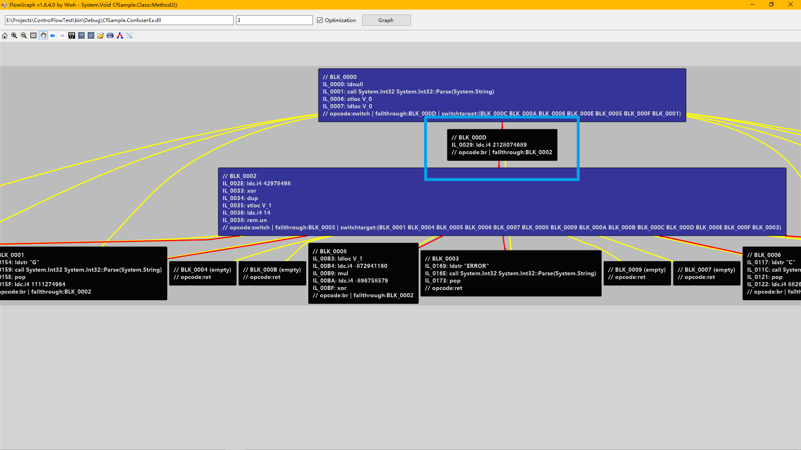

Same features as previously summarized.

So we have to clean up the linear Switch obfuscation, which can only be achieved by entering from this entry point and executing part of the code virtually.

### Virtual Machine

Virtual execution requires a virtual machine. Although there are ready-made virtual machines, such as the virtual machine in de4dot.blocks, but I just like to build wheels, write them myself and use them comfortably and easily to modify them.

Also at the end of the Virtual Machine Full Code article.

#### Opcode classification

We can start by classifying all the command opcodes, simulating the ones we need, and not simulating the ones we don't.

Here I post what I sorted.

``` csharp
Add
Add_Ovf
Add_Ovf_Un
And
Div
Div_Un
Mul
Mul_Ovf
Mul_Ovf_Un
Neg
Not
Or
Rem
Rem_Un
Shl
Shr
Shr_Un
Sub
Sub_Ovf
Sub_Ovf_Un
Xor
// calculate

Ceq
Cgt
Cgt_Un
Ckfinite
Clt
Clt_Un
// judgment

Box
Castclass
Conv_I
Conv_I1
Conv_I2
Conv_I4
Conv_I8
Conv_Ovf_I
Conv_Ovf_I_Un
Conv_Ovf_I1
Conv_Ovf_I1_Un
Conv_Ovf_I2
Conv_Ovf_I2_Un
Conv_Ovf_I4
Conv_Ovf_I4_Un
Conv_Ovf_I8
Conv_Ovf_I8_Un
Conv_Ovf_U
Conv_Ovf_U_Un
Conv_Ovf_U1
Conv_Ovf_U1_Un
Conv_Ovf_U2
Conv_Ovf_U2_Un
Conv_Ovf_U4
Conv_Ovf_U4_Un
Conv_Ovf_U8
Conv_Ovf_U8_Un
Conv_R_Un
Conv_R4
Conv_R8
Conv_U
Conv_U1
Conv_U2
Conv_U4
Conv_U8
Unbox
Unbox_Any
// convert

Dup
Ldarg
Ldarga
Ldc_I4
Ldc_I8
Ldc_R4
Ldc_R8
Ldelem
Ldelem_I
Ldelem_I1
Ldelem_I2
Ldelem_I4
Ldelem_I8
Ldelem_R4
Ldelem_R8
Ldelem_Ref
Ldelem_U1
Ldelem_U2
Ldelem_U4
Ldelema
Ldfld
Ldflda
Ldftn
Ldind_I
Ldind_I1
Ldind_I2
Ldind_I4
Ldind_I8
Ldind_R4
Ldind_R8
Ldind_Ref
Ldind_U1
Ldind_U2
Ldind_U4
Ldlen
Ldloc
Ldloca
Ldnull
Ldobj
Ldsfld
Ldsflda
Ldstr
Ldtoken
Ldvirtftn
Newarr
Newobj
Pop
Starg
Stelem
Stelem_I
Stelem_I1
Stelem_I2
Stelem_I4
Stelem_I8
Stelem_R4
Stelem_R8
Stelem_Ref
Stfld
Stind_I
Stind_I1
Stind_I2
Stind_I4
Stind_I8
Stind_R4
Stind_R8
Stind_Ref
Stloc
Stobj
Stsfld
// take a value and assign a value

Beq
Bge
Bge_Un
Bgt
Bgt_Un
Ble
Ble_Un
Blt
Blt_Un
Bne_Un
Br
Brfalse
Brtrue
Endfilter
Endfinally
Leave
Ret
Rethrow
Switch
Throw
// branch

Call
Calli
Callvirt
// call

Arglist
Cpblk
Cpobj
Initblk
Initobj
Isinst
Localloc
Mkrefany
Refanytype
Refanyval
Sizeof
// other
```

For example, to deal with ConfuserEx control flow obfuscation, we implement partial value assignment, virtualization of assignment instructions, and virtualization of all operation instructions is enough, very simple.

#### virtual value

I have divided the values in the virtual machine into several common types.
值标志
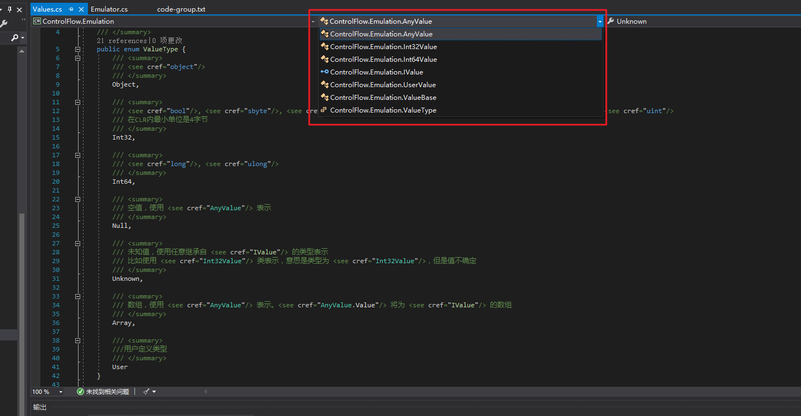

Just write one more interface representing the virtual value.

``` csharp
/// <summary>
/// value symbol
/// </summary>
public enum ValueType {
	/// <summary>
	/// <see cref="object"/>
	/// </summary>
	Object,

	/// <summary>
	/// <see cref="bool"/>, <see cref="sbyte"/>, <see cref="byte"/>, <see cref="short"/>, <see cref="ushort"/>, <see cref="int"/>, <see cref="uint"/>
	/// The minimum unit in the CLR is 4 bytes.
	/// </summary>
	Int32,

	/// <summary>
	/// <see cref="long"/>, <see cref="ulong"/>
	/// </summary>
	Int64,

	/// <summary>
	//// null value, using <see cref="AnyValue"/>
	/// </summary>
	Null,

	/// <summary>
	/// Unknown value, represented by an arbitrary inheritance from <see cref="IValue"/> type
	/// for example using <see cref="Int32Value"/> class representation, meaning type <see cref="Int32Value"/> but the value is uncertain
	/// </summary>
	Unknown,

	/// <summary>
	/// Array, represented by <see cref="AnyValue"/>. <see cref="AnyValue.Value"/> will be an array of <see cref="IValue"/>
	/// </summary>
	Array,

	/// <summary>
	///User-defined type
	/// </summary>
	User
}

/// <summary>
/// represent a value
/// </summary>
public interface IValue {
	/// <summary>
	/// mark
	/// </summary>
	ValueType Type { get; set; }

	/// <summary>
	/// value type returns this pointer, referencing the type depth clone itself
	/// </summary>
	/// <returns></returns>
	IValue Clone();
}
```

#### structure

I'm using the architecture inside de4dot.blocks, slightly modified to separate the virtual machine from the context itself.

``` csharp
/*
 * The virtual machine itself references the design of de4dot
 * 
 * The following code should have no relationship to the ControlFlow.Blocks project
 * The conversion should be done by Extensions
 * Simulator Emulator class only needs to do the function of simulation, not care what kind of Block it is
 * Nor do they need to care what the exception block looks like
 * Need only to return failures, to be judged and processed by the user
 * The user needs to determine what caused the simulation to fail
 *
 * This project is the same as the ControlFlow.Blocks project
 * Need to first use ControlFlow.Blocks.Extensions.SimplifyMacros (MethodDef) to streamline instructions
 * Otherwise the simulation may fail
 */

/// <summary>
/// Simulator context
/// </summary>
public sealed class EmulationContext {
	private readonly Dictionary<Local, IValue> _variables;
	private readonly Stack<IValue> _evaluationStack;

	/// <summary>
	/// local variable
	/// </summary>
	public Dictionary<Local, IValue> Variables => _variables;

	/// <summary>
	/// compute stack (computing)
	/// </summary>
	public Stack<IValue> EvaluationStack => _evaluationStack;

	/// <summary>
	/// constructor
	/// </summary>
	public EmulationContext() {
		_evaluationStack = new Stack<IValue>();
		_variables = new Dictionary<Local, IValue>();
	}

	/// <summary>
	/// constructor
	/// </summary>
	/// <param name="variables"></param>
	public EmulationContext(IEnumerable<Local> variables) : this() {
		if (variables == null)
			throw new ArgumentNullException(nameof(variables));

		foreach (Local variable in variables)
			_variables.Add(variable, null);
	}

	private EmulationContext(Dictionary<Local, IValue> variables, Stack<IValue> evaluationStack) {
		if (variables == null)
			throw new ArgumentNullException(nameof(variables));
		if (evaluationStack == null)
			throw new ArgumentNullException(nameof(evaluationStack));

		_variables = variables;
		_evaluationStack = evaluationStack;
	}

	/// <summary>
	/// Cloning the current instance
	/// </summary>
	/// <returns></returns>
	public EmulationContext Clone() {
		IValue[] array;
		Stack<IValue> evaluationStack;
		Dictionary<Local, IValue> variables;

		array = _evaluationStack.ToArray();
		evaluationStack = new Stack<IValue>(_evaluationStack.Count);
		for (int i = array.Length - 1; i >= 0; i--)
			evaluationStack.Push(array[i].Clone());
		variables = new Dictionary<Local, IValue>(_variables.Count);
		foreach (KeyValuePair<Local, IValue> variable in _variables)
			variables.Add(variable.Key, variable.Value?.Clone());
		return new EmulationContext(variables, evaluationStack);
	}
}

/// <summary>
/// Simulator results
/// </summary>
public sealed class EmulationResult {
	private readonly bool _success;
	private readonly Instruction _failedInstruction;
	private readonly Exception _exception;

	/// <summary>
	/// success or failure
	/// </summary>
	public bool Success => _success;

	/// <summary>
	/// Simulate a failed command.
	/// </summary>
	public Instruction FailedInstruction => _failedInstruction;

	/// <summary>
	/// Anomalies (if any)
	/// </summary>
	public Exception Exception => _exception;

	internal EmulationResult(bool success, Instruction failedInstruction, Exception exception) {
		_success = success;
		_failedInstruction = failedInstruction;
		_exception = exception;
	}
}
```

Giving the virtual machine a context, passing in the instructions to be executed virtually, returning the results of the execution, is that simple, not complicated.

For example, if we want to execute operations virtually, we need to use lambda in C#.

``` csharp
private bool Template_Arithmetic(Func<int, int, int> operation32, Func<long, long, long> operation64) {
	IValue x;
	IValue y;
	IValue result;

	y = EvaluationStack.Pop();
	x = EvaluationStack.Pop();
	result = CheckAndTryGetUnknownValue_Arithmetic(x, y);
	if (result != null) {
		EvaluationStack.Push(result);
		return true;
	}
	if (x is Int32Value && y is Int32Value) {
		if (operation32 == null)
			ThrowNotImpl();
		result = new Int32Value(operation32(((Int32Value)x).Int32, ((Int32Value)y).Int32));
	}
	else {
		if (operation32 == null)
			ThrowNotImpl();
		result = new Int64Value(operation64(GetInt64_Arithmetic(x), GetInt64_Arithmetic(y)));
	}
	EvaluationStack.Push(result);
	return true;
}

private static IValue CheckAndTryGetUnknownValue_Arithmetic(IValue x) {
	if (!(x is Int32Value) && !(x is Int64Value))
		ThrowErrorType();
	if (x.Type == ValueType.Unknown)
		return x is Int32Value ? (IValue)Int32Value.Unknown : Int64Value.Unknown;
	else
		return null;
}

private static IValue CheckAndTryGetUnknownValue_Arithmetic(IValue x, IValue y) {
	if ((!(x is Int32Value) && !(x is Int64Value)) || (!(y is Int32Value) && !(y is Int64Value)))
		ThrowErrorType();
	if (x.Type == ValueType.Unknown || y.Type == ValueType.Unknown)
		return x is Int32Value ? (IValue)Int32Value.Unknown : Int64Value.Unknown;
	else
		return null;
}

private static long GetInt64_Arithmetic(IValue value) {
	return value is Int32Value ? ((Int32Value)value).Int32 : ((Int64Value)value).Int64;
}
```

To simulate an arithmetic instruction, just call Template_Arithmetic, it's very simple.

``` csharp
protected virtual bool Emulate_Add(Instruction instruction) {
	return Template_Arithmetic((x, y) => x + y, (x, y) => x + y);
}

protected virtual bool Emulate_And(Instruction instruction) {
	return Template_Arithmetic((x, y) => x & y, (x, y) => x & y);
}

protected virtual bool Emulate_Div(Instruction instruction) {
	return Template_Arithmetic((x, y) => x / y, (x, y) => x / y);
}
```

The rest is very simple, it's just a big loop with a Switch judgment opcode, and then call the corresponding method for virtual execution, the code is not posted.

### Clear.

With a virtual machine, it's a lot easier for us to clear the Switch confusion. We can start clearing the Switch confusion now.

Part of the situation was first given special treatment.

ConfuserEx translates the conditional jump instruction into this form.

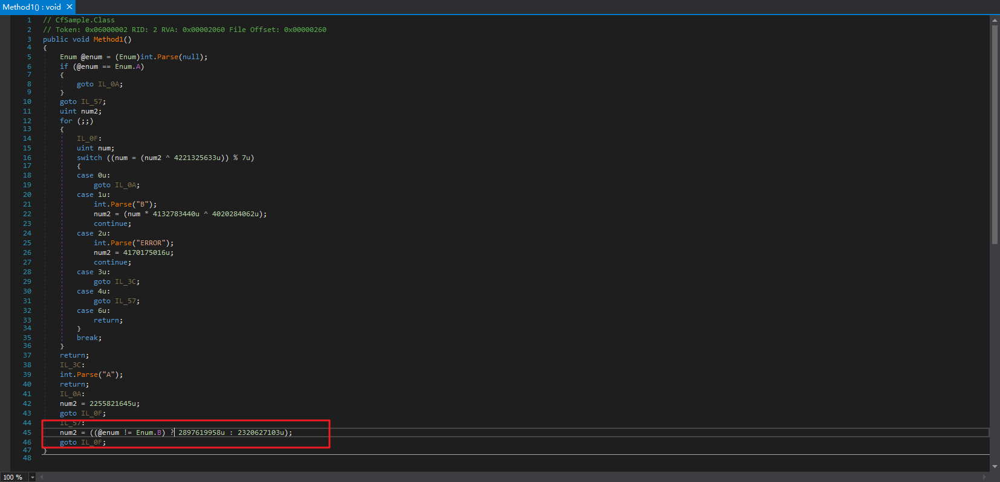

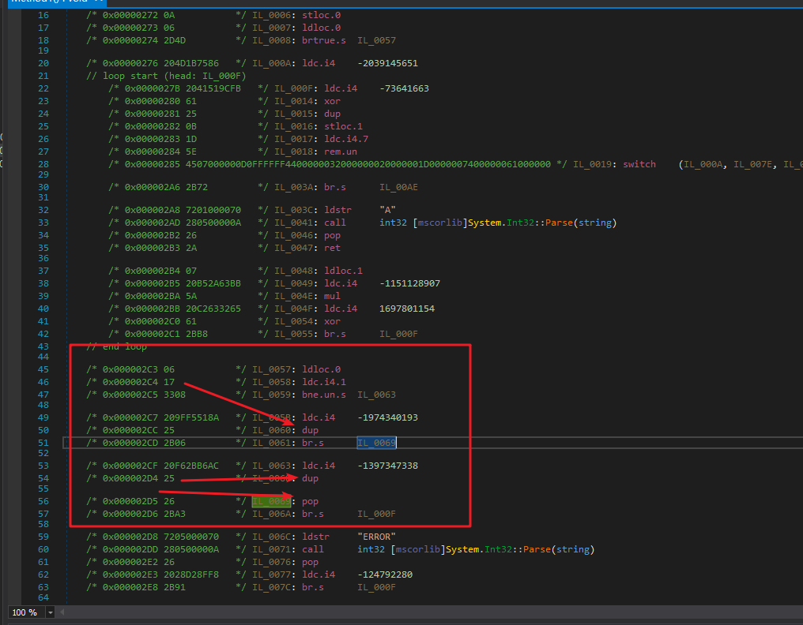

The dup and pop here is ConfuserEx's intentional interference with our code, and the dup and pop here are completely removable.

Remove the core code for this dup and pop (other code not posted, just get a thought).

``` csharp
private void HandleMultiDupWithOnePop(BasicBlock popBlock) {
	// We will only deal with this case for the time being, multiple dup blocks correspond to a single pop block (ConfuserEx)
	// Haven't seen a single DUP block corresponding to multiple POP blocks
	int popCount;
	List<BasicBlock> dupBlocks;
	int dupCount;

	popCount = GetPopCount(popBlock);
	if (popCount == 0)
		return;
	dupBlocks = popBlock.PeekExtraData<BlockInfo>().Dereferences;
	// Let's say the reverse references all have dups.
	if (dupBlocks.Count == 0)
		// Scene entry points may not be back-referenced, e.g. method block entry points, Catch block entry points
		return;
	foreach (BasicBlock dupBlock in dupBlocks)
		if (dupBlock.BranchOpcode.Code != Code.Br)
			// Must be an unconditional jump to the POP block.
			return;
	dupCount = int.MaxValue;
	foreach (BasicBlock dupBlock in dupBlocks) {
		int temp;

		temp = GetDupCount(dupBlock);
		if (temp < dupCount)
			dupCount = temp;
	}
	// Find the minimum number of dups
	if (dupCount == 0)
		return;
	if (popCount < dupCount)
		dupCount = popCount;
	// Find the minimum number of dup-pop pairs
	popBlock.Instructions.RemoveRange(0, dupCount);
	// pop block removes the pop at the beginning
	foreach (BasicBlock dupBlock in dupBlocks)
		dupBlock.Instructions.RemoveRange(dupBlock.Instructions.Count - dupCount, dupCount);
	// dup block removes dup at the end
	_dupCount += dupCount;
}
```

As with the previous BlockInliner, we also need to inline ConfuserEx's confused ifs so that we can mark the commands to be simulated for cleanup.

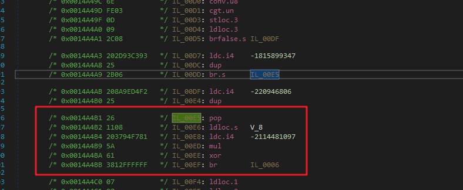

In this case, for example, the basic blocks in the red box can be inline to the 2 basic blocks above.

We have to first define an abstract class, write to clean up the logic of linear Switch confusion, and identify the part put into the subclass to implement, to achieve code reuse.

I'll just post the code for the abstract class.

``` csharp
/// <summary>
/// Linear Switch anti-aliasing (e.g. ConfuserEx)
/// We clean one linear Switch at a time, otherwise the code would be extremely complex
/// </summary>
public abstract class LinearSwitchDeobfuscatorBase : BlockRecursiveModel {
	/// <summary>
	/// Instruction Simulator
	/// </summary>
	protected readonly Emulator _emulator;
	/// <summary>
	/// Switch blocks
	/// </summary>
	protected BasicBlock _switchBlock;
	private bool _isModified;

	/// <summary />
	protected LinearSwitchDeobfuscatorBase(List<IBlock> blocks, IBlock scope, EmulationContext emulationContext) : base(blocks, scope) {
		_emulator = new Emulator(emulationContext);
	}

	/// <summary />
	protected static bool Deobfuscate(MethodBlock methodBlock, BlockRecursiveModelCreator deobfuscatorCreator) {
		return Execute(methodBlock, deobfuscatorCreator);
	}

	/// <summary />
	protected override bool Execute() {
		if (_blocks.Count < 2)
			return false;
		OnBegin();
		if (_switchBlock == null)
			return false;
		foreach (BasicBlock entry in GetEntries())
			VisitAllBasicBlocks(entry);
		OnEnd();
		return _isModified;
	}

	/// <summary>
	/// Access the specified base block and recursively access all jump targets for this base block
	/// </summary>
	/// <param name="basicBlock"></param>
	protected void VisitAllBasicBlocks(BasicBlock basicBlock) {
		BlockInfoBase blockInfo;

		if (basicBlock.Scope != _scope)
			// Specify that the base block is not in the current scope and no further access is required
			return;
		blockInfo = basicBlock.PeekExtraData<BlockInfoBase>();
		if (blockInfo.IsVisited && basicBlock != _switchBlock)
			// If the base block has been accessed and the base block is not a Switch block, return directly
			return;
		blockInfo.IsVisited = true;
		if (blockInfo.EmulationInfo != null) {
			// If a simulation is required.
			EmulationInfo emulationInfo;
			EmulationResult emulationResult;

			emulationInfo = blockInfo.EmulationInfo;
			_isModified |= OnEmulateBegin(basicBlock);
			emulationResult = _emulator.Emulate(basicBlock.Instructions, emulationInfo.StartIndex, emulationInfo.Length);
			_isModified |= OnEmulateEnd(basicBlock);
			if (!emulationResult.Success)
				throw new NotImplementedException ("No simulation failure handling yet, need to update the anti-aliasing model, or check if instructions that do not need to be simulated are simulated");
		}
		if (basicBlock == _switchBlock)
			// We're going to set up the next basic block to access.
			VisitAllBasicBlocks(GetNextBasicBlock());
		else
			// If not a Switch block, we use recursive access to the next base block
			switch (basicBlock.BranchOpcode.FlowControl) {
			case FlowControl.Branch:
				// unconditional jump, no need to back up the current simulator context
				VisitAllBasicBlocks(basicBlock.FallThrough);
				break;
			case FlowControl.Cond_Branch:
				CallNextVisitAllBasicBlocksConditional(basicBlock);
				break;
			}
	}

	/// <summary>
	/// Triggered before all operations start.
	/// In this method, it is necessary to add additional information to all basic blocks in _blocks and set the field <see cref="_switchBlock"/>
	/// If no Switch block is found, return directly instead of throwing an exception
	/// </summary>
	protected abstract void OnBegin();

	/// <summary>
	/// Triggered upon completion of all operations.
	/// In this method, it is necessary to remove all additional information from the basic blocks in _blocks
	/// </summary>
	protected abstract void OnEnd();

	/// <summary>
	/// Access to available simulated entry points
	/// </summary>
	/// <returns></returns>
	protected abstract IEnumerable<BasicBlock> GetEntries();

	/// <summary>
	/// Triggered before the specified base block is simulated, returns whether the current base block is modified
	/// </summary>
	/// <param name="basicBlock"></param>
	/// <returns></returns>
	protected abstract bool OnEmulateBegin(BasicBlock basicBlock);

	/// <summary>
	/// Triggered after specifying a base block simulation, returns whether the current base block is modified
	/// </summary>
	/// <param name="basicBlock"></param>
	/// <returns></returns>
	protected abstract bool OnEmulateEnd(BasicBlock basicBlock);

	/// <summary>
	/// After encountering a Switch block, get the next basic block via the simulator
	/// </summary>
	/// <returns></returns>
	protected virtual BasicBlock GetNextBasicBlock() {
		Int32Value value;

		value = _emulator.EvaluationStack.Pop() as Int32Value;
		if (value == null)
			throw new InvalidOperationException();
		return _switchBlock.SwitchTargets[value.Int32];
	}

	/// <summary>
	/// Recursively call VisitAllBasicBlocks when experiencing a conditional jump
	/// </summary>
	/// <param name="basicBlock">Basic blocks for conditional jumps</param>
	protected virtual void CallNextVisitAllBasicBlocksConditional(BasicBlock basicBlock) {
		EmulationContext context;

		context = _emulator.Context.Clone();
		// conditional jump, with multiple jump targets, requires backup of current simulator context
		if (basicBlock.FallThrough != null) {
			VisitAllBasicBlocks(basicBlock.FallThrough);
			_emulator.Context = context;
			// Restore simulator context
		}
		if (basicBlock.ConditionalTarget != null) {
			VisitAllBasicBlocks(basicBlock.ConditionalTarget);
			_emulator.Context = context;
		}
		if (basicBlock.SwitchTargets != null)
			foreach (BasicBlock target in basicBlock.SwitchTargets) {
				VisitAllBasicBlocks(target);
				_emulator.Context = context;
			}
	}

	/// <summary>
	/// Base block additional information base class
	/// </summary>
	protected abstract class BlockInfoBase {
		/// <summary />
		protected bool _isVisited;
		/// <summary />
		protected EmulationInfo _emulationInfo;

		/// <summary>
		/// Is this basic block accessed?
		/// </summary>
		public bool IsVisited {
			get => _isVisited;
			set => _isVisited = value;
		}

		/// <summary>
		/// Simulation-related information
		/// If simulation is required, set this attribute to non- <see langword="null"/> and vice versa, <see langword="null"/>
		/// </summary>
		public EmulationInfo EmulationInfo {
			get => _emulationInfo;
			set => _emulationInfo = value;
		}
	}

	/// <summary>
	/// Provide the information required for the simulation
	/// </summary>
	protected sealed class EmulationInfo {
		private readonly int _startIndex;
		private readonly int _length;

		/// <summary>
		/// Start the simulation with the instruction specifying the index.
		/// </summary>
		public int StartIndex => _startIndex;

		/// <summary>
		/// The number of instructions to be simulated
		/// </summary>
		public int Length => _length;

		/// <summary>
		/// constructor
		/// </summary>
		/// <param name="startIndex"></param>
		/// <param name="length"></param>
		public EmulationInfo(int startIndex, int length) {
			_startIndex = startIndex;
			_length = length;
		}
	}
}
```

There is not much code, the core part is still in the method name with VisitAllBasicBlocks. For example, VisitAllBasicBlocks, is the normal execution process of the simulation program, encountered the Switch confusion, the simulation execution, and then OnEmulateEnd inside the completion of the Switch confusion decryption.

After doing so many cleanup operations, ConfuserEx Switch almost revealed the original shape, features became very obvious, we inherited LinearSwitchDeobfuscatorBase and then identify the features on it.

``` csharp
public sealed class LinearSwitchDeobfuscator : LinearSwitchDeobfuscatorBase {
	private BasicBlock _lastCaseBlockAny;

	private LinearSwitchDeobfuscator(List<IBlock> blocks, IBlock scope, EmulationContext emulationContext) : base(blocks, scope, emulationContext) {
	}

	public static bool Deobfuscate(MethodBlock methodBlock) {
		bool isModified;

		isModified = false;
		while (Deobfuscate(methodBlock, (blocks, scope) => new LinearSwitchDeobfuscator(blocks, scope, methodBlock.CreateEmulationContext()))) {
			// We can only clear one LinearSwitch at a time, so use while loop
			methodBlock.Standardize();
			isModified = true;
		}
		return isModified;
	}

	protected override void OnBegin() {
		foreach (BasicBlock basicBlock in _blocks.EnumerateAllBasicBlocks())
			if (IsLinearSwitchBlock(basicBlock)) {
				_switchBlock = basicBlock;
				break;
			}
		// Find the Switch block first.
		if (_switchBlock == null)
			return;
		foreach (BasicBlock basicBlock in _blocks.EnumerateAllBasicBlocks()) {
			if (basicBlock == _switchBlock)
				basicBlock.PushExtraData(new BlockInfo(BlockType.LinearSwitch) {
					EmulationInfo = new EmulationInfo(0, SwitchConstants.LinearSwitchCodes.Length)
				});
			else if (IsCaseBlock(basicBlock))
				basicBlock.PushExtraData(new BlockInfo(BlockType.Case) {
					EmulationInfo = new EmulationInfo(basicBlock.Instructions.Count - SwitchConstants.CaseCodes.Length, SwitchConstants.CaseCodes.Length)
				});
			else if (IsLinearCaseBlock(basicBlock))
				basicBlock.PushExtraData(new BlockInfo(BlockType.LinearCase) {
					EmulationInfo = new EmulationInfo(basicBlock.Instructions.Count - SwitchConstants.LinearCaseCodes1.Length, SwitchConstants.LinearCaseCodes1.Length)
					// LinearCaseCodes1和LinearCaseCodes2长度一样
				});
			else
				basicBlock.PushExtraData(new BlockInfo(BlockType.Normal));
		}
	}

	private bool IsLinearSwitchBlock(BasicBlock basicBlock) {
		return basicBlock.BranchOpcode.Code == Code.Switch && basicBlock.Instructions.CodeEquals(SwitchConstants.LinearSwitchCodes);
	}

	private bool IsCaseBlock(BasicBlock basicBlock) {
		return basicBlock.BranchOpcode.Code == Code.Br && basicBlock.FallThrough == _switchBlock && basicBlock.Instructions.EndsWith(SwitchConstants.CaseCodes);
	}

	private bool IsLinearCaseBlock(BasicBlock basicBlock) {
		return basicBlock.BranchOpcode.Code == Code.Br &&
			basicBlock.FallThrough == _switchBlock &&
			(basicBlock.Instructions.EndsWith(SwitchConstants.LinearCaseCodes1) ||
			basicBlock.Instructions.EndsWith(SwitchConstants.LinearCaseCodes2));
	}

	protected override void OnEnd() {
		foreach (BasicBlock basicBlock in _blocks.EnumerateAllBasicBlocks())
			basicBlock.PopExtraData();
	}

	protected override IEnumerable<BasicBlock> GetEntries() {
		foreach (BasicBlock basicBlock in _blocks.EnumerateAllBasicBlocks())
			if (basicBlock.PeekExtraData<BlockInfo>().Type == BlockType.Case)
				yield return basicBlock;
	}

	protected override bool OnEmulateBegin(BasicBlock basicBlock) {
		return false;
	}

	protected override bool OnEmulateEnd(BasicBlock basicBlock) {
		BlockInfo blockInfo;

		blockInfo = basicBlock.PeekExtraData<BlockInfo>();
		switch (blockInfo.Type) {
		case BlockType.LinearSwitch:
			Int32Value value;

			if (_lastCaseBlockAny == null)
				throw new InvalidOperationException();
			value = _emulator.EvaluationStack.Peek() as Int32Value;
			if (value == null)
				throw new InvalidOperationException();
			_lastCaseBlockAny.FallThrough = _switchBlock.SwitchTargets[value.Int32];
			_lastCaseBlockAny = null;
			return true;
		case BlockType.Case:
			basicBlock.Instructions.RemoveTrailingRange(SwitchConstants.CaseCodes.Length);
			_lastCaseBlockAny = basicBlock;
			break;
		case BlockType.LinearCase:
			basicBlock.Instructions.RemoveTrailingRange(SwitchConstants.LinearCaseCodes1.Length);
			_lastCaseBlockAny = basicBlock;
			break;
		}
		return false;
	}

	private enum BlockType {
		Normal,
		LinearSwitch,
		Case,
		LinearCase
	}

	private sealed class BlockInfo : BlockInfoBase {
		private readonly BlockType _type;

		public BlockType Type => _type;

		public BlockInfo(BlockType type) {
			_type = type;
		}
	}
}
```

The cleanup part of this code is in OnEmulateEnd, this OnEmulateEnd is very much like a Hook, we intercept the current compute stack before the switch jumps to the target, get the num in switch(num), so we can know where the last basic block is going to jump to, then we modify the jump target of the last basic block, we are done with a cleanup operation.

If ConfuserEx's switch obfuscation adds N multilayers, we have to judge again whether it is really a linear switch, such as this one, is not a linear switch:.

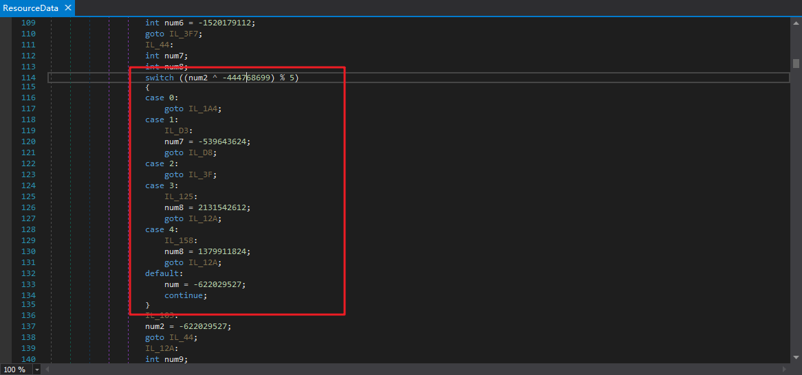

If we clean up the linear Switch without cleaning up these non-linear ones first, it's likely to cause errors.

## Download

Control FlowGraph: [Baidu Cloud](https://pan.baidu.com/s/1eCu6U0ZWsIwQBM3F9ZIcDw) Extraction code: csb1

Anti-obfuscation tool ConfuserExSwitchDeobfuscator: [Baidu Cloud](https://pan.baidu.com/s/1Cesv95OBRb_llP4zQ_QbTQ) Extraction code: 6hvr

Emulation：[Baidu Cloud](https://pan.baidu.com/s/10k372M1LAJQkg8Z6jsPPNw) Extraction code：d687

To test UnpackMe for ConfuserExSwitchDeobfuscator, I added 15 layers of control flow confusion: [Baidu Cloud](https://pan.baidu.com/s/1VegZtzj4avjIXS4qrWL8Bg) Extraction code: xbj6
