# Anti-obfuscation Mutation of VMP.NET

## preamble

**This is an anti-aliasing of VMP under .NET, not C++**

VMP v3.4 adds support for .NET programs, I know the features include anti-debugging, JIT protection (a little strange, because debugging did not see the hook operation, but really can not directly dump), Mutation (mutation), Virtualization (virtualization). virtualization is really strong, I can not figure it out, but probably understand the structure, maybe the write tool automatically rename can be more understandable, probably not as strong as KoiVM. but Mutation is still better to handle, something like control flow confusion, or control flow-related constant encryption.

## analysis

Since the VMP Demo version of the shelled program can only run on my own computer, I wrote a .NET sample myself.

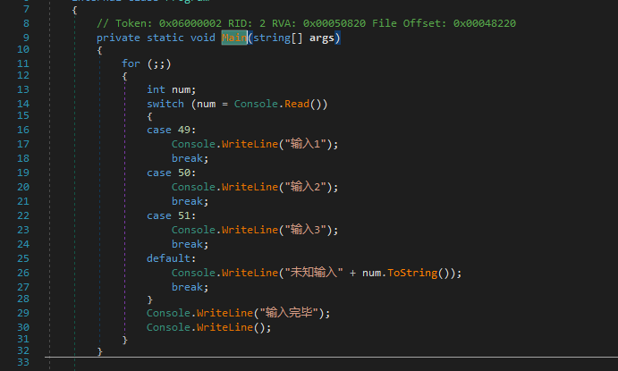

Then add the shell, compile mode select Mutation, open with dnSpy, find your own way to add the shell. A number of loops can be found that are generated by obfuscators.

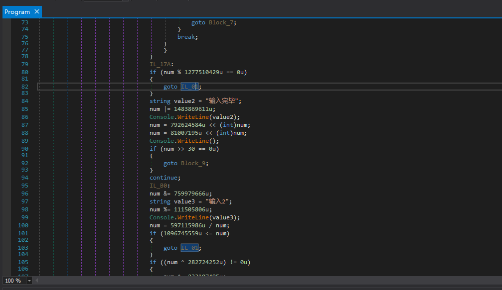

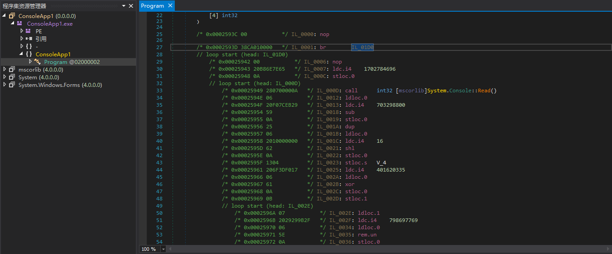

On closer inspection, we can see that the confusion is relatively single, the variable num is what can be called a Context (context), execute an instruction and the context will update itself once. Why would I pick a sample with a switch statement to shell out, because we need to know if the context is the same when going into a different base block and then transferring to the same base block (it's generally the same, because I can't think of a different case...) .

Maybe it's not so easy to understand, I debug it directly and can understand it better. Each case block in the sample corresponds to a different base block than the one just described, and will eventually be transferred to the same base block,
that is "Console.WriteLine("Input complete")", start with this basic block. So we break point under this basic block.

We enter different numbers separately, let the switch statement jump to a different case block, to see if the final execution to "Console.WriteLine("Enter complete")", when the value of num is the same.

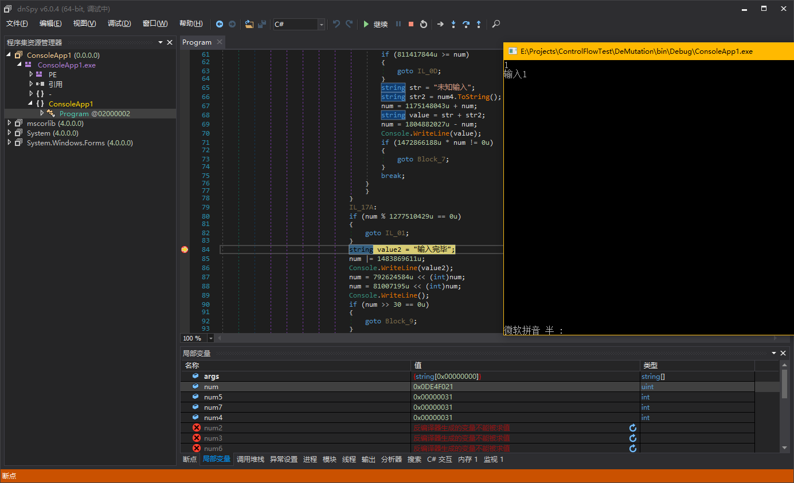

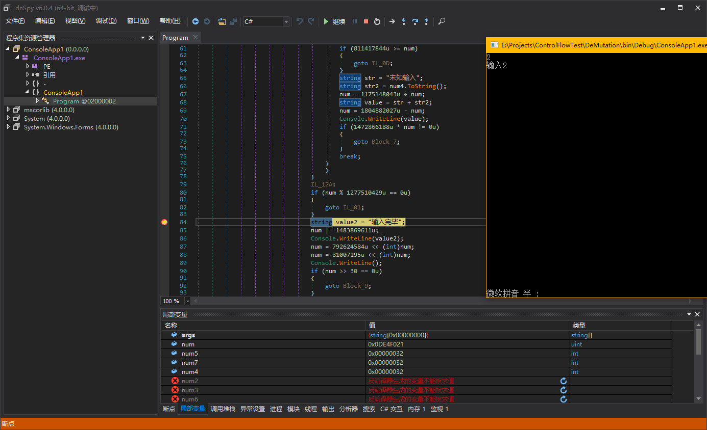

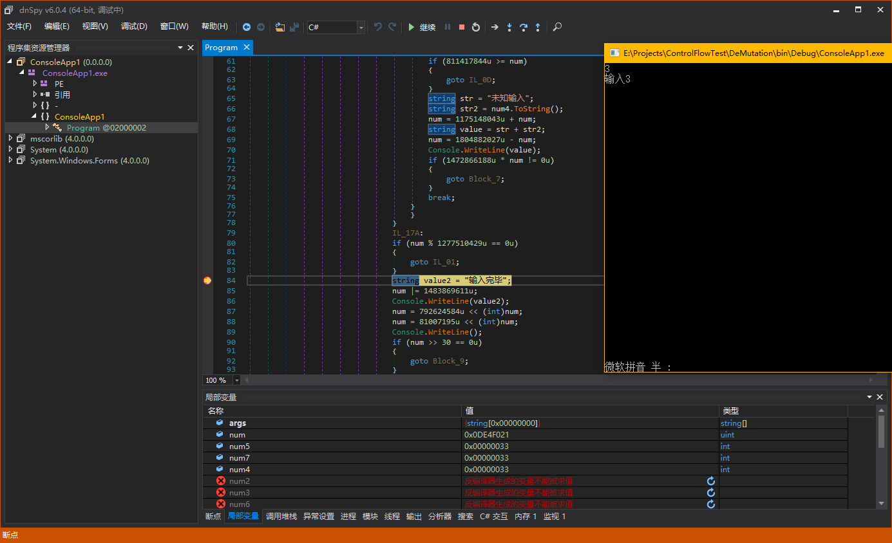

In this way, our conjecture is correct and the macrostructure of Mutation we understand is cleared for the next step of analysis.

We want to formulate the simplest scheme to clean up Mutation, so switch dnSpy decompile mode back to IL and see what the num update statement actually looks like.

The entry point for this method is a BR jump, so look directly at what the basic block that the BR jump to looks like.

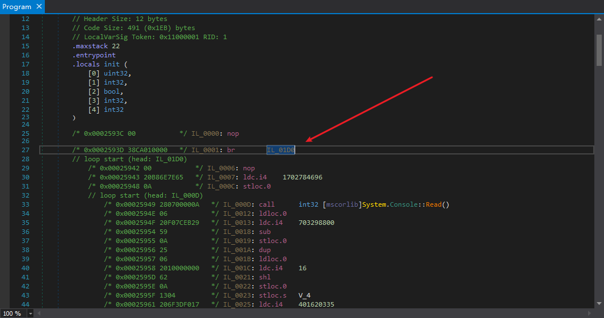

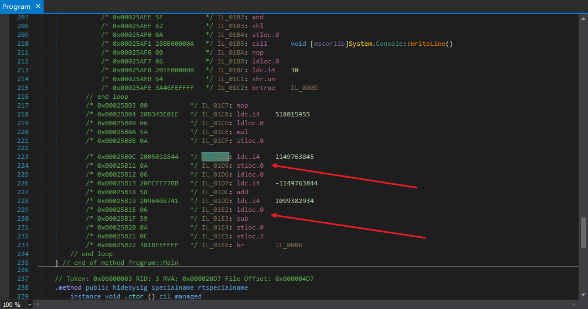

Since this basic block is the entry point for the entire method, then this basic block must also be the place where Mutation is initialized and will be the entry point for our simulations using the simulator, as shown in my previous
NET Control Flow Analysis (II) - Anti-Muddle", search to find, first look inside to clean up ConfuserEx's switch muddle and clean up VMP.NET Mutation is very similar.

The first arrow pointed at it.
``` csharp
ldc.i4    1149763845
stloc.0
```
This is the initialization of the context num, which will be updated later with code like this
``` csharp
ldc.i4    1099382934
ldloc.0
sub
stloc.0
```
If there are constants in the code, the decryption of constants is similar to this one, since it was analyzed before writing, so it's not written again.

## anti-aliasing

This kind of confusion, while simple, is a bit of a hassle to actually clean up, so why say so? Because you have to simulate the entire control stream, simulating every possible branching situation, to ensure that your decryption results are foolproof. It would be very cumbersome to simulate and could cause a dead loop. What to do with the results obtained from decryption is again a problem when simulating.

### try

**The following are all my attempts (only partial), and the solutions I found after various attempts. **

My first thought was feature matching.
``` csharp
ldc.i4
ldloc
add/sub/mul/div ...
```
Such a code, when encountered, is directly replaced with
``` csharp
nop
nop
ldc.i4
```
It ended up failing, not very well, because there are some features that are not like this, such as confusing the branch jump before the instruction (say confusing the branch jump, because the result of this jump is definite and the result is the same every time it is jumped)

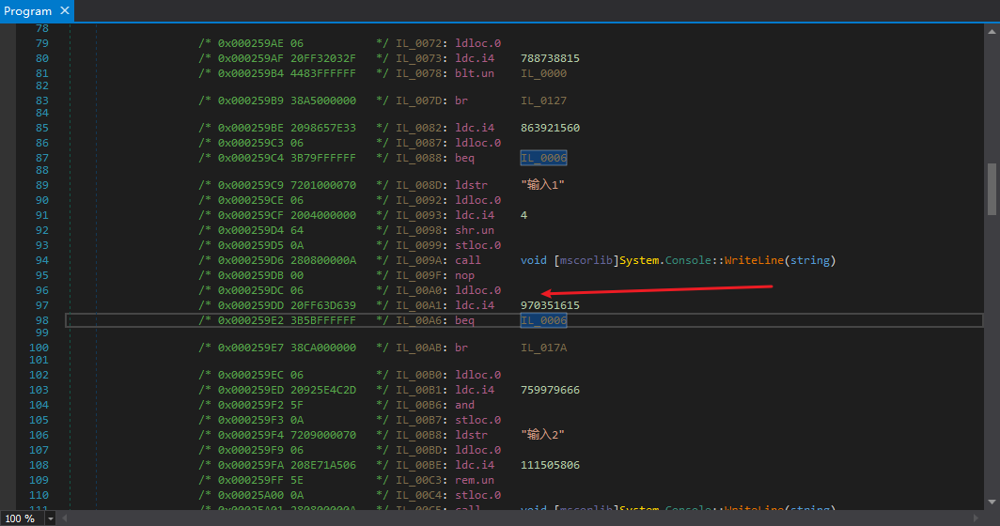

So I came up with a very speculative way to just replace

``` csharp
ldloc
```

for

``` csharp
ldc.i4
```

This can be applied to all situations.。

After each simulation, I determine if the simulated instruction reads the variable NUM, and if so, I directly replace it with

``` csharp
ldc.i4
```

But there's a big problem with finding that out. Because I have no way of accurately identifying the methods that have been confused by VMP.NET Mutation. It's true that C# decompilation results are obvious to the naked eye, but how to identify them with code is a very big problem. Sometimes there is a misjudgment, identify what is not confused as confused, then simulate the result, replace directly, and finally find out that it should not be replaced, which is very troublesome. Declassified and replaced in place, with other issues, all in all very bad.

In the end, I decided to use a collection to save the decryption results and to verify that the results are the same for each simulation, and that if they are different it means that there is a problem with the code, or that there is a bug in the VMP, which increases stability.

### Write good logic.

In fact, at first I wrote the logic and the implementation together, because it was easy to modify, but later, when it was basically stable and there were not many bugs, I abstracted the logic and separated the underlying decryption operations.

Since I wrote the tool, I'll go by my source code, starting with the abstract class.

Here is the list of members of my abstract class

``` csharp
namespace ControlFlow.Deobfuscation {
	/// <summary>
	/// Decoding the constants of the hybrid control flow
	/// </summary>
	public abstract class ConstantFlowDeobfuscatorBase {
		/// <summary>
		/// Method blocks to be decrypted
		/// </summary>
		protected readonly MethodBlock _methodBlock;
		/// <summary>
		/// Instruction Simulator
		/// </summary>
		protected readonly Emulator _emulator;
		/// <summary>
		/// Control flow related variables
		/// </summary>
		protected Local _flowContext;
		/// <summary>
		/// Decipher the number of
		/// </summary>
		protected int _decryptedCount;

#if DEBUG
		/// <summary />
		protected int _indent;
		/// <summary />
		public bool DEBUG;
#endif

		/// <summary>
		/// constructor
		/// </summary>
		/// <param name="methodBlock"></param>
		protected ConstantFlowDeobfuscatorBase(MethodBlock methodBlock);

		/// <summary>
		/// decryption
		/// </summary>
		protected virtual void Deobfuscate();

		/// <summary>
		/// Access the specified base block and recursively access all jump targets for this base block
		/// </summary>
		/// <param name="basicBlock"></param>
		protected virtual void VisitAllBasicBlocks(BasicBlock basicBlock);

		/// <summary>
		/// Triggered before all operations start.
		/// In this method, it is necessary to add additional information to all basic blocks and set the field <see cref="_flowContext"/>
		/// If <see cref="_flowContext"/> is not found, return directly instead of throwing an exception
		/// </summary>
		protected abstract void OnBegin();

		/// <summary>
		/// Triggered upon completion of all operations.
		/// In this method, it is necessary to remove all additional information from the basic blocks
		/// </summary>
		protected abstract void OnEnd();

		/// <summary>
		/// Access to available simulated entry points
		/// </summary>
		/// <returns></returns>
		protected abstract IEnumerable<BasicBlock> GetEntries();

		/// <summary>
		/// Triggered before the specified command simulation for the specified base block
		/// </summary>
		/// <param name="basicBlock"></param>
		/// <param name="index">Index of instructions</param>
		protected abstract void OnEmulateBegin(BasicBlock basicBlock, int index);

		/// <summary>
		/// Triggered after the specified command simulation of the specified base block
		/// </summary>
		/// <param name="basicBlock"></param>
		/// <param name="index">Index of instructions</param>
		protected abstract void OnEmulateEnd(BasicBlock basicBlock, int index);

		/// <summary>
		/// Triggered before the base block simulation is specified
		/// </summary>
		/// <param name="basicBlock"></param>
		protected virtual void OnEmulateBegin(BasicBlock basicBlock);

		/// <summary>
		/// Triggered after specifying the base block simulation
		/// </summary>
		/// <param name="basicBlock"></param>
		protected virtual void OnEmulateEnd(BasicBlock basicBlock);

		/// <summary>
		/// After the simulation runs one base block, fetch the next base block by simulating the branching instruction, and if you cannot fetch it, return <see langword="null"/>
		/// Whether successful or not, be sure to balance the stack
		/// </summary>
		/// <param name="basicBlock"></param>
		/// <returns></returns>
		protected virtual BasicBlock EmulateBranch(BasicBlock basicBlock);

		/// <summary>
		/// Recursively call <see cref="VisitAllBasicBlocks"/> when experiencing a conditional jump
		/// </summary>
		/// <param name="basicBlock">Basic blocks for conditional jumps</param>
		protected virtual void CallNextVisitAllBasicBlocksConditional(BasicBlock basicBlock);

#if DEBUG
		private static string DEBUG_ToString(BasicBlock basicBlock);
#endif

		/// <summary>
		/// Base block additional information base class
		/// </summary>
		protected abstract class BlockInfoBase {
			/// <summary>
            /// Simulation tag, if the specified instruction requires simulation, set the element corresponding to the index to <see langword="true"/>

			/// </summary>
			public bool[] EmulationMarks;

			/// <summary>
			/// Next basic block to simulate (just possible, but if <see cref="HashSet{T}.Count"/> is 1, it is certain)
			/// </summary>
			public List<BasicBlock> NextBasicBlocks;

			/// <summary>
			/// Is the current base block already entered to prevent loops
			/// </summary>
			public bool IsEntered;

			/// <summary>
			/// constructor
			/// </summary>
			/// <param name="basicBlock"></param>
			protected BlockInfoBase(BasicBlock basicBlock);
		}
	}
}
```

If you read my original ConfuserEx switch confusion cleanup article, you can see that this and that switch cleanup abstraction classes are very similar, both need to provide all available entry points, simulate to the end, thus covering the entire method to achieve the decryption effect.

The key logic is still here at VisitAllBasicBlocks, and I've changed it N times, and all N bugs are caused by logic problems here.

So instead of posting code with bugs, I'll just post the code that works, with the comments I was asked to write because of the bugs.

``` csharp
protected virtual void VisitAllBasicBlocks(BasicBlock basicBlock) {
	BlockInfoBase blockInfo;

	blockInfo = basicBlock.PeekExtraData<BlockInfoBase>();
	if (blockInfo.IsEntered)
		// If already in the base block, prevent loops and return directly
		return;
#if DEBUG
	if (DEBUG)
		Console.WriteLine($"{new string(' ', _indent)}{DEBUG_ToString(basicBlock)}: {_emulator.Locals[_flowContext]}");
#endif
	blockInfo.IsEntered = true;
	OnEmulateBegin(basicBlock);
	for (int i = 0; i < basicBlock.Instructions.Count; i++)
		if (blockInfo.EmulationMarks[i]) {
			OnEmulateBegin(basicBlock, i);
			if (!_emulator.Emulate(basicBlock.Instructions[i]))
				throw new NotImplementedException("No simulation failure handling has been implemented and the anti-aliasing model needs to be updated or checked to see if instructions that do not need to be simulated are being simulated");
			OnEmulateEnd(basicBlock, i);
		}
	OnEmulateEnd(basicBlock);
	switch (basicBlock.BranchOpcode.FlowControl) {
	case FlowControl.Return:
	case FlowControl.Throw:
		break;
	default:
		BasicBlock nextBasicBlock;

		nextBasicBlock = EmulateBranch(basicBlock);
		if (nextBasicBlock is null) {
#if DEBUG
			_indent += 2;
			if (DEBUG)
				Console.WriteLine(new string(' ', _indent) + "conditional");
#endif
			CallNextVisitAllBasicBlocksConditional(basicBlock);
#if DEBUG
			_indent -= 2;
#endif
		}
		else {
			// The current simulation results are based on the current base block before the base block.
			// Since the results of the previous base block simulations are not necessarily going to happen (see CallNextVisitAllBasicBlocksConditional), we can't just clean up the branches here, but save them.
			//nextBasicBlock.PeekExtraData<BlockInfoBase>().IsEntered = false;
			// If there is a while(true){} loop, this line of code may cause a dead loop
			// The idea was that if the next base block A, i.e. the branching instruction, is available, then the next base block A simulation is forced, regardless of whether it is currently in base block A
			// It may not be necessary for the time being.
			If (!blockInfo.NextBasicBlocks.Contains(nextBasicBlock))
				blockInfo.NextBasicBlocks.Add(nextBasicBlock);
			// If the branch result is the same in all cases, then we can conclude that there are confusing branch instructions here that can be cleaned
			// Assuming that the previous base block simulation results occurred, then this base block simulation results are correct, so force the next base block to be simulated
			VisitAllBasicBlocks(nextBasicBlock);
		}
		break;
	}
	blockInfo.IsEntered = false;
}
```

The blockInfo.IsEntered here was originally IsVisited and I changed it to IsEntered. to prevent the simulation from going into a dead loop, it is necessary to prevent a basic block from repeating itself, but this degree needs to be mastered. Initially it was intended that if this basic block had already been simulated, then it would not be simulated. Clearly there is something wrong with this idea. If you use IsVisited to indicate that the basic block can only be simulated once, then you will not be able to simulate every branch situation, which may lead to a miscarriage of justice.

Why say there could be a miscarriage of justice, like this.

``` csharp
uint num = 0;
if (xxx)
	num = RandomUInt32();
Console.WriteLine(num);
```

Assuming that the logic is that a basic block can only be executed once, we first simulate a situation where the if statement does not execute, then the execution to

``` csharp
Console.WriteLine(num);
```

When the value of num is determined, it is 0

We then simulate the if branch execution, since the base block of Console.WriteLine is executed, so we don't execute it.

Then in the end, we get a decryption result where the value of num used by Console.WriteLine is 0, but that is not the case.

So we should use IsEntered to say that if it's already in a base block, then we can't simulate this base block repeatedly to prevent a dead loop like while(true). Setting IsEntered for a base block to true before simulating a base block, and false after simulating the branching instructions for this base block, solves the problem perfectly.

CallNextVisitAllBasicBlocksConditional the code is the same as the ConfuserEx switch obfuscation and cleanup code (from the previous post

CallNextVisitAllBasicBlocksConditional (There is a bug in the code of the EmulationContext, carefully compare the code that I wait for the next post, we will know why, note that my EmulationContext is a reference type)

``` csharp
protected virtual void CallNextVisitAllBasicBlocksConditional(BasicBlock basicBlock) {
	EmulationContext context;

	context = _emulator.Context.Clone();
	// conditional jump, with multiple jump targets, requires backup of current simulator context
	if (!(basicBlock.FallThrough is null)) {
		VisitAllBasicBlocks(basicBlock.FallThrough);
		_emulator.Context = context.Clone();
		// Restore simulator context
	}
	if (!(basicBlock.ConditionalTarget is null)) {
		VisitAllBasicBlocks(basicBlock.ConditionalTarget);
		_emulator.Context = context.Clone();
	}
	if (!(basicBlock.SwitchTargets is null))
		foreach (BasicBlock target in basicBlock.SwitchTargets) {
			VisitAllBasicBlocks(target);
			_emulator.Context = context.Clone();
		}
}
```

Next is the implementation of all abstract methods and some imaginary methods. The code is posted straight out.

``` csharp
namespace ControlFlow.Deobfuscation.Specials.VMProtect {
	public sealed class MutationDeobfuscator : ConstantFlowDeobfuscatorBase {
		private static readonly Code[] InitializeFlowContextCodes = new Code[] { Code.Ldc_I4, Code.Stloc };
		private static readonly Code[] CanBeEmulatedCodes = new Code[] {
			Code.Add, Code.Add_Ovf, Code.Add_Ovf_Un, Code.And, Code.Div, Code.Div_Un, Code.Mul, Code.Mul_Ovf, Code.Mul_Ovf_Un, Code.Neg, Code.Not, Code.Or, Code.Rem, Code.Rem_Un, Code.Shl, Code.Shr, Code.Shr_Un, Code.Sub, Code.Sub_Ovf, Code.Sub_Ovf_Un, Code.Xor,
			Code.Ceq, Code.Cgt, Code.Cgt_Un, Code.Clt, Code.Clt_Un,
			Code.Ldc_I4,
			Code.Ldloc, Code.Stloc,
			Code.Beq, Code.Bge, Code.Bge_Un, Code.Bgt, Code.Bgt_Un, Code.Ble, Code.Ble_Un, Code.Blt, Code.Blt_Un, Code.Bne_Un, Code.Br, Code.Brfalse, Code.Brtrue, Code.Endfilter, Code.Endfinally, Code.Leave, Code.Ret, Code.Rethrow, Code.Switch, Code.Throw
		};

		private List<BasicBlock> _basicBlocks;
		private List<BasicBlock> _entries;
		private bool _isNotMutation;

		private MutationDeobfuscator(MethodBlock methodBlock) : base(methodBlock) {
		}

		public static int Deobfuscate(MethodBlock methodBlock) {
			MutationDeobfuscator deobfuscator;

			deobfuscator = new MutationDeobfuscator(methodBlock);
			deobfuscator.Deobfuscate();
			if (deobfuscator._decryptedCount > 0) {
				NopRemover.Remove(methodBlock);
				ConstantArithmeticRemover.Remove(methodBlock);
			}
			return deobfuscator._decryptedCount;
		}

		protected override void OnBegin() {
			Dictionary<Local, int> frequencies;
			int maxFrequency;
			Local flowContext;

			frequencies = new Dictionary<Local, int>();
			// For statistics on the frequency of occurrence of local variables
			_basicBlocks = _methodBlock.GetAllBasicBlocks();
			foreach (BasicBlock basicBlock in _basicBlocks)
				foreach (Instruction instruction in basicBlock.Instructions) {
					Local local;

					if (instruction.OpCode.Code != Code.Ldloc && instruction.OpCode.Code != Code.Stloc)
						// No LDLOCA because MUTATION will not use LDLOCA
						continue;
					local = (Local)instruction.Operand;
					if (!frequencies.ContainsKey(local))
						frequencies[local] = 1;
					else
						frequencies[local]++;
				}
			maxFrequency = 0;
			flowContext = null;
			foreach (KeyValuePair<Local, int> frequency in frequencies)
				if (frequency.Value > maxFrequency) {
					maxFrequency = frequency.Value;
					flowContext = frequency.Key;
				}
			if (!(flowContext is null) && (flowContext.Type.ElementType != ElementType.U4 /*|| !MayBeEntry(_methodBlock.GetFirstBasicBlock(), flowContext)*/))
				flowContext = null;
			// Determine if there is a possibility of a flowContext
			if (flowContext is null)
				return;
			_flowContext = flowContext;
			_entries = new List<BasicBlock>();
			foreach (BasicBlock basicBlock in _basicBlocks)
				if (MayBeEntry(basicBlock, flowContext))
					_entries.Add(basicBlock);
			// Access to all entry points
			foreach (BasicBlock basicBlock in _basicBlocks)
				basicBlock.PushExtraData(new BlockInfo(basicBlock));
			_emulator.Interceptor = Interceptor;
		}

		private static bool MayBeEntry(BasicBlock basicBlock, Local flowContext) {
			int index;

			index = basicBlock.Instructions.IndexOf(InitializeFlowContextCodes);
			if (index == -1)
				// featureless
				return false;
			if (basicBlock.Instructions[index + 1].Operand != flowContext)
				// The operands are not flowContext
				return false;
			for (int i = 0; i < index; i++)
				if (basicBlock.Instructions[i].Operand == flowContext)
					// FlowContext was used before initialization.
					return false;
			return true;
		}

		private bool Interceptor(Emulator emulator, Instruction instruction) {
			if (!CanBeEmulatedCodes.Contains(instruction.OpCode.Code)) {
				// Don't simulate what's not on the list.
				emulator.UpdateStack(instruction);
				return true;
			}
			if (instruction.Operand is Local && instruction.Operand != _flowContext) {
				// The operands are not _flowContext's ldloc and stloc don't sim
				emulator.UpdateStack(instruction);
				return true;
			}
			return false;
		}

		protected override void OnEnd() {
			if (_isNotMutation)
				_decryptedCount = 0;
			foreach (BasicBlock basicBlock in _basicBlocks) {
				if (_decryptedCount != 0) {
					List<BasicBlock> nextBasicBlocks;

					foreach (KeyValuePair<int, List<int>> decryptedValue in basicBlock.PeekExtraData<BlockInfo>().DecryptedValues) {
						if (decryptedValue.Value.Count != 1)
							// Decipher different values and do not replace them.
							continue;
						basicBlock.Instructions[decryptedValue.Key] = OpCodes.Ldc_I4.ToInstruction(decryptedValue.Value[0]);
					}
					// replacement command
					nextBasicBlocks = basicBlock.PeekExtraData<BlockInfoBase>().NextBasicBlocks;
					if (nextBasicBlocks.Count == 1)
						switch (basicBlock.BranchOpcode.StackBehaviourPop) {
						case StackBehaviour.Popi:
							// brfalse brtrue
							basicBlock.Instructions.Add(OpCodes.Pop.ToInstruction());
							basicBlock.SetBr(nextBasicBlocks[0]);
							break;
						case StackBehaviour.Pop1_pop1:
							// bgt bge blt ble ...
							basicBlock.Instructions.Add(OpCodes.Pop.ToInstruction());
							basicBlock.Instructions.Add(OpCodes.Pop.ToInstruction());
							basicBlock.SetBr(nextBasicBlocks[0]);
							break;
						}
#if DEBUG
					if (nextBasicBlocks.Count > 1) {
						System.Console.WriteLine(BlockPrinter.ToString(_methodBlock));
						System.Diagnostics.Debug.Assert(false, "Different branching simulation results exist.");
					}
#endif
					// Clearance of branches
				}
				basicBlock.PopExtraData();
			}
		}

		protected override IEnumerable<BasicBlock> GetEntries() {
			return _entries;
		}

		protected override void OnEmulateBegin(BasicBlock basicBlock, int index) {
		}

		protected override void OnEmulateEnd(BasicBlock basicBlock, int index) {
			List<Instruction> instructions;

			if (_isNotMutation)
				return;
			instructions = basicBlock.Instructions;
			if (instructions[index].OpCode.Code == Code.Ldloc && instructions[index].Operand == _flowContext) {
				// ldloc flowContext should be a constant and directly replace
				Int32Value value;
				Dictionary<int, List<int>> decryptedValues;
				List<int> existingValues;

				value = _emulator.EvaluationStack.Peek() as Int32Value;
				if (value is null) {
					// We cannot accurately identify whether it is a VMP Mutation or not, and if there is an anomaly, it is not a Mutation
					_isNotMutation = true;
					return;
				}
				decryptedValues = basicBlock.PeekExtraData<BlockInfo>().DecryptedValues;
				if (!decryptedValues.TryGetValue(index, out existingValues)) {
					existingValues = new List<int>();
					decryptedValues.Add(index, existingValues);
				}
				if (!existingValues.Contains(value.Signed)) {
					existingValues.Add(value.Signed);
					_decryptedCount++;
				}
				// Save the simulation results.
				if (existingValues.Count > 1) {
					_decryptedCount--;
					_isNotMutation = true;
					// Either it's not mutation or there's something wrong with VMP.
#if DEBUG
					System.Console.WriteLine(BlockPrinter.ToString(_methodBlock));
					System.Diagnostics.Debug.Assert(false, "There are different decryption results.");
#endif
				}
			}
		}

		protected override void VisitAllBasicBlocks(BasicBlock basicBlock) {
			if (_isNotMutation)
				return;
			base.VisitAllBasicBlocks(basicBlock);
		}

		protected override void CallNextVisitAllBasicBlocksConditional(BasicBlock basicBlock) {
			if (_isNotMutation)
				return;
			base.CallNextVisitAllBasicBlocksConditional(basicBlock);
		}

		private sealed class BlockInfo : BlockInfoBase {
			private readonly Dictionary<int, List<int>> _decryptedValues;

			/// <summary>
			/// decrypted value, key is the index of the instruction, value is the decrypted value, use ldc.i4 instead on
			/// </summary>
			public Dictionary<int, List<int>> DecryptedValues => _decryptedValues;

			public BlockInfo(BasicBlock basicBlock) : base(basicBlock) {
				_decryptedValues = new Dictionary<int, List<int>>();
				for (int i = 0; i < EmulationMarks.Length; i++)
					EmulationMarks[i] = true;
			}
		}
	}
}
```

First we have to find out which local variable is the context of Mutation, but actually I can only judge roughly if it is not, and this is really hard to determine without simulating it again. We wrote this in OnBegin because it's the initialization step. The exact realization is there above.

OnBegin has one in the last line.

``` csharp
_emulator.Interceptor = Interceptor;
```

This Interceptor is new to me, but it's not in the source code of the simulator I put out before. This thing is the equivalent of a Hook.

``` csharp
/// <summary>
/// Interceptor, if <see langword="true"/> is returned, <see cref="Emulator"/> will no longer emulate the current instruction
/// </summary>
/// <param name="emulator"></param>
/// <param name="instruction"></param>
/// <returns></returns>
public delegate bool Interceptor(Emulator emulator, Instruction instruction);
```

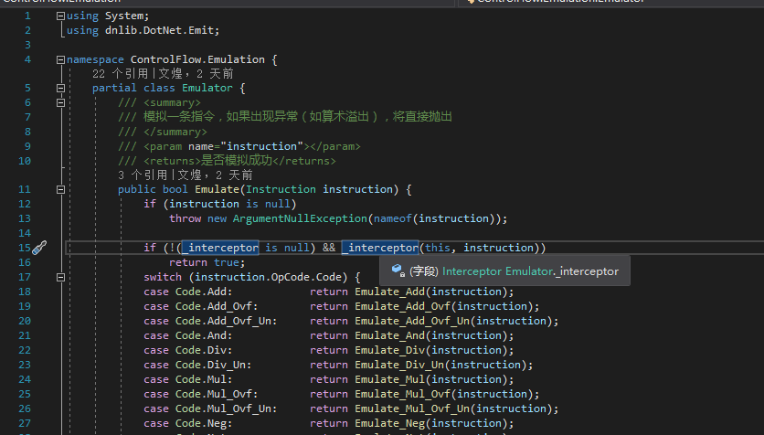

If you guys want to use it, just take the source code I put out earlier and change it.

Returning to the Interceptor implemented in the Anti-Muddler, I filtered a lot of instructions to improve stability, not to simulate irrelevant code, and to improve speed, because VMP.NET's Mutation only requires four types of instructions: operational, comparison, value, and branch.

For ldloc, which is the instruction to read variables, there is a special treatment to prevent reading the values of variables that are not related to Mutation, and to prevent the simulator from calculating what it should not and causing problems in the branching simulation.

VMP.NET's Mutation encrypts constants and adds code that obfuscates branches, so we have to restore them all after the simulation is over. This is partly achieved in OnEnd.

In general, VMP.NET Mutation is average, you can't be scared by the C# decompilation results, because it's deliberately bluffing you, how do you know if you can get it off without even trying it?

As for VMP.NET's virtualization model, I haven't finished it yet, I don't know if the big guys who are working on anti-virtualization would be willing to share their experience, I've been unclear about this area and plan to study it.

### Tool Download

[https://pan.baidu.com/s/1UpCYi25dBLlxoha9eVEfbQ](https://pan.baidu.com/s/1UpCYi25dBLlxoha9eVEfbQ) extraction code: 94u3

Currently the tool is very stable, tested many times, no bugs, occasionally invalid branch instructions will be prompted, that does not matter, has no effect on the program operation.

Before and after cleanup

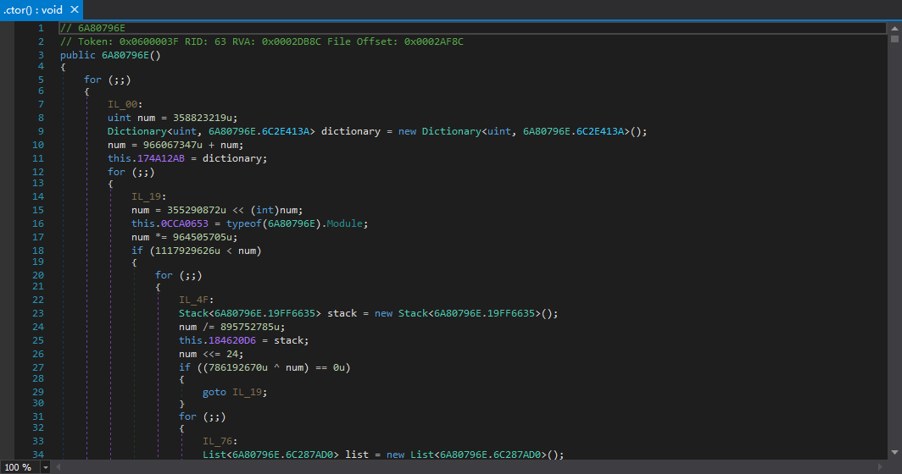

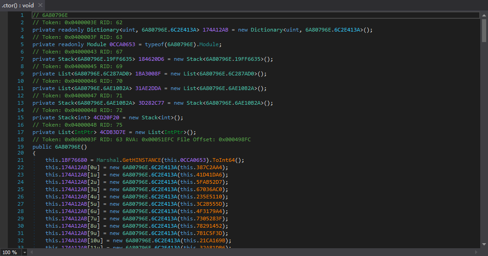

The effect is still pretty good.
