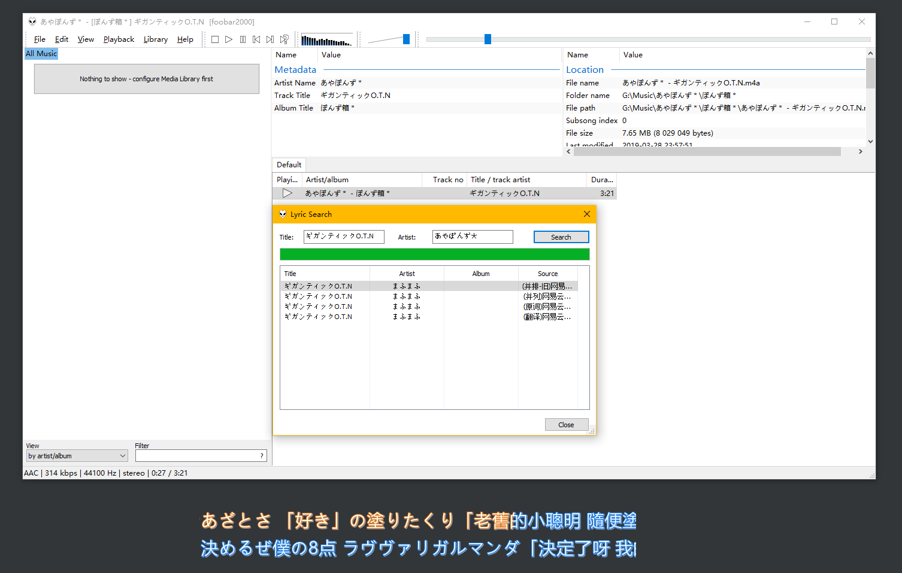

# foobar2000 Lyrics search script

**I didn't write the original script.！！！**

**Source of the script.：[github.com/EHfive/Some-js-script-for-FB2K](https://github.com/EHfive/Some-js-script-for-FB2K)**

**I've only modified it on that basis.：[github.com/wwh1004/Some-js-script-for-FB2K](https://github.com/wwh1004/Some-js-script-for-FB2K)**

**My modified version has enhanced the ability to search the lyrics of Japanese songs (mainly V's), such as the song in the image below, to match the songs sung by other singers **.

**The V's have basically the same lyrics for all their covers except for remix or something, so there's nothing particularly wrong with matching like that**

## Usage

1. open[github.com/wwh1004/Some-js-script-for-FB2K](https://github.com/wwh1004/Some-js-script-for-FB2K)，Just download the file "ncm.js" and leave the other 2 alone.
2. in accordance with "[ESLyric 介绍与使用](https://github.com/elia-is-me/WSH-Script-Tutorials/blob/master/%E5%85%B6%E5%AE%83%E6%96%87%E7%AB%A0/ESLyric/ESLyric%20%E4%BB%8B%E7%BB%8D%E4%B8%8E%E4%BD%BF%E7%94%A8.md)" This article (good ESLyric and ncm.js

ESLyric Download Address：[https://pan.baidu.com/s/1nHsRuRzYyAjtmFT4lI4DAw](https://pan.baidu.com/s/1nHsRuRzYyAjtmFT4lI4DAw) extraction code: d8e2

## integration package

If you're too lazy to install or configure it yourself, here are the integrated

rendering (visual representation of how things will turn out)：

rendering (visual representation of how things will turn out)

Click on the left "Nothing to show - configure Media Library first"You can choose your music folder，foobar2000 will be automatically added to the"All Music"，There are other operations in Baidu, I'll leave it at that.

Download Address : [https://pan.baidu.com/s/1s-I1mRPgHb-W0ZDtbKoyUw](https://pan.baidu.com/s/1s-I1mRPgHb-W0ZDtbKoyUw) extraction code: w95p
